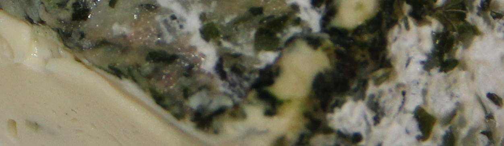
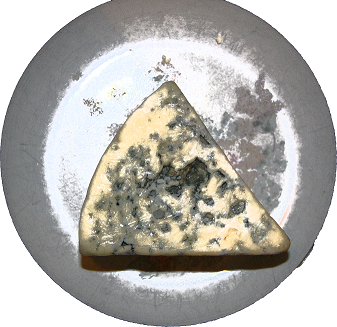

Azure IoT Hub is a cloud service that can handle large volumes of telemetry sent from remote devices. The remote devices typically contain a number of sensors (temperature, humidity, location, velocity, to name a few). These sensors send out telemetry on a regular basis. An IoT Hub processes this data in a number of ways, including storing it, or running a back-end app on the data. The IoT Hub also communicates new settings back to the devices.

An IoT Hub can scale to handle millions of devices. An IoT device can upload files, as well as send telemetry.

In this module, you'll learn about IoT Hub by implementing a system to monitor and control conditions in a cheese cave. A simple scenario, one IoT Hub, and one remote device.

## Learning objectives

In this module you will:

- Create a custom Azure IoT Hub, using the IoT Hub portal
- Create an IoT Hub device ID, using the IoT Hub portal
- Create an app to send device telemetry to the custom IoT Hub, in C# or Node.js
- Create a back-end service app to listen for the telemetry
- Implement a _direct method_, to communicate settings to the remote device
- Implement _device twins_, to maintain remote device properties

## Prerequisites

- An introductory knowledge of Azure IoT
- Ability to navigate Azure IoT portal
- Ability to use Node.js, or C#, at the beginner level
- Experience using Visual Studio, or Visual Studio Code, at the beginner level

## Learn the scenario

Suppose you manage a gourmet cheese making company in a southern location. The company is proud of its cheese, and is careful to maintain the perfect temperature and humidity of a natural cave that is used to age the cheese. There are sensors in the cave that report on the temperature and humidity. A remote operator can set a fan to new settings if needed, to maintain the perfect environment for the aging cheese. The fan can heat and cool, and humidify and de-humidify.

  

Caves are used to mature cheese, their constant temperature, humidity, and air flow make them nearly ideal for the process. Not to mention the cachet of having your cheese products mature in a natural cave, instead of a constructed cellar. Something to put on your product labels!

The accepted ideal temperature for aging cheese is 50 degrees fahrenheit (10 degrees centigrade), with up to 5 degrees (2.78 degrees C) either side of this being acceptable. Humidity is also important. Measured in percentage of maximum saturation, a humidity of between 75 and 95 percent is considered fine. We'll set 85 percent as the ideal, with a 10 percent variation as acceptable. These values apply to most cheeses. To achieve specific results, such as a certain condition of the rind, cheese makers will adjust these values for some of the time during aging.

In a southern location, a natural cave near the surface might have an ambient temperature of around 70 degrees. The cave might also have a relative humidity of close to 100 percent, because of water seeping through the roof. These high numbers aren't perfect conditions for aging cheese. At a more northerly location, the ambient temperature of a natural cave can be the ideal of 50 degrees. Because of our location, we need some Azure IoT intervention!

  

## The first step

The first step to building this scenario is to create a custom IoT Hub.
