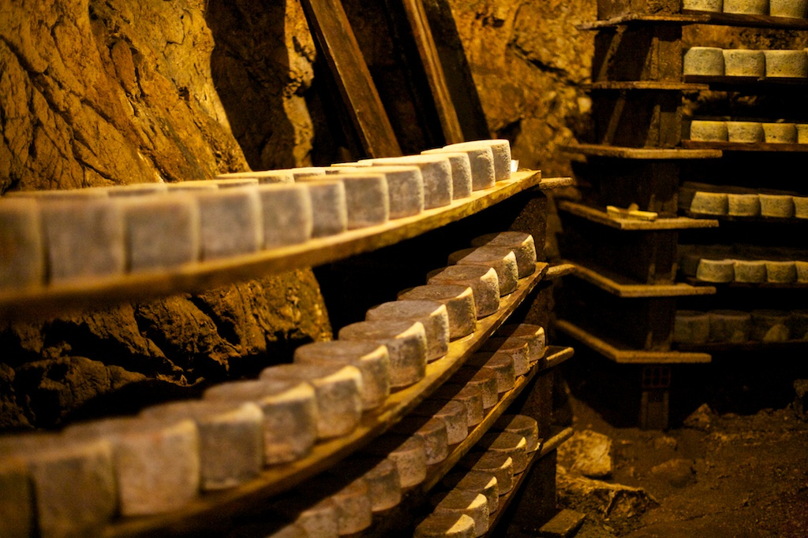

Azure IoT Hub is a cloud service that can handle large volumes of telemetry sent from remote devices. The remote devices typically contain a number of sensors (temperature, humidity, location, velocity, to name a few), and send out telemetry on a regular basis. An IoT Hub can process this data in a number of ways, including storing it, or running a back-end app on the data, and perhaps communicating new settings back to the devices (to enable optimal operation).

In this module, you will learn about IoT Hub by implementing a system to monitor and control conditions in a cheese cave.

## Learning objectives

In this module you will:
  - Create a custom Azure IoT Hub, using the IoT Hub portal
  - Create a Node.js app to send device telemetry to the custom IoT Hub
  - Create a second Node.js app to handle the back-end service
  - Understand the role of _direct methods_, in communicating remote device settings
  - Understand the role of _device twins_, in maintaining remote device properties

## Prerequisites

- An introductory knowledge of the purpose of Azure IoT
- Ability to navigate Azure IoT portal
- Ability to use Node.js, at the beginner level
- Experience using Visual Studio, or Visual Studio Code, at the beginner level

## The scenario

Suppose you manage a gourmet cheese making company in a southern location. The company is very proud of its cheese, and is very careful to maintain the perfect temperature and humidity of a natural cave that is used to age the cheese. There are sensors in the cave that report on the temperature and humidity, and a remote operator can set a fan (for both heating and cooling, and humidifying/de-humidifying) to new settings if needed, to maintain the perfect environment for the aging cheese.

  

Caves are used to mature cheese, their constant temperature, humidity, and air flow make them nearly ideal for the process. Not to mention the cachet of having your cheese products mature in a natural cave, instead of a man-made cellar. Something to put on your product labels!

The generally accepted ideal temperature for aging cheese is 50 degrees fahrenheit (10 degrees centigrade), with up to 5 degrees F (2.78 degrees C) either side of this being acceptable. Humidity is also important. Measured in percentage of maximum saturation, a humidity of between 75 and 95 percent is generally considered fine, so we will set 85 percent as the ideal, with a 10 percent variation as acceptable. These values apply to most cheeses. To achieve specific results, such as a certain condition of the rind, cheese makers will adjust these values for some of the time during aging.

In a southern location, a natural cave near the surface might have an ambient temperature of around 70 degrees fahrenheit, and a relative humidity of close to 100 percent (due to water seeping through the roof). These are slightly challenging conditions for aging cheese. At a more northerly location the ambient temperature of a natural cave might well be the ideal of 50 degrees. Because of our southern location, we need some Azure IoT intervention.

## The first step

The first step to building this scenario is to create a custom IoT Hub.
