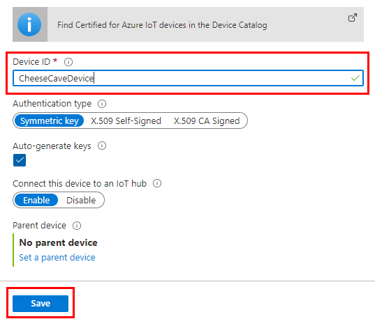

In this unit, we'll first create an IoT Hub, and add a single device to that hub. Then we record the connection strings we need for the coding sections of this module.

## Create a custom IoT Hub

1. Make sure you've activated the sandbox, using the button above. The sandbox creates a free temporary resource.
1. Right-click on [Azure portal](https://portal.azure.com/learn.docs.microsoft.com?azure-portal=true), and select **Open in new window**.
1. Select **+ Create a resource**, from the top of the left-hand menu. In the **Search the Marketplace** search box, enter "IoT Hub".
1. Select **IoT Hub** from the search results, and click **Create**.
1. You'll be required to enter a **Subscription** from the selection offered to you. A sandbox subscription will be **Concierge Subscription**, so choose that. For **Resource Group**, enter <rgn>[sandbox resource group name]</rgn>. A resource group is similar to a folder, it's largely there to help you organize your resources.
1. The **Region** should be the geographical region closest to you, and finally enter a friendly name (say "CheeseCaveHub-&lt;your ID&gt;") for **IoT Hub Name**.
    >[!IMPORTANT]
    >Your hub names are publicly discoverable, so take this into account when entering names. Hub names must also be unique, as they form part of the Azure URL.
1. Select **Next: Size and scale** to view the capabilities of your hub, noting all the services we need are enabled. Open up **Advanced Settings** to see the number of partitions. You can leave all entries at their default settings. Or, for peace of mind, you can change **Pricing and scale tier** to **F1: Free tier**, although you'll not be charged if you leave the tier at **S1: Standard tier**, as sandbox resources are free.

    > [!NOTE]
    > A single _partition_ has a maximum number of concurrent readers processing data. In our cheese cave scenario, we only have one reader (the back-end service app), so could get away with one partition. However, if high telemetry throughput is an issue, increasing the number of partitions, and number of concurrent connected readers, will aid in increasing efficiency.

1. Now, select **Review + create**, this option gives you a chance to verify your choices before clicking **Create**, and building the hub. Building your hub can take a few minutes.
1. Click **Go to resource**, to go to the home page for your new IoT hub.
1. It's a good idea to bookmark the home page of your IoT Hub.

## Create an IoT Hub device identity

Now we need to create a single device identity, the sensor monitoring the cheese cave.

1. With the home page of your hub open, locate and select the **IoT devices** entry in the left-hand menu.
1. Click **+ New**.
1. In the **Create a device** screen that follows, enter a **Device ID**, such as "CheeseCaveID". Ensure **Auto-generate keys** is enabled, as is **Connect this device to an IoT Hub**, and click **Save**.

    [](../media/cheesecave-device-create.png#lightbox)

1. You should now see your device in the list of devices for the IoT Hub. Click on the device name. Copy your **Device ID**, and the **Primary Connection String** to a text file (using Notepad, or similar text editor).

    > [!IMPORTANT]
    > The connection string you've just copied is the _device_ connection string. There are many other connection strings, including the _service_ connection string, that we also will need. Add a note to your text file that this is the device connection string.

1. Navigate back to the **Overview** page for your IoT Hub.

1. In the left-hand menu, select **Shared access policies**.

1. Click the **iothubowner** entry under **Policy**, then, on the right-hand side, copy the **Connection string-primary key** and paste it into your text file. Again, add a note, this text is the _service_ connection string.
1. Save off the text file, with a name such as "Cave connections.txt", for reference in the next unit.

::: zone pivot="csharp"

## Record the event hub endpoint, path, and key

For C# versions of the code, you also need the _Event Hubs-compatible endpoint_, _Event Hubs-compatible path_, and _service primary key_ from your IoT hub. These strings enable the back-end app to connect to your IoT Hub, and retrieve messages.

1. Copy the following three commands to your text file, and replace `<YourIoTHubName>` with the name of your hub.

    ``` Azure CLI
    az iot hub show --query properties.eventHubEndpoints.events.endpoint --name <YourIoTHubName>

    az iot hub show --query properties.eventHubEndpoints.events.path --name <YourIoTHubName>

    az iot hub policy show --name service --query primaryKey --hub-name <YourIoTHubName>

    ```

1. Copy all the commands from the text file to the **Azure Cloud Shell** pane.

1. Copy the strings that are returned back to your text file.

    >[!TIP]
    >The endpoint will look similar to this string:
    >
    >"sb://iothub-ns-cheesexxxx-xxxxxxx-xxxxxxxxxx.servicebus.windows.net/".
    >
    >The path will be a lower-case version of your hub name.
    >
    >The service key will be a character string, similar to any primary key in the Azure portal.
    >
    >These strings replace the `<your event hub endpoint>`, `<your event hub path>`, and `<your event hub Sas key>` strings, respectively, in an upcoming unit.

::: zone-end

You've now completed the preparatory work for this module, the next steps are all coding and testing. Before we advance though, a quick knowledge check!
