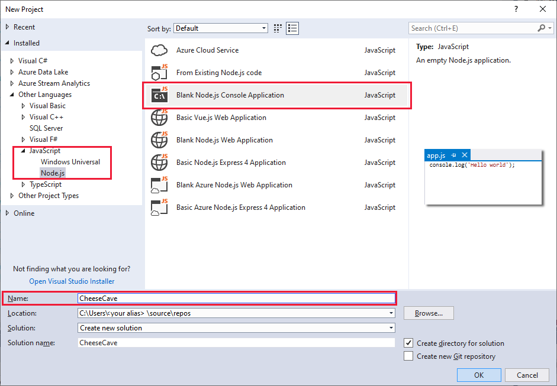
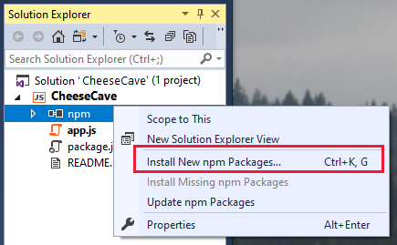
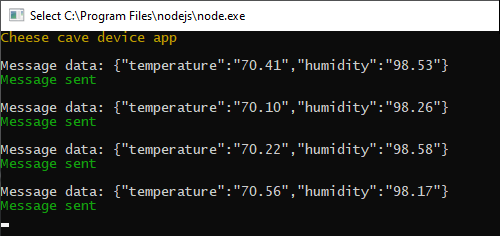
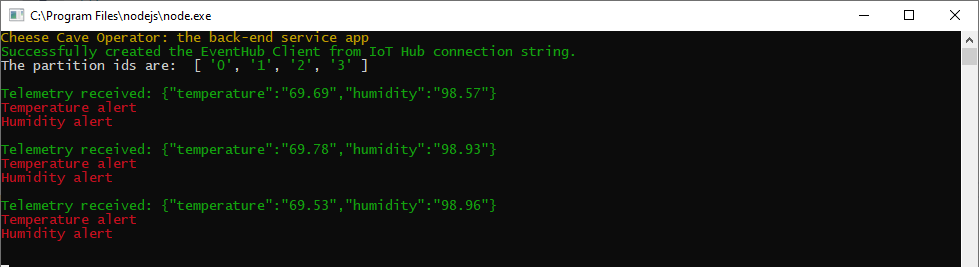

At the end of this unit, you'll be sending and receiving telemetry.

## Create an app to send telemetry

::: zone pivot="vscode-node"

1. Open Visual Studio Code. From the **Terminal** menu, open a **New Terminal**.

1. In the opened terminal, create an empty folder where you'll develop your code, called "cheesecave", by entering `mkdir cheesecave`. Then, navigate to that folder with `cd cheesecave`.

1. From the **File** menu, create a new file. Insert a single line as a comment, such as `// Cheese Cave device app`. Save the file to the `cheesecave` folder (locating this folder might involve a bit of navigation), with the name `app.js`. By using the .js file extension, Visual Studio Code interprets this file as JavaScript and evaluates the contents with the JavaScript language service.

1. Back in the terminal, install the required libraries. Enter:

    ```
        npm install azure-iot-device@1.15.0
        npm install azure-iot-device-mqtt@1.15.0
        npm install chalk@2.4.2
    ```

1. After you've entered the code below into the **app.js** file, you can run it from the terminal by entering `node app.js`. Ensure that the `cheesecave` folder is the current folder of the terminal, when you run the app.

::: zone-end
::: zone pivot="vscode-csharp"

1. To use C# in Visual Studio Code, ensure both [.NET Core](https://dotnet.microsoft.com/download), and the [C# extension](https://marketplace.visualstudio.com/items?itemName=ms-vscode.csharp) are installed.

1. Open a terminal in Visual Studio Code, and create a folder called "cheesecavedevice" (enter `mkdir cheesecavedevice`). Navigate to the `cheesecavedevice` folder.

1. Enter the following command in the terminal: `dotnet new console`. This command creates a **Program.cs** file in your folder, along with a project file.

1. Enter `dotnet restore` in the terminal. This command gives your app access to the required .NET packages.

1. In the terminal, install the required libraries. Enter:

    ```
        dotnet add package Microsoft.Azure.Devices.Client
        dotnet add package Microsoft.Azure.Devices.Shared
        dotnet add package Newtonsoft.Json
    ```

1. From the **File** menu, open up the **Program.cs** file, and delete the default contents.

1. After you've entered the code below into the **Program.cs** file, you can run the app with the command `dotnet run`. This command will run the **Program.cs** file in the current folder, so ensure you are in the `cheesecavedevice` folder.

::: zone-end
::: zone pivot="vs-node"

1. Navigate to the **JavaScript** project types, and create a new **Blank Node.js Console Application** project, called "CheeseCave".

    [](../media/cheesecave-vs-project.png#lightbox)

1. In the **Solution Explorer** tab, right click **npm**, and select **Install New npm Packages**. Install:
    * **azure-iot-device**
    * **azure-iot-device-mqtt**
    * **chalk**

    [](../media/cheesecave-vs-npm.png#lightbox)

1. Delete the default contents of the **app.js** file.

1. When you've entered the code below, you'll be able to run the app with the **Start Without Debugging**, or **Start Debugging**, options. In the latter case, you can set breakpoints, examine data, and do other debugging tasks.

::: zone-end
::: zone pivot="vs-csharp"

1. Open Visual Studio, and create a new **Visual C#/Windows Desktop** project. Select **Console App (.NET Framework)**.

1. Give the project a friendly name, such as "CheeseCaveDevice".

1. Under **Tools/NuGet Package Manager**, select **Manage NuGet Packages for Solution**. Select **Browse**, then search for, and install, the following library:
    * **Microsoft.Azure.Devices.Client**

1. Delete the default contents of the **Program.cs** file.

1. Add all the code that follows to the **Program.cs** file.

::: zone-end

> [!NOTE]
> This module doesn't require you to download any code. However, all of the code is available from [GitHub/MicrosoftDocs/mslearn-remotely-monitor-and-control-devices-with-iot-hub](https://github.com/MicrosoftDocs/mslearn-remotely-monitor-and-control-devices-with-iot-hub), if needed.

### Add code to send telemetry

This section adds code to send telemetry from a simulated device. The device sends temperature (in degrees fahrenheit) and humidity (in percentages), regardless of whether any back-end app is listening or not.

::: zone pivot="vs-node,vscode-node"

1. With the **app.js** file open, copy and paste the following code.

    ```JavaScript
    // Copyright (c) Microsoft. All rights reserved.
    // Licensed under the MIT license. See LICENSE file in the project root for full license information.

    'use strict';
    const chalk = require('chalk');
    console.log(chalk.yellow('Cheese cave device app'));

    // The device connection string to authenticate the device with your IoT hub.
    const connectionString = '<your device connection string>';

    // The sample connects to a device-specific MQTT endpoint on your IoT Hub.
    const Mqtt = require('azure-iot-device-mqtt').Mqtt;
    const DeviceClient = require('azure-iot-device').Client
    const Message = require('azure-iot-device').Message;

    const client = DeviceClient.fromConnectionString(connectionString, Mqtt);

    // Global variables.
    const ambientTemperature = 70;                          // Ambient temperature of a southern cave, in degrees F.
    const ambientHumidity = 99;                             // Ambient humidity in relative percentage of air saturation.
    let desiredTemperature = ambientTemperature-10;         // Initial desired temperature, in degrees F.
    const desiredTempLimit = 5;                             // Acceptable range above or below the desired temp, in degrees F.
    let desiredHumidity = ambientHumidity - 20;             // Initial desired humidity in relative percentage of air saturation.
    const desiredHumidityLimit = 10;                        // Acceptable range above or below the desired humidity, in percentages.
    const intervalInMilliseconds = 5000;                    // Interval at which telemetry is sent to the cloud.

    // Enum for the state of the fan for cooling/heating, and humidifying/de-humidifying.
    const stateEnum = Object.freeze({ "off": "off", "on": "on", "failed": "failed" });
    let fanState = stateEnum.off;

    let currentTemperature = ambientTemperature;            // Initial setting of temperature.
    let currentHumidity = ambientHumidity;                  // Initial setting of humidity.

    function greenMessage(text) {
        console.log(chalk.green(text));
    }

    function redMessage(text) {
        console.log(chalk.red(text));
    }

    // Send telemetry messages to your hub.
    function sendMessage() {

        let deltaTemperature = Math.sign(desiredTemperature - currentTemperature);
        let deltaHumidity = Math.sign(desiredHumidity - currentHumidity);

        if (fanState == stateEnum.on) {

            // If the fan is on the temperature and humidity will be nudged towards the desired values most of the time.
            currentTemperature += (deltaTemperature * Math.random()) + Math.random() - 0.5;
            currentHumidity += (deltaHumidity * Math.random()) + Math.random() - 0.5;

            // Randomly fail the fan.
            if (Math.random() < 0.01) {
                fanState = stateEnum.failed;
                redMessage('Fan has failed');
            }
        }
        else {
            // If the fan is off, or has failed, the temperature and humidity will creep up until they reach ambient values, thereafter fluctuate randomly.
            if (currentTemperature < ambientTemperature - 1) {
                currentTemperature += Math.random() / 10;
            } else {
                currentTemperature += Math.random() - 0.5;
            }
            if (currentHumidity < ambientHumidity - 1) {
                currentHumidity += Math.random() / 10;
            } else {
                currentHumidity += Math.random() - 0.5;
            }
        }

        // Check: humidity can never exceed 100%.
        currentHumidity = Math.min(100, currentHumidity);

        // Prepare the telemetry message.
        const message = new Message(JSON.stringify({
            temperature: currentTemperature.toFixed(2),
            humidity: currentHumidity.toFixed(2),
        }));

        // Add custom application properties to the message.
        // An IoT hub can filter on these properties without access to the message body.
        message.properties.add('sensorID', "S1");
        message.properties.add('fanAlert', (fanState == stateEnum.failed) ? 'true' : 'false');

        // Send temperature or humidity alerts, only if they occur.
        if ((currentTemperature > desiredTemperature + desiredTempLimit) || (currentTemperature < desiredTemperature - desiredTempLimit)) {
            message.properties.add('temperatureAlert', 'true');
        }
        if ((currentHumidity > desiredHumidity + desiredHumidityLimit) || (currentHumidity < desiredHumidity - desiredHumidityLimit)) {
            message.properties.add('humidityAlert', 'true');
        }

        console.log('\nMessage data: ' + message.getData());

        // Send the telemetry message.
        client.sendEvent(message, function (err) {
            if (err) {
                redMessage('Send error: ' + err.toString());
            } else {
                greenMessage('Message sent');
            }
        });
    }

    // Set up the telemetry interval.
    setInterval(sendMessage, intervalInMilliseconds);
    ```

    > [!NOTE]
    > Read through the comments in the code, noting how the temperature and humidity settings from the description of the scenario in the introduction have worked their way into the code.

1. Replace the `<your device connection string>` with the device connection string you saved off in an earlier unit. No other lines of code need to be changed.

1. Save the **app.js** file.

::: zone-end
::: zone pivot="vs-csharp,vscode-csharp"

1. Open the **Program.cs** file for the device app.

1. Copy and paste the following code.

    ```cs
    // Copyright (c) Microsoft. All rights reserved.
    // Licensed under the MIT license. See LICENSE file in the project root for full license information.

    using System;
    using Microsoft.Azure.Devices.Client;
    using Microsoft.Azure.Devices.Shared;
    using Newtonsoft.Json;
    using System.Text;
    using System.Threading.Tasks;
    using Newtonsoft.Json.Linq;

    namespace simulated_device
    {
        class SimulatedDevice
        {
           // Global constants.
            const float ambientTemperature = 70;                    // Ambient temperature of a southern cave, in degrees F.
            const double ambientHumidity = 99;                      // Ambient humidity in relative percentage of air saturation.
            const double desiredTempLimit = 5;                      // Acceptable range above or below the desired temp, in degrees F.
            const double desiredHumidityLimit = 10;                 // Acceptable range above or below the desired humidity, in percentages.
            const int intervalInMilliseconds = 5000;                // Interval at which telemetry is sent to the cloud.

            // Global variables.
            private static DeviceClient s_deviceClient;
            private static stateEnum fanState = stateEnum.off;                      // Initial setting of the fan.
            private static double desiredTemperature = ambientTemperature - 10;     // Initial desired temperature, in degrees F.
            private static double desiredHumidity = ambientHumidity - 20;           // Initial desired humidity in relative percentage of air saturation.

            // Enum for the state of the fan for cooling/heating, and humidifying/de-humidifying.
            enum stateEnum
            {
                off,
                on,
                failed
            }

            // The device connection string to authenticate the device with your IoT hub.
            private readonly static string s_deviceConnectionString = "<your device connection string>";

            private static void colorMessage(string text, ConsoleColor clr)
            {
                Console.ForegroundColor = clr;
                Console.WriteLine(text);
                Console.ResetColor();
            }
            private static void greenMessage(string text)
            {
                colorMessage(text, ConsoleColor.Green);
            }

            private static void redMessage(string text)
            {
                colorMessage(text, ConsoleColor.Red);
            }

            // Async method to send simulated telemetry.
            private static async void SendDeviceToCloudMessagesAsync()
            {
                double currentTemperature = ambientTemperature;         // Initial setting of temperature.
                double currentHumidity = ambientHumidity;               // Initial setting of humidity.

                Random rand = new Random();

                while (true)
                {
                    // Simulate telemetry.
                    double deltaTemperature = Math.Sign(desiredTemperature - currentTemperature);
                    double deltaHumidity = Math.Sign(desiredHumidity - currentHumidity);

                    if (fanState == stateEnum.on)
                    {
                        // If the fan is on the temperature and humidity will be nudged towards the desired values most of the time.
                        currentTemperature += (deltaTemperature * rand.NextDouble()) + rand.NextDouble() - 0.5;
                        currentHumidity += (deltaHumidity * rand.NextDouble()) + rand.NextDouble() - 0.5;

                        // Randomly fail the fan.
                        if (rand.NextDouble() < 0.01)
                        {
                            fanState = stateEnum.failed;
                            redMessage("Fan has failed");
                        }
                    }
                    else
                    {
                        // If the fan is off, or has failed, the temperature and humidity will creep up until they reaches ambient values, thereafter fluctuate randomly.
                        if (currentTemperature < ambientTemperature - 1)
                        {
                            currentTemperature += rand.NextDouble() / 10;
                        }
                        else
                        {
                            currentTemperature += rand.NextDouble() - 0.5;
                        }
                        if (currentHumidity < ambientHumidity - 1)
                        {
                            currentHumidity += rand.NextDouble() / 10;
                        }
                        else
                        {
                            currentHumidity += rand.NextDouble() - 0.5;
                        }
                    }

                    // Check: humidity can never exceed 100%.
                    currentHumidity = Math.Min(100, currentHumidity);

                    // Create JSON message.
                    var telemetryDataPoint = new
                    {
                        temperature = Math.Round(currentTemperature, 2),
                        humidity = Math.Round(currentHumidity, 2)
                    };
                    var messageString = JsonConvert.SerializeObject(telemetryDataPoint);
                    var message = new Message(Encoding.ASCII.GetBytes(messageString));

                    // Add custom application properties to the message.
                    message.Properties.Add("sensorID", "S1");
                    message.Properties.Add("fanAlert", (fanState == stateEnum.failed) ? "true" : "false");

                    // Send temperature or humidity alerts, only if they occur.
                    if ((currentTemperature > desiredTemperature + desiredTempLimit) || (currentTemperature < desiredTemperature - desiredTempLimit))
                    {
                        message.Properties.Add("temperatureAlert", "true");
                    }
                    if ((currentHumidity > desiredHumidity + desiredHumidityLimit) || (currentHumidity < desiredHumidity - desiredHumidityLimit))
                    {
                        message.Properties.Add("humidityAlert", "true");
                    }

                    Console.WriteLine("Message data: {0}", messageString);

                    // Send the telemetry message.
                    await s_deviceClient.SendEventAsync(message);
                    greenMessage("Message sent\n");

                    await Task.Delay(intervalInMilliseconds);
                }
            }
            private static void Main(string[] args)
            {
                colorMessage("Cheese Cave device app.\n", ConsoleColor.Yellow);

                // Connect to the IoT hub using the MQTT protocol.
                s_deviceClient = DeviceClient.CreateFromConnectionString(s_deviceConnectionString, TransportType.Mqtt);

                SendDeviceToCloudMessagesAsync();
                Console.ReadLine();
            }
        }
    }
    ```

    > [!NOTE]
    > Read through the comments in the code, noting how the temperature and humidity settings from the description of the scenario in the introduction have worked their way into the code.

1. Replace the `<your device connection string>` with the device connection string you saved off in an earlier unit. No other lines of code need to be changed.

1. Save the **Program.cs** file.

::: zone-end

### Test your code to send telemetry

1. Run the app.
1. You should quickly get a console screen, similar to the following image. Note the use of green text, to show things are working as they should! If you don't get a screen similar to this image, check your device connection string carefully.

    [](../media/cheesecave-telemetry.png#lightbox)

1. Watch the telemetry for a short while, checking that is it giving temperatures and humidity in the expected ranges.
1. You can leave this app running, as it's needed for the next section.

    > [!NOTE]
    > The screenshots in this module are based on the Node.js version of the apps. If you are developing using C#, there will be minor differences in the screen output.

## Create a second app to receive telemetry

Now we have a device pumping out telemetry, we need to listen for that telemetry with a back-end app, also connected to our IoT Hub.

::: zone pivot="vscode-node"

1. Open Visual Studio Code. From the **Terminal** menu, open a **New Terminal**.

1. In the opened terminal, create an empty folder where you'll develop your code, called "cheesecaveservice", by entering `mkdir cheesecaveservice`. Then, navigate to that folder with `cd cheesecaveservice`.

1. From the **File** menu, create a new file. Insert a single line as a comment, such as `// Cheese Cave back-end service app`. Save the file to the `cheesecaveservice` folder (locating this folder might involve a bit of navigation), with the name `app.js`.

1. Back in the terminal, enter the following commands:

    ```
        npm install azure-iothub@1.12.2
        npm install @azure/event-hubs@2.1.4
        npm install chalk@2.4.2
    ```

1. After you've entered the code below into the **app.js** file, you can run it from the terminal by entering `node app.js`. Ensure that the `cheesecaveservice` folder is the current folder of the terminal.

::: zone-end
::: zone pivot="vscode-csharp"

1. Open a terminal in Visual Studio Code, and create a folder called "cheesecaveoperator" (enter `mkdir cheesecaveoperator`). Navigate to the `cheesecaveoperator` folder.

1. Enter the following command in the terminal: `dotnet new console`. This command creates a **Program.cs** file in your folder, along with a project file.

1. Enter `dotnet restore` in the terminal. This command gives your app access to the required .NET packages.

1. In the terminal, enter the following commands:

    ```
        dotnet add package Microsoft.Azure.EventHubs
        dotnet add package Microsoft.Azure.Devices
        dotnet add package Newtonsoft.Json
    ```

1. From the **File** menu, open up the **Program.cs** file, and delete the default contents.

1. After you've entered the code below into the **Program.cs** file, run the code with the command `dotnet run`. This command will run the **Program.cs** file in the current folder, so ensure you are in the correct folder.

::: zone-end
::: zone pivot="vs-node"

1. Navigate to the **JavaScript** project types, and create a new **Blank Node.js Console Application** project, called "CheeseCaveOperator".

1. In the **Solution Explorer** tab, right click **npm**, and select **Install New npm Packages**. Install the following libraries:
    * **azure-iothub**
    * **chalk**

1. Delete the default contents of the **app.js** file.

1. When you've entered the code below, you'll be able to run the app with the **Start Without Debugging**, or **Start Debugging**, options.

::: zone-end
::: zone pivot="vs-csharp"

1. Open Visual Studio, and create a new **Visual C#/Windows Desktop** project. Select **Console App (.NET Framework)**.

1. Give the project a friendly name, such as "CheeseCaveOperator".

1. Under **Tools/NuGet Package Manager**, select **Manage NuGet Packages for Solution**. Select **Browse**, then search for, and install, the following libraries:
    * **Microsoft.Azure.Devices**
    * **Microsoft.Azure.EventHubs**

1. Delete the default contents of **Program.cs**.

1. Add all the code that follows to the **Program.cs** file.

::: zone-end

### Add code to receive telemetry

::: zone pivot="vs-node,vscode-node"

1. With the **app.js** file open, copy and paste the following code.

    ```JavaScript
    // Copyright (c) Microsoft. All rights reserved.
    // Licensed under the MIT license. See LICENSE file in the project root for full license information.

    'use strict';

    const chalk = require('chalk');
    console.log(chalk.yellow('Cheese Cave Operator: the back-end service app'));

    // The connection string for the IoT Hub service.
    const connectionString = '<your service connection string>';

    // The device ID.
    const deviceId = 'CheeseCaveID';

    // The sample connects to service-side endpoint to call direct methods on devices.
    const Client = require('azure-iothub').Client;
    const Registry = require('azure-iothub').Registry;

    // Connect to the service-side endpoint on your IoT hub.
    const client = Client.fromConnectionString(connectionString);

    // The sample connects to an IoT hub's Event Hubs-compatible endpoint to read messages sent from a device.
    const { EventHubClient, EventPosition } = require('@azure/event-hubs');

    let eventHubClient;

    function greenMessage(text) {
        console.log(chalk.green(text));
    }

    function redMessage(text) {
        console.log(chalk.red(text));
    }

    function printError(err) {
        redMessage(err.message);
    };

    // Display the message content - telemetry and properties.
    function printMessage(message) {

        greenMessage('Telemetry received: ' + JSON.stringify(message.body));
        if (message.applicationProperties.fanAlert == 'true') {
            redMessage('Fan alert');
        }
        if (message.applicationProperties.temperatureAlert == 'true') {
            redMessage('Temperature alert');
        }
        if (message.applicationProperties.humidityAlert == 'true') {
            redMessage('Humidity alert');
        }
        console.log('');
    };

    // Connect to the partitions on the IoT Hub's Event Hubs-compatible endpoint.
    EventHubClient.createFromIotHubConnectionString(connectionString).then(function (client) {
        greenMessage("Successfully created the EventHub Client from IoT Hub connection string.");

        // Save the client as a global variable.
        eventHubClient = client;

        return eventHubClient.getPartitionIds();

    }).then(function (ids) {
        console.log("The partition ids are: ", ids);
        console.log('');
        return ids.map(function (id) {
            return eventHubClient.receive(id, printMessage, printError, { eventPosition: EventPosition.fromEnqueuedTime(Date.now()) });
        });
    }).catch(printError);
    ```

    > [!NOTE]
    > Our implementation only reads messages after the app has been started. Any telemetry sent prior to this isn't handled.

1. Replace the `<your service connection string>` with the _service_ connection string you saved off in a text file, in an earlier unit.

1. Replace the `const deviceId`, if you did not use the suggested "CheeseCaveID".

1. Save the **app.js** file.

::: zone-end
::: zone pivot="vs-csharp,vscode-csharp"

1. Open the **Program.cs** file for the back-end app.

    ```cs
    // Copyright (c) Microsoft. All rights reserved.
    // Licensed under the MIT license. See LICENSE file in the project root for full license information.

    using System;
    using System.Threading.Tasks;
    using System.Text;
    using System.Collections.Generic;
    using System.Linq;

    using Microsoft.Azure.EventHubs;
    using Microsoft.Azure.Devices;
    using Newtonsoft.Json;

    namespace cheesecave_operator
    {
        class ReadDeviceToCloudMessages
        {
            // Global variables.
            // The Event Hub-compatible endpoint.
            private readonly static string s_eventHubsCompatibleEndpoint = "<your event hub endpoint>";

            // The Event Hub-compatible name.
            private readonly static string s_eventHubsCompatiblePath = "<your event hub path>";
            private readonly static string s_iotHubSasKey = "<your event hub Sas key>";
            private readonly static string s_iotHubSasKeyName = "service";
            private static EventHubClient s_eventHubClient;

            // Connection string for your IoT Hub.
            private readonly static string s_serviceConnectionString = "<your service connection string>";

            // Asynchronously create a PartitionReceiver for a partition and then start reading any messages sent from the simulated client.
            private static async Task ReceiveMessagesFromDeviceAsync(string partition)
            {
                // Create the receiver using the default consumer group.
                var eventHubReceiver = s_eventHubClient.CreateReceiver("$Default", partition, EventPosition.FromEnqueuedTime(DateTime.Now));
                Console.WriteLine("Created receiver on partition: " + partition);

                while (true)
                {
                    // Check for EventData - this methods times out if there is nothing to retrieve.
                    var events = await eventHubReceiver.ReceiveAsync(100);

                    // If there is data in the batch, process it.
                    if (events == null) continue;

                    foreach (EventData eventData in events)
                    {
                        string data = Encoding.UTF8.GetString(eventData.Body.Array);

                        greenMessage("Telemetry received: " + data);

                        foreach (var prop in eventData.Properties)
                        {
                            if (prop.Value.ToString() == "true")
                            {
                                redMessage(prop.Key);
                            }
                        }
                        Console.WriteLine();
                    }
                }
            }

            public static void Main(string[] args)
            {
                colorMessage("Cheese Cave Operator\n", ConsoleColor.Yellow);

                // Create an EventHubClient instance to connect to the IoT Hub Event Hubs-compatible endpoint.
                var connectionString = new EventHubsConnectionStringBuilder(new Uri(s_eventHubsCompatibleEndpoint), s_eventHubsCompatiblePath, s_iotHubSasKeyName, s_iotHubSasKey);
                s_eventHubClient = EventHubClient.CreateFromConnectionString(connectionString.ToString());

                // Create a PartitionReceiver for each partition on the hub.
                var runtimeInfo = s_eventHubClient.GetRuntimeInformationAsync().GetAwaiter().GetResult();
                var d2cPartitions = runtimeInfo.PartitionIds;

                // Create receivers to listen for messages.
                var tasks = new List<Task>();
                foreach (string partition in d2cPartitions)
                {
                    tasks.Add(ReceiveMessagesFromDeviceAsync(partition));
                }

                // Wait for all the PartitionReceivers to finish.
                Task.WaitAll(tasks.ToArray());
            }

            private static void colorMessage(string text, ConsoleColor clr)
            {
                Console.ForegroundColor = clr;
                Console.WriteLine(text);
                Console.ResetColor();
            }
            private static void greenMessage(string text)
            {
                colorMessage(text, ConsoleColor.Green);
            }

            private static void redMessage(string text)
            {
                colorMessage(text, ConsoleColor.Red);
            }
        }
    }
    ```

    > [!NOTE]
    > Our implementation only reads messages after the back-end app has been started. Any telemetry sent prior to this isn't handled.

1. Replace the `<your service connection string>` with the _service_ connection string you saved off in a text file, in an earlier unit.

1. Replace the `<your event hub endpoint>`, `<your event hub path>`, and the `<your event hub Sas key>` with the strings you saved off to your text file.

1. Save the **Program.cs** file.

::: zone-end

### Test your code to receive telemetry

This test is important, checking whether your back-end app is picking up the telemetry being sent out by your simulated device. Remember your device app is still running, and sending telemetry.

1. Run the service app.
1. A second console window should open up, and immediately respond if it successfully connects to IoT Hub. If not, carefully check your IoT Hub service connection string, noting that this string should be the _service_ connection string, and not any other.

    [](../media/cheesecave-telemetry-received.png#lightbox)

1. Visually compare the telemetry sent and received. Is there an exact match? Is there much of a delay? If it looks good, close both the console windows for now.

Completing this unit is great progress. you've an app sending telemetry from a device, and a back-end app acknowledging receipt of the data. This unit covers the _monitoring_ side of our scenario. The next step handles the _control_ side - what to do when issues arise with the data. Clearly, there are issues, we're getting temperature and humidity alerts!
