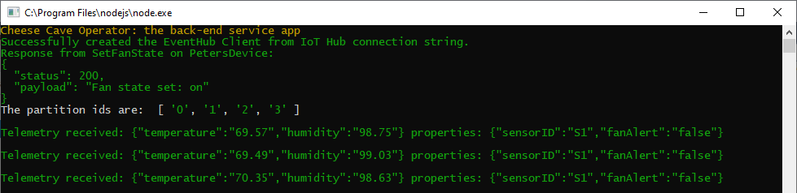
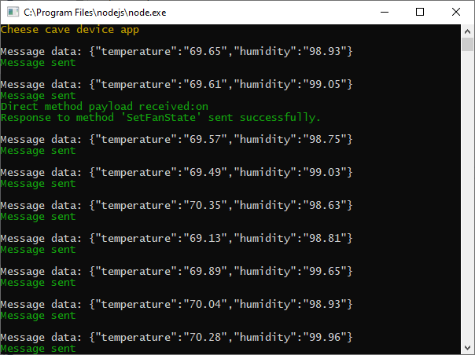

In this unit, we'll add code to the device app for a direct method to turn on the fan. Next, we add code to the back-end service app to invoke this direct method.

## Add code to define a direct method in the device app

::: zone pivot="node"

1. Open the **app.js** file for the device app.

1. Append the following code to the end of the file. This code is the body of the direct method itself, and a single statement to record the direct method with the IoT Hub client.

    ```javascript
    // Function to handle the SetFanState direct method call from IoT hub.
    function onSetFanState(request, response) {

        // Function to send a direct method response to your IoT hub.
        function directMethodResponse(err) {
            if (err) {
                redMessage('An error ocurred when sending a method response:\n' + err.toString());
            } else {
                greenMessage('Response to method \'' + request.methodName + '\' sent successfully.');
            }
        }

        greenMessage('Direct method payload received:' + request.payload);

        // Check that a valid value was passed as a parameter.
        if (fanState == stateEnum.failed) {
            redMessage('Fan has failed and cannot have its state changed');

            // Report fan failure back to your hub.
            response.send(400, 'Fan has failed and cannot be set to: ' + request.payload, directMethodResponse);
        } else {
            if (request.payload != "on" && request.payload != "off") {
                redMessage('Invalid state response received in payload');

                // Report payload failure back to your hub.
                response.send(400, 'Invalid direct method parameter: ' + request.payload, directMethodResponse);

            } else {
                fanState = request.payload;

                // Report success back to your hub.
                response.send(200, 'Fan state set: ' + request.payload, directMethodResponse);
            }
        }
    }

    // Set up the handler for the SetFanState direct method call.
    client.onDeviceMethod('SetFanState', onSetFanState);
    ```

1. Save the **app.js** file.

::: zone-end
::: zone pivot="csharp"

1. Open the **Program.cs** file for the device app.

1. Add the following method, perhaps to the end of the class.

    ```cs
        // Handle the direct method call
        private static Task<MethodResponse> SetFanState(MethodRequest methodRequest, object userContext)
        {
            if (fanState == stateEnum.failed)
            {
                // Acknowledge the direct method call with a 400 error message.
                string result = "{\"result\":\"Fan failed\"}";
                redMessage("Direct method failed: " + result);
                return Task.FromResult(new MethodResponse(Encoding.UTF8.GetBytes(result), 400));
            }
            else
            {
                try
                {
                    var data = Encoding.UTF8.GetString(methodRequest.Data);

                    // Remove quotes from data.
                    data = data.Replace("\"", "");

                    // Parse the payload, and trigger an exception if it's not valid.
                    fanState = (stateEnum)Enum.Parse(typeof(stateEnum), data);
                    greenMessage("Fan set to: " + data);

                    // Acknowledge the direct method call with a 200 success message.
                    string result = "{\"result\":\"Executed direct method: " + methodRequest.Name + "\"}";
                    return Task.FromResult(new MethodResponse(Encoding.UTF8.GetBytes(result), 200));
                }
                catch
                {
                    // Acknowledge the direct method call with a 400 error message.
                    string result = "{\"result\":\"Invalid parameter\"}";
                    redMessage("Direct method failed: " + result);
                    return Task.FromResult(new MethodResponse(Encoding.UTF8.GetBytes(result), 400));
                }
            }
        }
    ```

1. Add the following lines of code to the `Main` method, after creating the device client.

    ```cs
            // Create a handler for the direct method call
            s_deviceClient.SetMethodHandlerAsync("SetFanState", SetFanState, null).Wait();
    ```

1. Save the **Program.cs** file.

::: zone-end

   > [!NOTE]
   > The fan has three states: _on_, _off_, and _failed_. The method above sets the fan to either of the first two of these states. If the payload text doesn't match one of these two, or the fan is in a failed state, an error is returned.

You've completed what is needed at the device end of things. Next, we need to add code to the back-end service.

## Add code to call a direct method

::: zone pivot="node"

When setting up a call to invoke a direct method, it's best to divide the code into three parts: the parameters, a function handling the call, and one or more calls to that function.

1. Open up the back-end service **app.js** file and add the following code to the end of the file.

    ```javascript
    const methodParams = {
        methodName: 'SetFanState',
        payload: 'on',
        responseTimeoutInSeconds: 30
    };
    ```

    > [!NOTE]
    > The `methodName` parameter is an exact match of the first parameter in the `client.onDeviceMethod('SetFanState', onSetFanState);` call you entered into the device app.

1. Now, enter the code to send the message to invoke the method.

    ```javascript
    function sendDirectMethod() {

        // Call the direct method on your device using the defined parameters.
        client.invokeDeviceMethod(deviceId, methodParams, function (err, result) {
            if (err) {
                redMessage('Failed to invoke method \'' + methodParams.methodName + '\': ' + err.message);
            } else {
                greenMessage('Response from ' + methodParams.methodName + ' on ' + deviceId + ':');
                greenMessage(JSON.stringify(result, null, 2));
            }
        });
    }
    ```

    > [!NOTE]
    > The first parameter of the `client.invokeDeviceMethod` call identifies the device the call is to go to. With multiple devices, this could be changed to a parameter of the `sendDirectMethod` function.

1. Finally, add a call to the `sendDirectMethod` function into the `createFromIotHubConnectionString` function, after the `eventHubClient = client;` line of code.

    ```javascript
        // Send a direct method to turn the fan on.
        sendDirectMethod();
    ```

1. Save the **app.js** file.

::: zone-end
::: zone pivot="csharp"

1. Open the **Program.cs** file for the back-end app.

1. Add the following line to the global variables.

    ```cs
    private static ServiceClient s_serviceClient;
    ```

1. Add the following task, perhaps after the `Main` method.

    ```cs
        // Handle invoking a direct method.
        private static async Task InvokeMethod()
        {
            try
            {
                var methodInvocation = new CloudToDeviceMethod("SetFanState") { ResponseTimeout = TimeSpan.FromSeconds(30) };
                string payload = JsonConvert.SerializeObject("on");

                methodInvocation.SetPayloadJson(payload);

                // Invoke the direct method asynchronously and get the response from the simulated device.
                var response = await s_serviceClient.InvokeDeviceMethodAsync("CheeseCaveID", methodInvocation);

                if (response.Status == 200)
                {
                    greenMessage("Direct method invoked: " + response.GetPayloadAsJson());
                }
                else
                {
                    redMessage("Direct method failed: " + response.GetPayloadAsJson());
                }
            }
            catch
            {
                redMessage("Direct method failed: timed-out");
            }
        }
    ```

1. If you did not use the suggested "CheeseCaveID" device Id, change the `InvokeDeviceMethodAsync` call to use your device Id.

1. Add the following code to the `Main` method, before creating the receivers to listen for messages.

    ```cs
            // Create a ServiceClient to communicate with service-facing endpoint on your hub.
            s_serviceClient = ServiceClient.CreateFromConnectionString(s_serviceConnectionString);
            InvokeMethod().GetAwaiter().GetResult();  
    ```

1. Save the **Program.cs** file.

::: zone-end

## Test the direct method

To test the method, start the apps in the correct order.

1. Start the device app. A console window will open up, and telemetry will appear.
1. Start the back-end app. This app immediately calls the direct method. Do you notice it's handled by the back-end app, with output similar to the following?
  
    [](../media/cheesecave-direct-method-sent.png#lightbox)

1. Now check on the console output for the device app, you should see that the fan has been turned on.

    [](../media/cheesecave-direct-method-received.png#lightbox)

You are now successfully monitoring and controlling a remote device. We have turned on the fan, which will slowly move the environment in the cave to our initial desired settings. However, we might like to remotely specify those desired settings. We could specify desired settings with a direct method (which is a valid approach). Or we could use another feature of IoT Hub, called _device twins_. Let's look into the technology of device twins.

Close the two console windows.
