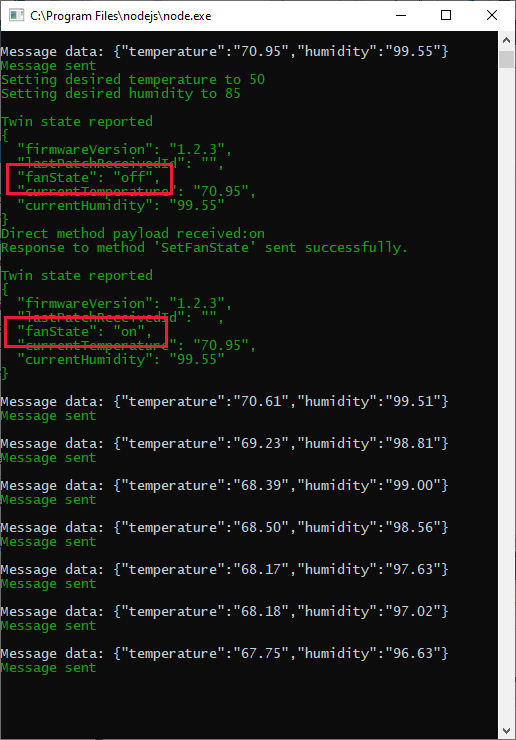
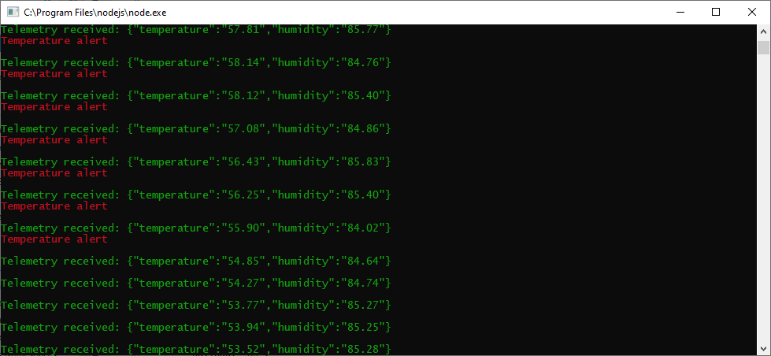

In this unit, we'll add some code to both the device app and back-end service app, to show device twin synchronization in operation.

## Add code to use device twins to synchronize device properties

We'll start this time with the back-end service app.

::: zone pivot="node"

1. Open the **app.js** file for the back-end app.
1. Add the following code to the end of the file. This code sets the desired temperature of the device to 50 degrees F, humidity to 85 percent, and sets two **tags** (information only available to the IoT Hub). To verify the tags, a call is made to query the device twins based on a SQL search.

    ```javascript
    // Locate the device twin via the Registry, then update some tags and properties.
    const registry = Registry.fromConnectionString(connectionString);

    registry.getTwin(deviceId, function (err, twin) {
        if (err) {
            redMessage(err.constructor.name + ': ' + err.message);
        } else {
            const desiredTemp = 50;
            const desiredHumidity = 85;
            const setDesiredValues = {

                // Tags aren't shared with the device, they are known only to IoT Hub.
                tags: {
                    customerID: 'Customer1',
                    cellar: 'Cellar1'
                },

                // Properties are shared with the device.
                properties: {
                    desired: {
                        patchId: "Set values",
                        temperature: desiredTemp.toString(),
                        humidity: desiredHumidity.toString()
                    }
                }
            };

            // Update the device twin.
            twin.update(setDesiredValues, function (err) {
                if (err) {
                    redMessage('Could not update twin: ' + err.constructor.name + ': ' + err.message);
                } else {
                    greenMessage(twin.deviceId + ' twin updated successfully');

                    // Show how a query to the device twins is handled.
                    queryTwins();
                }
            });
        }
    });

    function queryTwins() {

        // Send a SQL query, to determine all the devices in "Cellar1".
        const query = registry.createQuery("SELECT * FROM devices WHERE tags.cellar = 'Cellar1'", 100);
        query.nextAsTwin(function (err, results) {
            if (err) {
                redMessage('Failed to fetch the results: ' + err.message);
            } else {
                greenMessage("Devices in Cellar1: " + results.map(function (twin) { return twin.deviceId }).join(','));
            }
        });
    };
    ```

1. Save the **app.js** file.

::: zone-end
::: zone pivot="csharp"

1. Open the **Program.cs** file, for the back-end app.

1. Add the following code, perhaps to the end of the class.

    ```cs
        // Device twins section.
        private static RegistryManager registryManager;

        private static async Task SetTwinProperties()
        {
            var twin = await registryManager.GetTwinAsync("CheeseCaveID");
            var patch =
                @"{
                    tags: {
                        customerID: 'Customer1',
                        cellar: 'Cellar1'
                    },
                    properties: {
                        desired: {
                            patchId: 'set values',
                            temperature: '50',
                            humidity: '85'
                        }
                    }
            }";
            await registryManager.UpdateTwinAsync(twin.DeviceId, patch, twin.ETag);

            var query = registryManager.CreateQuery(
              "SELECT * FROM devices WHERE tags.cellar = 'Cellar1'", 100);
            var twinsInCellar1 = await query.GetNextAsTwinAsync();
            Console.WriteLine("Devices in Cellar1: {0}",
              string.Join(", ", twinsInCellar1.Select(t => t.DeviceId)));

        }
    ```

1. If you did not use the suggested "CheeseCaveID" device Id, change the `GetTwinAsync` call to use your device Id.

1. Now, add the following lines to the `Main` method, before the lines creating a service client.

    ```cs
            // A registry manager is used to access the digital twins.
            registryManager = RegistryManager.CreateFromConnectionString(s_serviceConnectionString);
            SetTwinProperties().Wait();
    ```

1. Save the **Program.cs** file.

::: zone-end

Now we need to add code to the device app.

## Add code to synchronize device twin settings for the device

::: zone pivot="node"

1. Open up the **app.js** file for the device.

1. Add the following code to the end of the file.

    ```javascript
    let deviceTwin;                                         // Global reference to device twin.

    // Create a patch to send to the hub.
    const reportedPropertiesPatch = {
        firmwareVersion: '1.2.3',
        lastPatchReceivedId: '',
        fanState: '',
        currentTemperature: '',
        currentHumidity: ''
    };

    // Send the reported properties patch to the hub.
    function sendReportedProperties() {

        // Prepare the patch.
        reportedPropertiesPatch.fanState = fanState;
        reportedPropertiesPatch.currentTemperature = currentTemperature.toFixed(2);
        reportedPropertiesPatch.currentHumidity = currentHumidity.toFixed(2);

        deviceTwin.properties.reported.update(reportedPropertiesPatch, function (err) {
            if (err) {
                redMessage(err.message);
            } else {
                greenMessage('\nTwin state reported');
                greenMessage(JSON.stringify(reportedPropertiesPatch, null, 2));
            }
        });
    }

    // Handle changes to the device twin properties.
    client.getTwin(function (err, twin) {
        if (err) {
            redMessage('could not get twin');
        } else {
            deviceTwin = twin;
            deviceTwin.on('properties.desired', function (v) {
                desiredTemperature = parseFloat(v.temperature);
                desiredHumidity = parseFloat(v.humidity);
                greenMessage('Setting desired temperature to ' + v.temperature);
                greenMessage('Setting desired humidity to ' + v.humidity);

                // Update the reported properties, after processing the desired properties.
                sendReportedProperties();
            });
        };
    });
    ```

1. Change the `onSetFanState` function, so the success section of the function reports the updated state of the fan. Add the following lines after the `response.send(200, 'Fan state set: ' + request.payload, directMethodResponse);` statement.

    ```javascript
            // Confirm changes to reported properties.
            sendReportedProperties();
    ```

1. Save the **app.js** file.

::: zone-end
::: zone pivot="csharp"

1. Open the **Program.cs** file for the device app.

1. Add the following task to the class.

    ```cs
        private static async Task OnDesiredPropertyChanged(TwinCollection desiredProperties, object userContext)
        {
            try
            {
                desiredHumidity = desiredProperties["humidity"];
                desiredTemperature = desiredProperties["temperature"];
                greenMessage("Setting desired humidity to " + desiredProperties["humidity"]);
                greenMessage("Setting desired temperature to " + desiredProperties["temperature"]);

                // Report the properties back to the IoT Hub.
                var reportedProperties = new TwinCollection();
                reportedProperties["fanstate"] = fanState.ToString();
                reportedProperties["humidity"] = desiredHumidity;
                reportedProperties["temperature"] = desiredTemperature;
                await s_deviceClient.UpdateReportedPropertiesAsync(reportedProperties);

                greenMessage("\nTwin state reported: " + reportedProperties.ToJson());
            }
            catch
            {
                redMessage("Failed to update device twin");
            }
        }
    ```

1. Update the `Main` method. Add the following lines after the statements creating a handler for the direct method.

    ```cs
            // Get the device twin to report the initial desired properties.
            Twin deviceTwin = s_deviceClient.GetTwinAsync().GetAwaiter().GetResult();
            greenMessage("Initial twin desired properties: " + deviceTwin.Properties.Desired.ToJson());

            // Set the device twin update callback.
            s_deviceClient.SetDesiredPropertyUpdateCallbackAsync(OnDesiredPropertyChanged, null).Wait();
    ```

1. Save the **Program.cs** file.

::: zone-end

>[!NOTE]
>Now you have added device twins to your app, you can reconsider having explicit variables such as  `desiredHumidity`. Instead, you can use the variables in the device twin object.

## Test the device twins

Now for our final code test of this module.

1. Start the telemetry running, by starting the device app.
1. Start the back-end service app.
1. Check the console window for the device app, confirming the device twin synchronized correctly.

    [](../media/cheesecave-device-twin-received.png#lightbox)

1. If we let the fan do its work, we should eventually get rid of those red alerts!

    [](../media/cheesecave-device-twin-success.png#lightbox)

The code given in this module isn't industrial quality. It does show how to use direct methods, and device twins. However, the messages are sent only when the back-end service app is first run. Typically, a back-end service app would require a browser interface, for an operator to send direct methods. Or set device twin properties, when required.

You've nearly completed this module. Just a summary and a knowledge check to go!
