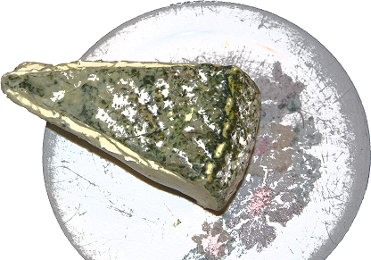

In this module, you learned how to:

- Create a custom Azure IoT Hub, using the Azure portal
- Create a device ID for a custom device, using the Azure portal
- Create an app to simulate a device monitoring a cheese cave
- Create an app to provide a back-end service to listen for the telemetry sent by the device
- Add code to both apps to provide a _direct method_
- Add code to both apps to show the role of _device twins_

## Clean up

When you're satisfied you don't need to return to the CheeseCaveHub, delete the device, then delete the hub. These options are available in your [Azure portal](https://ms.portal.azure.com/#home).

No need to delete your project code though, keep it for future reference!

## Next steps

Take your interest further with:

- [Azure IoT Hub Documentation](https://docs.microsoft.com/azure/iot-hub//)
- [Azure Certified for IoT device catalog](https://catalog.azureiotsolutions.com/)
- [Develop IoT Edge modules for Windows devices](https://docs.microsoft.com/azure/iot-edge/tutorial-develop-for-windows#set-up-visual-studio-and-tools)

And look out for additional Learn modules on IoT Hub.

## Learn more with a Channel 9 video series

- [IoT 101](https://channel9.msdn.com/Series/IoT-101/?&WT.mc_id=EducationalIoT-c9-niner&azure-portal=true)

To finish this module, and earn your rewards, complete a final knowledge check.
