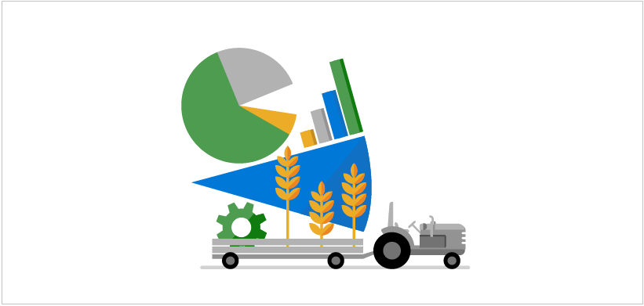
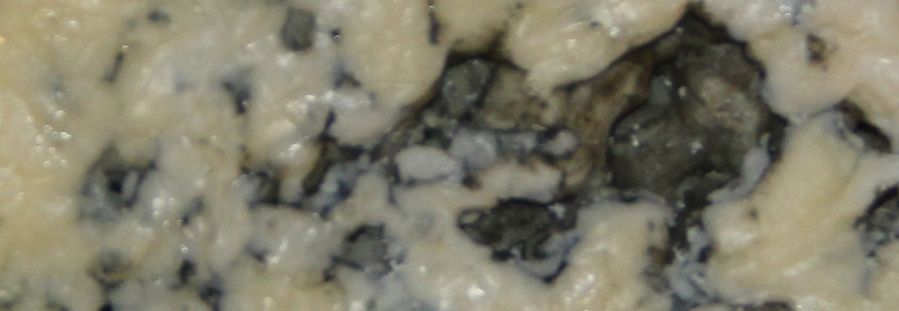

An Azure IoT Hub can handle large volumes of telemetry data, sent from many sensor devices. You can individually set up each device, to be certain of its authenticity. However, with many devices, this task would be onerous to say the least. The process of validating the authenticity of a device is known as "provisioning". In this module, we investigate the IoT Device Provisioning Service (DPS). A service that enables the near-automatic provisioning of any number of devices.

This module builds on the [Remotely monitor and control devices with Azure IoT Hub](/learn/modules/remotely-monitor-devices-with-azure-iot-hub/) module - a fun introduction to IoT Hub programming, using the example of a temperature and humidity sensor in a cheese cave. It isn't necessary to complete the introductory module before working on this module on security, though completing it will help your understanding of IoT Hub. The introductory module covers such concepts as _Device Twins_, and _Direct Methods_. These concepts aren't explained in detail in this module on security.

Security is a gnarly subject. However, it is more logical and understandable than you might think. Completing this module will give you a good foundation for making security decisions for your IoT-based projects.

## Learning objectives

In this module you will:

- Create a custom Azure IoT Hub, using the Azure portal
- Learn about device provisioning, X.509 certificates, and enrollments
- Create a DPS resource, and a group enrollment, using the Azure portal
- Create an X.509 root certificate, and multiple leaf certificates, using downloaded scripts
- Create an app to send device telemetry to your IoT Hub, using Visual Studio, or Visual Studio Code
- Test multiple IoT devices are provisioned by your DPS resource

## Prerequisites

- An introductory knowledge of Azure IoT
- Ability to navigate the Azure IoT portal
- Ability to use C#, at the beginner level
- Experience using Visual Studio, or Visual Studio Code, at the beginner level

## The scenario

The [Remotely monitor and control devices with Azure IoT Hub](/learn/modules/remotely-monitor-devices-with-azure-iot-hub/) module has one sensor in one cheese cave. The sensor ensures the cheese is maturing nicely to the ideal temperature and humidity for your particular brand.

Suppose you're the manager of the cheese cave maturing process. Your first cheese from the one cave has been a huge success. Your company has expanded rapidly and now has 30 cheese caves. Each cave is used to mature your best-selling cheese, but each cave is also in different locations throughout the country. Some of these caves provide near-ideal conditions without much involvement of a temperature/humidity setting fan. Other caves aren't so perfectly located, and require a fan to adjust the temperature and humidity, based on the telemetry output of a sensor.

If your cheese business carries on growing, you're going to need solutions that scale smoothly and effortlessly.

You decide on a single Azure IoT Hub to process the telemetry from all 30 sensors. You decide that commercial competition requires that your system is secure. You must be certain of each device before accepting its input. You decide to investigate Azure DPS as your security service.

Cheese making is a competitive business, and you want to keep your secrets well wrapped. And maybe your cheese too.

### The first step

The first step is to build an IoT Hub, using the Microsoft Azure portal.