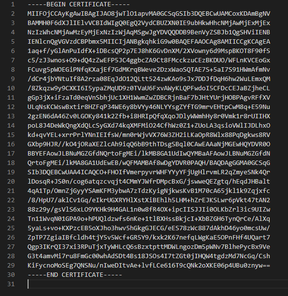

This module uses X.509 certificates to validate devices, before the devices are allowed to communicate with the IoT Hub. Let's go over some background information about these certificates.

## Introduction to the Device Provisioning Service and X.509 certificates

The basis of the X.509 certificate is the concept of public/private key encryption. As the key names suggest, one key is typically made public, and one kept private, or secret. Use of the keys for encryption distorts the text of a message into incomprehensible characters. If the public key is used to encrypt a message, then only the private key can be used to decrypt the message. If the private key is used to encrypt a message, then only the public key can be used to decrypt it. Public/private keys is a form of _asymmetric_ encryption. The public key cannot be used to derive the private key. The underlying math is known as _one way functions_. Asymmetric encryption is more secure than _symmetric_ encryption, where the same key is used to encrypt and decrypt a message.

To keep private keys secret, a _public key infrastructure_ (PKI) is needed to prevent the keys becoming lost or stolen. This infrastructure is potentially a disadvantage of the public/private key system. However, using X.509 certificates with the Azure Device Provisioning Service (DPS), a public key infrastructure is built into the service. Users of the service don't even need to know their own private keys. The private keys are generated by helper tools that are publicly available. The keys are stored in the X.509 certificates, and a user doesn't need to do much more than upload them to Azure DPS. A password protects the content of the private key.

To validate the authenticity of X.509 certificates, the certificates need to be _signed_. There are two ways of signing. You can use an organization known as a _Certificate Authority_ (or, CA) that specializes in supplying signed certificates. This approach might be the right way to go in a production environment, though there can be a cost involved. The alternative is known as _self-signed_ certificates, where the user validates their own certificates. There's no cost to this second option, though as you would be relying on publicly available tools, this system isn't recommended for production. For our purposes in this module, self-signed certificates will work fine.

The name "X.509" originates from the format the certificate is stored in. If you open the certificate file, it will look like the following image. In addition to the key, the certificate contains metadata such as version, encoding algorithm, issuers ID, and similar data. For most of us though, the contents of a certificate are a _black box_, and can stay that way!

With the X.509 certificates and the PKI, there's no need to distribute the public keys when creating key pairs. Another advantage is the PKI can maintain a list of invalidated certificates, so authentication can be centrally revoked.

There's a bit more to the X.509 story that you need to know, as it's central to our sample.

### Root, intermediate, and leaf certificates

There's perhaps a third way of signing certificates. That is, a certificate can be used to validate another certificate. Such a certificate is known as a _root certificate_, or sometimes a _trust anchor_. This one certificate isn't used to validate any devices, for example, but is only used to validate a range of subordinate certificates.

These subordinate certificates can be _intermediate certificates_. An intermediate certificate is again not used to validate devices, but only to validate other intermediate certificates, or validate _leaf_ certificates. We'll not be using any intermediate certificates in our sample.

A leaf certificate, as its name suggests, is the end-entity certificate that is used to validate a device. Leaf certificates can't be used to validate other certificates. A root certificate can be used to validate any number of intermediate, or leaf, certificates.

In our sample, we'll generate one root certificate for all our devices. From that root, we'll generate one leaf certificate for _each_ device that we'll be connecting to the IoT Hub.

All these certificates will be self-signed.

Cryptography is a complex technology, that goes deep into mathematics, so isn't for everyone. Follow the links on the **Summary** page of this module, if you're interested in a deeper introduction than we have given here. For the record, X.509 certification is the basis of the secure HTTPS protocol - for secure browsing of the internet.

Suffice to conclude that public/private key technology is state-of-the-art security, and by using X.509 certificates correctly, you can be confident your IoT Hub is secure. Secure against an invalid device supplying invalid data, and secure against a denial-of-service type attack. However, no security is perfect, and doing your own research on certification is recommended.

An Azure Device Provisioning Service can be linked to one, or more, IoT Hubs, and can be thought of as a system for managing your certificates and your enrollments.

### Individual and group enrollments

An Azure DPS can contain a number of individual, or group, enrollments. In our scenario, the group enrollment provides the solution we're looking for. One enrollment group works with one root certificate, and any number of leaf certificates signed by this root. An enrollment maintains information on all the devices that have tried to register.

Individual enrollments are best used for devices that have a unique configuration, and require greater security than the connection strings you may have used in other Learn modules or Azure samples. Unique configurations aren't what we're looking for in our scenario, where we have many sensors configured to provide an identical format of telemetry data.

Another concept you'll see when we create an Azure DPS resource, is that of _allocation policy_. This policy isn't something we delve into. Allocation policies only apply when you've multiple IoT Hubs handling telemetry from a huge number of devices, and want to direct the incoming data to one of these hubs based on a policy.

After creating your enrollments, and self-signed root certificate, there's one more process necessary to prove to the provisioning service that you own the root certificate.

### Proof of possession

When uploading certificates to Azure DPS, you'll be asked to generate a verification code.

_Proof of Possession_ of a certificate is provided to DPS by uploading a _verification_ certificate generated from the root certificate with this verification code. The verification certificate is _chained_ to the root certificate.

This process is how you provide proof that you own the root certificate. There's no need to provide proof of possession of the leaf certificates, as, if you own the root, trust has been established.

### Another level of security

Sensitive data, such as the certificates, could be stored in a Hardware Security Module (HSM). HSMs are physical devices, either in the form of an external drive, or an internal plug-in card. HSMs are designed to safeguard digital keys, and a cryptoprocessor chip is part of the device. These devices are connected directly to a network server. An alternative, and well suited to storing passwords, and other secret data, is the Azure Key Vault resource. This resource ensures apps have no direct access to the secret data. For more information on both of these options, follow the links on the Summary page.

### Next step

That summary should be enough theory. For the next step, let's create an Azure DPS resource, and then all the necessary certificates.