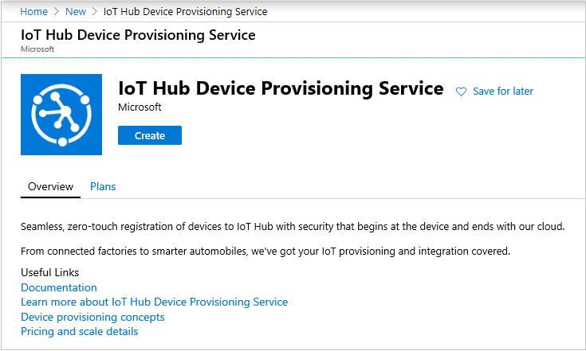
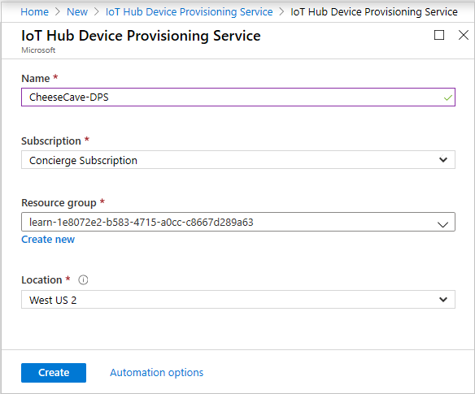
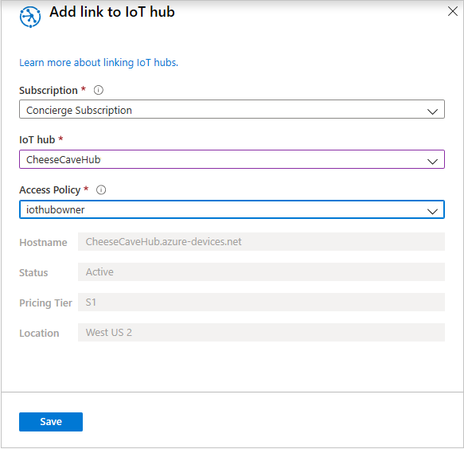

A Device Provisioning Service (DPS) can be linked to one or more hubs. It's a separate resource, and is independent of any one IoT Hub. You create a DPS resource the same way you create any other Azure resource.

## Create an Azure IoT Hub Device Provisioning Service

1. From your [Azure portal](https://portal.azure.com/learn.docs.microsoft.com?azure-portal=true) **Home** page, under **Azure services**, select **Create a resource**. The **Create a resource** pane appears.

1. In the *Search services and marketplace* search box, enter *provisioning*, and select **IoT Hub Device Provisioning Service**. The **IoT Hub Device Provisioning Service** pane appears.

1. Select **Create**.

    [](../media/iot-hub-provisioning-resource-create.png#lightbox)

    The **IoT Hub device provisioning service** pane appears.

1. On the **Basics** tab, enter the following values for each setting.

    | Setting | Value |
    |---|---|
    | **Project details** |
    | Subscription | Concierge Subscription |
    | Resource group | From the dropdown list, select <rgn>[sandbox resource group name]</rgn>. |
    | **Instance details** |
    | Name | Enter a friendly name (for example, *CheeseCaveHub-DPS*) |
    | Region | Choose a location close to you. |

    [](../media/iot-hub-provisioning-resource-name.png#lightbox)

1. Select **Review + create**.

1. After validation passes, select **Create**. Wait for it to deploy. It can take a minute or two for the deployment message to appear.

1. After deployment completes, select **Go to resource**. Your **Device Provisioning Service** pane appears for CheeseCave-DPS.

### Link the DPS resource to your IoT Hub

1. In the left menu pane, under **Settings**, select **Linked IoT hubs**. The **Linked IoY hubs** pane appears for your DPS.

1. In the top menu bar, select **Add**. The **Add link to IoT hub** pane appears.

1. Enter the following values for each setting.

    | Setting | Value |
    |---|---|
    | Subscription | Concierge Subscription |
    | IoT hub | From the dropdown list, select your IoT hub. |
    | Access Policy | From the dropdown list, select **iothubowner**. |

1. Select **Save**.

    [](../media/iot-hub-provisioning-resource-hub-link.png#lightbox)

    The **Linked IoT hubs** pane appears.

1. In the left menu pane, under **Settings**, select **Manage allocation policy**. The **Manage allocation policy** pane appears.

1. Verify the policy is set to **Evenly weighted distribution**.

    [](../media/iot-hub-provisioning-resource-policy.png#lightbox)

1. In the left menu pane, select **Overview**. Your **DPS** pane reappears.

1. In the **Essentials** section, copy the **ID Scope** string to a text file.

    We recommend bookmarking a link to the **Overview** page of this resource.

Before we can go any further with the DPS resource, by adding enrollments, we must first create a root certificate.

## Create an X.509 root certificate

The first time we create any X.509 certificates, we need to download some tools.

1. Right-click [Microsoft Azure Cloud Shell](https://shell.azure.com/?prompt=True), and select **Open link in new window**.

    > [!NOTE]
    > If you are given a choice, there is no need to choose sandbox Cloud Shell, as we are not creating any resources.

1. Ensure the **Bash** shell option is selected. We need the Bash option, as the helper tools that you'll download next are written for Bash.

1. Run the following script. It creates a certificate directory in the shell storage, and downloads some helper scripts to it.

    ```azurecli
     # create certificates directory
     mkdir certificates
     # navigate to certificates directory
     cd certificates
    
     # download helper script files
     curl https://raw.githubusercontent.com/Azure/azure-iot-sdk-c/master/tools/CACertificates/certGen.sh --output certGen.sh
     curl https://raw.githubusercontent.com/Azure/azure-iot-sdk-c/master/tools/CACertificates/openssl_device_intermediate_ca.cnf --output openssl_device_intermediate_ca.cnf
     curl https://raw.githubusercontent.com/Azure/azure-iot-sdk-c/master/tools/CACertificates/openssl_root_ca.cnf --output openssl_root_ca.cnf
    
     # update script permissions so user can read, write, and execute it
     chmod 700 certGen.sh

    ```

    These helper scripts are downloaded from the _Azure/azure-iot-sdk-c_ open-source project hosted on GitHub. This project is a part of the Azure IoT SDK. The _certGen.sh_ helper script will help demonstrate the purpose of CA Certificates without diving into the specifics of OpenSSL configuration. If you need additional instructions about using these helper scripts, or for instructions about how to use PowerShell instead of Bash, see [CACertificateOverview](https://github.com/Azure/azure-iot-sdk-c/blob/master/tools/CACertificates/CACertificateOverview.md).

    >[!WARNING]
    >Do not use these helper scripts in a production environment, as the scripts contain hardcoded passwords that expire after 30 days. The scripts are provided only for demo purposes.

1. Run the following command to generate root and intermediate certificates. We're only interested in the root certificate, which will be named `azure-iot-test-only.root.ca.cert.pem`.

    ```azurecli
     ./certGen.sh create_root_and_intermediate

    ```

1. We need to download the root certificate to your local machine, to then upload it to Azure DPS. Run the following command.

    ```azurecli
     download ~/certificates/certs/azure-iot-test-only.root.ca.cert.pem

    ```

    >[!NOTE]
    >Downloaded files will be saved to your `Downloads` folder.

1. Create a new folder in your **Documents** folder, called "cheese cave certs", or something similar.

1. Copy the certificate file you downloaded into the **cheese cave certs** folder.

### Configure Azure DPS to trust the root certificate

1. In the Azure portal, go to the cheese cave DPS resource you created earlier.

1. In the left menu pane, under **Settings**, select **Certificates**. The **Certificates** pane appears.

1. In the top menu bar, select **Add**. The **Add Certificate** pane appears.

1. Enter the following values for each setting.

    | Setting | Value |
    |---|---|
    | Certificate name | Enter an understandable name, such as *cheesecave-dps-root*. The name doesn't have to be the same as the certificate filename. |
    | Certificate .pem or .cer file. | Go to the **cheese cave certs** folder, and select the **azure-iot-test-only.root.ca.cert.pem** file that you downloaded. |

1. Select **Save**.

After the root certificate has been uploaded, the **Certificates** pane will display the certificate with the **Status** of *Unverified*. Before this CA Certificate can be used to authenticate devices to DPS, you'll need to establish _Proof of Possession_ of the certificate.

### Establish your Proof of Possession

1. In the **Certificates** pane, select the certificate. The **Certificate** (flyout) pane appears.

1. Select **Generate verification code**.

1. Copy the **Verification Code** that appears above the **Generate verification code** button. Use the *Copy to clipboard* icon to the right of the text box to copy the code for you. Open a text editor, such as Notepad, and paste the verification code.

    Proof of Possession of the CA certificate is provided to DPS by uploading a verification certificate generated from the root certificate. The verification certificate contains the verification code you just generated.

1. Keep the **Certificate** (flyout) pane open while you generate the verification certificate. If you close the pane, you'll invalidate the verification code, and will need to generate a new one.

1. Copy the following command to the text file containing the verification code, and change `<verification-code>` to the actual code.

    ```azurecli
     ./certGen.sh create_verification_certificate <verification-code>
    ```

1. Returning to Cloud Shell, and in the **certificates** directory, run the completed command. This command generates a verification certificate that is chained to the root certificate. The generated certificate is named `verification-code.cert.pem`, and is located within the **./certs** directory of the Cloud Shell.

1. Run the following command to download the verification certificate to your local machine.

    ```azurecli
    download ~/certificates/certs/verification-code.cert.pem
    
    ```

1. Copy the downloaded file to your **cheese cave certs** folder.

1. Change focus back to the **Certificate** (flyout) pane of the Azure portal. For the **Verification Certificate .pem or .cer file** field, go to and select the `verification-code.cert.pem` file.

1. Select **Verify**.

1. In the **Certificates** pane, check that the status for the certificate now appears as **Verified**. You may need to use the refresh button at the top of the pane to see this change.

Great progress! You've created a root certificate, and validated to Azure DPS that you own it. The next step is to create a **Group Enrollment**, and link it to the root certificate.

### Create a Group Enrollment in Azure DPS

1. In the Azure portal, select your DPS resource.

1. In the left menu pane, under **Settings**, select **Manage enrollments**. The **Manage enrollments** pane appears.

1. In the top menu bar, select **Add enrollment group**. The **Add Enrollment Group** pane appears. Make sure you're adding a group, and not an individual enrollment.

1. Enter the following values for each setting.

    | Setting | Value |
    |---|---|
    | Group name | Enter *cheesecave-devices*. |
    | Attestation Type | Ensure it is set to **Certificate**. |
    | Certificate Type | Ensure it is set to **CA Certificate**. |
    | Primary Certificate | In the dropdown list, select your CA certificate. This certificate will be **cheesecave-dps-root**, if you used the suggested name. |
    | Secondary Certificate | Accept default, **No certificate selected**. You're not required to have a secondary certificate. |
    | Select how you want to assign devices to hubs | **Evenly weighted distribution**. As you only have one IoT Hub associated with the enrollment, this setting is unimportant. |
    | Select the IoT hubs this group can be assigned to | Verify your IoT Hub is selected. |
    | Select how you want device data to be handled on re-provisioning | Accept default. |

1. In the top menu bar, select **Save**. The **Manage enrollments** pane reappears.

1. Verify your new enrollment group appears under the **Enrollment Groups** tab in the **GROUP NAME** section.

A group enrollment is going to be very useful in handling remote devices at scale. In the next unit, we create multiple leaf certificates.
