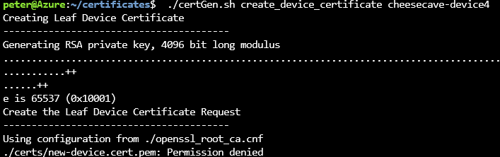

In this unit, we need to create one leaf certificate for each device that we want to send telemetry to the hub. As the saying goes, "two is company, three is a crowd." So, let's create code for a *crowd* of devices. Remember, in our scenario description we stated that there were now 30 cheese caves, requiring 30 sensor devices. Let's limit this number to three for the sake of explanation and testing!

1. In Cloud Shell, make sure you're in the **certificates** folder.

1. Run the following command:

    ```azurecli
     ./certGen.sh create_device_certificate cheesecave-device1

    ```

1. Verify the leaf certificate was created correctly. You should see numerous console messages, ending in something like the following image.

    [](../media/iot-hub-provisioning-cert-create1.png#lightbox)

1. To download the created certificate to your local machine, enter:

    ```azurecli
    download ~/certificates/certs/new-device.cert.pfx

    ```

1. Copy the **new-device.cert.pfx** file, from its downloaded location in your `Downloads` folder, into the **cheese cave certs** folder, and rename it **new-device.cert1.pfx**.

1. In Cloud Shell, delete the **new-device.cert** files. This step is important so the tools can be used to create further certificates. You can delete the file in the **certificates/certs** folder, by going through the following procedure:
    1. Enter `cd certs`.
    1. Enter `rm new*`.
    1. Answer `y` to the question on the protected file.
    1. Enter `cd ..`.

1. In Cloud Shell, create a second leaf certificate:

    ```azurecli
     ./certGen.sh create_device_certificate cheesecave-device2

    ```

1. If you get a `Permission denied` response, similar to the following, verify you've deleted the earlier certificates correctly.

    [](../media/iot-hub-provisioning-cert-denied.png#lightbox)

1. To download the second certificate to your local machine, enter:

    ```azurecli
    download ~/certificates/certs/new-device.cert.pfx

    ```

1. Copy the **new-device.cert.pfx** file from its downloaded location into the **cheese cave certs** folder, and rename it **new-device.cert2.pfx**.

1. In Cloud Shell, delete the **new-device.cert** files:
    1. Type `cd certs`.
    1. Type `rm new*`.
    1. Answer `y` to the question on the protected file.
    1. Type `cd ..`.

1. In Cloud Shell, create a third leaf certificate:

    ```azurecli
     ./certGen.sh create_device_certificate cheesecave-device3

    ```

1. Tp download the third certificate to your local machine, enter:

    ```azurecli
    download ~/certificates/certs/new-device.cert.pfx

    ```

1. Copy the **new-device.cert.pfx** file from its downloaded location into the **cheese cave certs** folder, and rename it **new-device.cert3.pfx**.

Great! You now have three leaf certificates. The next step is to write some code to simulate each device.
