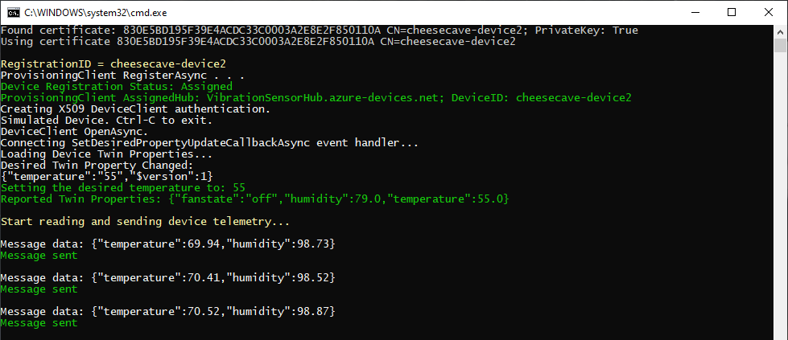

In this unit, we create the code running on each sensor device.

One of the goals is to make the code as identical as possible for each device, so minimizing human involvement. The code will require one tweak as we prepare it for a second device, the path to the leaf certificate needs to be unique for each device. Unique in this case means changing a "1" to a "2" or "3". This change is so minor it could easily be automated in a production environment.

The code is written in C#, and you can choose Visual Studio, or Visual Studio Code, as your development environment.

## Create a project for one simulated device

::: zone pivot="vscode"

1. To use C# in Visual Studio Code, ensure both [.NET Core](https://dotnet.microsoft.com/download), and the [C# extension](https://marketplace.visualstudio.com/items?itemName=ms-vscode.csharp) are installed.

1. Open a terminal in Visual Studio Code, and create a folder called "CaveDevice1" (enter `mkdir CaveDevice1`). Navigate to the `CaveDevice1` folder.

1. Enter the following command in the terminal: `dotnet new console`. This command creates a **Program.cs** file in your folder, along with a project file.

1. Enter `dotnet restore` in the terminal. This command gives your app access to the required .NET packages.

1. In the terminal, install the required libraries. Enter:
    - **dotnet add package Microsoft.Azure.Devices.Client**
    - **dotnet add package Microsoft.Azure.Devices.Provisioning.Client**
    - **dotnet add package Microsoft.Azure.Devices.Provisioning.Transport.Amqp**

1. From the **File** menu, open up the **Program.cs** file, and delete the default contents. You'll have to navigate to the `CaveDevice1` folder.

1. After you've entered the code below into the **Program.cs** file, you can run the app with the command `dotnet run`. This command will run the **Program.cs** file in the current folder, so ensure you are in the `CaveDevice1` folder.

::: zone-end
::: zone pivot="vstudio"

1. Open Visual Studio, and create a new **Visual C#/Windows Desktop** project. Select **Console App (.NET Framework)**.

1. Give the project a friendly name, such as "CaveDevice1".

1. Under **Tools**, then **NuGet Package Manager**, select **Manage NuGet Packages for Solution**. Click **Browse**, and search for, and install, the following libraries:
    - **Microsoft.Azure.Devices.Client**
    - **Microsoft.Azure.Devices.Provisioning.Client**
    - **Microsoft.Azure.Devices.Provisioning.Transport.Amqp**

1. Delete the default contents of the **Program.cs** file.

1. Add all the code that follows to the **Program.cs** file.

::: zone-end

> [!NOTE]
> This module doesn't require you to download any code. However, all of the code is available from [Learn module: Automatically provision IoT devices securely and at scale with DPS](https://github.com/MicrosoftDocs/mslearn-automatically-provision-iot-devices-securely-and-at-scale-with-dps), if needed.

### Add code to send telemetry

This section adds code to send telemetry from a simulated sensor device.

1. Open the **Program.cs** file for the device app.

1. Copy and paste the following code.

    ```cs
    // Copyright (c) Microsoft. All rights reserved.
    // Licensed under the MIT license. See LICENSE file in the project root for full license information.
    
    using Microsoft.Azure.Devices.Client;
    using Microsoft.Azure.Devices.Provisioning.Client;
    using Microsoft.Azure.Devices.Provisioning.Client.Transport;
    using Microsoft.Azure.Devices.Shared;
    using System;
    using System.Text;
    using System.Threading.Tasks;
    using System.IO;
    using Newtonsoft.Json;
    using System.Security.Cryptography.X509Certificates;
    
    namespace X509CertificateSimulatedDevice
    {
        class Program
        {
            // Azure Device Provisioning Service (DPS) Global Device Endpoint.
            private const string GlobalDeviceEndpoint = "global.azure-devices-provisioning.net";
    
            // Azure Device Provisioning Service (DPS) ID Scope.
            private static string dpsIdScope = "<your DPS ID Scope>";
    
            // Certificate (PFX) File Name.
            private static string s_certificateFileName = "<your leaf path>";
    
            // Certificate (PFX) Password. Better to use a Hardware Security Module for production devices.
            private static string s_certificatePassword = "1234";
    
            public static int Main(string[] args)
            {
                X509Certificate2 certificate = LoadProvisioningCertificate();
    
                using (var security = new SecurityProviderX509Certificate(certificate))
                {
                    using (var transport = new ProvisioningTransportHandlerAmqp(TransportFallbackType.TcpOnly))
                    {
                        ProvisioningDeviceClient provClient =
                            ProvisioningDeviceClient.Create(GlobalDeviceEndpoint, dpsIdScope, security, transport);
    
                        var provisioningDeviceLogic = new ProvisioningDeviceLogic(provClient, security);
                        provisioningDeviceLogic.RunAsync().GetAwaiter().GetResult();
                    }
                }
    
                return 0;
            }
    
            private static X509Certificate2 LoadProvisioningCertificate()
            {
                var certificateCollection = new X509Certificate2Collection();
                certificateCollection.Import(s_certificateFileName, s_certificatePassword, X509KeyStorageFlags.UserKeySet);
    
                X509Certificate2 certificate = null;
    
                foreach (X509Certificate2 element in certificateCollection)
                {
                    Console.WriteLine($"Found certificate: {element?.Thumbprint} {element?.Subject}; PrivateKey: {element?.HasPrivateKey}");
                    if (certificate == null && element.HasPrivateKey)
                    {
                        certificate = element;
                    }
                    else
                    {
                        element.Dispose();
                    }
                }
    
                if (certificate == null)
                {
                    throw new FileNotFoundException($"{s_certificateFileName} did not contain any certificate with a private key.");
                }
    
                Console.WriteLine($"Using certificate {certificate.Thumbprint} {certificate.Subject}");
                return certificate;
            }
        }
    
        // The ProvisioningDeviceLogic class contains the device logic to read from the simulated Device Sensors, and send Device-to-Cloud
        // messages to the Azure IoT Hub. It also contains the code that updates the device with changes to the device twin properties.
        public class ProvisioningDeviceLogic
        {
            readonly ProvisioningDeviceClient _provClient;
            readonly SecurityProvider _security;
            DeviceClient s_deviceClient;
    
            // Global constants.
            const float ambientTemperature = 70;                    // Ambient temperature of a southern cave, in degrees F.
            const double ambientHumidity = 99;                      // Ambient humidity in relative percentage of air saturation.
            const double desiredTempLimit = 5;                      // Acceptable range above or below the desired temp, in degrees F.
            const double desiredHumidityLimit = 10;                 // Acceptable range above or below the desired humidity, in percentages.
            const int intervalInMilliseconds = 5000;                // Interval at which telemetry is sent to the cloud.
            enum stateEnum
            {
                off,
                on,
                failed
            }
    
            // Global variables.
            private static stateEnum fanState = stateEnum.off;                      // Initial setting of the fan. 
            private static double desiredTemperature = ambientTemperature - 10;     // Initial desired temperature, in degrees F. 
            private static double desiredHumidity = ambientHumidity - 20;           // Initial desired humidity in relative percentage of air saturation.
    
            public ProvisioningDeviceLogic(ProvisioningDeviceClient provisioningDeviceClient, SecurityProvider security)
            {
                _provClient = provisioningDeviceClient;
                _security = security;
            }
    
            private static void colorMessage(string text, ConsoleColor clr)
            {
                Console.ForegroundColor = clr;
                Console.WriteLine(text);
                Console.ResetColor();
            }
            private static void greenMessage(string text)
            {
                colorMessage(text, ConsoleColor.Green);
            }
    
            private static void redMessage(string text)
            {
                colorMessage(text, ConsoleColor.Red);
            }
    
            private static void whiteMessage(string text)
            {
                colorMessage(text, ConsoleColor.White);
            }
    
            public async Task RunAsync()
            {
                colorMessage($"\nRegistrationID = {_security.GetRegistrationID()}", ConsoleColor.Yellow);
    
                // Register the Device with DPS.
                whiteMessage("ProvisioningClient RegisterAsync . . . ");
                DeviceRegistrationResult result = await _provClient.RegisterAsync().ConfigureAwait(false);
    
                if (result.Status == ProvisioningRegistrationStatusType.Assigned)
                {
                    greenMessage($"Device Registration Status: {result.Status}");
                    greenMessage($"ProvisioningClient AssignedHub: {result.AssignedHub}; DeviceID: {result.DeviceId}");
                }
                else
                {
                    redMessage($"Device Registration Status: {result.Status}");
                    throw new Exception($"DeviceRegistrationResult.Status is NOT 'Assigned'");
                }
    
                // Create x509 DeviceClient Authentication.
                whiteMessage("Creating X509 DeviceClient authentication.");
                var auth = new DeviceAuthenticationWithX509Certificate(result.DeviceId, (_security as SecurityProviderX509).GetAuthenticationCertificate());
    
                whiteMessage("Simulated Device. Ctrl-C to exit.");
                using (s_deviceClient = DeviceClient.Create(result.AssignedHub, auth, TransportType.Amqp))
                {
                    // Explicitly open DeviceClient to communicate with Azure IoT Hub.
                    whiteMessage("DeviceClient OpenAsync.");
                    await s_deviceClient.OpenAsync().ConfigureAwait(false);
    
                    // Setup OnDesiredPropertyChanged Event Handling to receive Desired Properties changes.
                    whiteMessage("Connecting SetDesiredPropertyUpdateCallbackAsync event handler...");
                    await s_deviceClient.SetDesiredPropertyUpdateCallbackAsync(OnDesiredPropertyChanged, null).ConfigureAwait(false);
    
                    // Load Device Twin Properties since device is just starting up.
                    whiteMessage("Loading Device Twin Properties...");
                    var twin = await s_deviceClient.GetTwinAsync().ConfigureAwait(false);
                    // Use OnDesiredPropertyChanged event handler to set the loaded Device Twin properties.
                    await OnDesiredPropertyChanged(twin.Properties.Desired, null);
    
                    // Start reading and sending device telemetry.
                    colorMessage("\nStart reading and sending device telemetry...\n", ConsoleColor.Yellow);
                    await SendDeviceToCloudMessagesAsync2(s_deviceClient);
    
                    // Explicitly close DeviceClient.
                    whiteMessage("DeviceClient CloseAsync.");
                    await s_deviceClient.CloseAsync().ConfigureAwait(false);
                }
            }
            private async Task OnDesiredPropertyChanged(TwinCollection desiredProperties, object userContext)
            {
                whiteMessage("Desired Twin Property Changed:");
                whiteMessage($"{desiredProperties.ToJson()}");
    
                // Read the desired Twin Properties.
                if (desiredProperties.Contains("fanstate") & fanState != stateEnum.failed)
                {
                    string desiredFanState = desiredProperties["fanstate"];
                    desiredFanState = desiredFanState.ToLower();
                    if (desiredFanState == "on" || desiredFanState == "off")
                    {
                        fanState = (stateEnum)Enum.Parse(typeof(stateEnum), desiredFanState);
                        greenMessage($"Set the fan to: {desiredFanState}");
                    }
                    else
                    {
                        redMessage($"Illegal fan state received: {desiredFanState}");
                    }
                }
    
                if (desiredProperties.Contains("temperature"))
                {
                    string desiredTemperatureString = desiredProperties["temperature"];
                    try
                    {
                        desiredTemperature = double.Parse(desiredTemperatureString);
                        greenMessage($"Setting the desired temperature to: {desiredTemperatureString}");
                    }
                    catch
                    {
                        redMessage($"Illegal temperature received: {desiredTemperatureString}");
                    }
                }
    
                if (desiredProperties.Contains("humidity"))
                {
                    string desiredHumidityString = desiredProperties["humidity"];
                    try
                    {
                        desiredHumidity = double.Parse(desiredHumidityString);
                        greenMessage($"Setting the desired humidity to: {desiredHumidityString}");
                    }
                    catch
                    {
                        redMessage($"Illegal humidity received: {desiredHumidityString}");
                    }
                }
    
                // Report Twin properties.
                var reportedProperties = new TwinCollection();
                reportedProperties["fanstate"] = fanState.ToString();
                reportedProperties["humidity"] = desiredHumidity;
                reportedProperties["temperature"] = desiredTemperature;
                await s_deviceClient.UpdateReportedPropertiesAsync(reportedProperties).ConfigureAwait(false);
                greenMessage($"Reported Twin Properties: {reportedProperties.ToJson()}");
            }
    
            // Async method to send simulated telemetry.
            private async Task SendDeviceToCloudMessagesAsync2(DeviceClient deviceClient)
            {
    
                double currentTemperature = ambientTemperature;         // Initial setting of temperature.
                double currentHumidity = ambientHumidity;               // Initial setting of humidity.
    
                Random rand = new Random();
    
                while (true)
                {
                    // Simulate telemetry.
                    double deltaTemperature = Math.Sign(desiredTemperature - currentTemperature);
                    double deltaHumidity = Math.Sign(desiredHumidity - currentHumidity);
    
                    if (fanState == stateEnum.on)
                    {
                        // If the fan is on the temperature and humidity will be nudged towards the desired values most of the time.
                        currentTemperature += (deltaTemperature * rand.NextDouble()) + rand.NextDouble() - 0.5;
                        currentHumidity += (deltaHumidity * rand.NextDouble()) + rand.NextDouble() - 0.5;
    
                        // Randomly fail the fan.
                        if (rand.NextDouble() < 0.01)
                        {
                            fanState = stateEnum.failed;
                            redMessage("Fan has failed");
                        }
                    }
                    else
                    {
                        // If the fan is off, or has failed, the temperature and humidity will creep up until they reaches ambient values, 
                        // thereafter fluctuate randomly.
                        if (currentTemperature < ambientTemperature - 1)
                        {
                            currentTemperature += rand.NextDouble() / 10;
                        }
                        else
                        {
                            currentTemperature += rand.NextDouble() - 0.5;
                        }
                        if (currentHumidity < ambientHumidity - 1)
                        {
                            currentHumidity += rand.NextDouble() / 10;
                        }
                        else
                        {
                            currentHumidity += rand.NextDouble() - 0.5;
                        }
                    }
    
                    // Check: humidity can never exceed 100%.
                    currentHumidity = Math.Min(100, currentHumidity);
    
                    // Create JSON message.
                    var telemetryDataPoint = new
                    {
                        temperature = Math.Round(currentTemperature, 2),
                        humidity = Math.Round(currentHumidity, 2)
                    };
                    var messageString = JsonConvert.SerializeObject(telemetryDataPoint);
                    var message = new Message(Encoding.ASCII.GetBytes(messageString));
    
                    // Add custom application properties to the message.
                    message.Properties.Add("sensorID", "S1");
                    message.Properties.Add("fanAlert", (fanState == stateEnum.failed) ? "true" : "false");
    
                    // Send temperature or humidity alerts, only if they occur.
                    if ((currentTemperature > desiredTemperature + desiredTempLimit) || (currentTemperature < desiredTemperature - desiredTempLimit))
                    {
                        message.Properties.Add("temperatureAlert", "true");
                    }
                    if ((currentHumidity > desiredHumidity + desiredHumidityLimit) || (currentHumidity < desiredHumidity - desiredHumidityLimit))
                    {
                        message.Properties.Add("humidityAlert", "true");
                    }
    
                    colorMessage($"Message data: {messageString}", ConsoleColor.White);
    
                    // Send the telemetry message
                    await deviceClient.SendEventAsync(message);
                    greenMessage("Message sent\n");
    
                    await Task.Delay(intervalInMilliseconds);
                }
            }
        }
    }
    ```

1. Change the `<your DPS ID Scope>` string to your actual DPS **ID Scope**, that you saved off in an earlier unit.

    > [!NOTE]
    > The `dpsIdScope` string is identical for all devices connected to this DPS resource.

1. Change the `<your leaf path>` to the actual path to your leaf certificate. You can do this by replacing the line of code containing this string, with the following statement. You will have to replace `<your user name>` with your actual user name.

    ```csharp
          private static string s_certificateFileName = "C:\\Users\\<your user name>\\Documents\\cheese cave certs\\new-device.cert1.pfx";
    ```

1. Set the app running. In Visual Studio Code, enter `dotnet run` in the terminal. In Visual Studio, select **Debug/Start without Debugging**.

    [](../media/iot-hub-provisioning-device1.png#lightbox)

### Create an app for a second device

1. Repeat all the steps in the **Create a project for a simulated device** section, except with a new project name: "CaveDevice2".
1. Change the leaf name from `new-device.cert1.pfx` to `new-device.cert2.pfx`.
1. Set the app running.

    [](../media/iot-hub-provisioning-device2.png#lightbox)

### Create an app for a third device

1. Repeat all the steps in the **Create a project for a simulated device** section, except with a new project name: "CaveDevice3".
1. Change the leaf path from `new-device.cert1.pfx` to `new-device.cert3.pfx`.
1. Set the app running.

    [](../media/iot-hub-provisioning-device3.png#lightbox)

Great, a bit of repetitive work, but we now have our crowd of devices. The next, and final, step is to test our DPS resource and IoT Hub handle the assignments and telemetry correctly.
