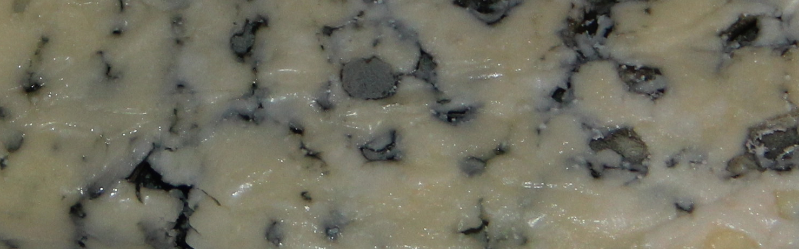

Completing this module should have shed valuable light into the dark world of cryptography and message security. If you're new to this world, you'll appreciate the thought and design that has gone into X.509 certificates, and Azure DPS Group Enrollments. You'll see how these technologies neatly map the root and leaf X.509 certificates to an IoT Hub, and its range of IoT devices. You'll also appreciate how well these technologies make security user-friendly enough for those of us who don't want to know too much about the underlying logic.

In short, you've learnt how to keep your cheese maturing practices a secret!

In this module, you learned how to:

- Create a custom Azure IoT Hub, using the Azure portal
- Create a DPS resource, and a group enrollment, using the Azure portal
- Create root and leaf X.509 certificates
- Create an app to send device telemetry to your IoT Hub, using Visual Studio, or Visual Studio Code
- Test multiple IoT devices are provisioned by your DPS service

## Next steps

Learn about storing passwords and certificates:

- [Azure Key Vault](https://azure.microsoft.com/services/key-vault/)
- [Azure Dedicated HSM](https://azure.microsoft.com/services/azure-dedicated-hsm/)

Learn more about IoT Hub:

- [IoT Hub Documentation](/azure/iot-hub/)
- [Set up X.509 security in your Azure IoT hub](/azure/iot-hub/iot-hub-security-x509-get-started)

Learn more about IoT Hub devices:

- [Find your IoT device](https://catalog.azureiotsolutions.com/)

Learn more about X.509 certificates:

- [X.509 Digital Certification](/windows/win32/seccrypto/x-509-digital-certification)

To complete this module, there's a slightly _harder-than-usual_ knowledge check. Good luck with it!