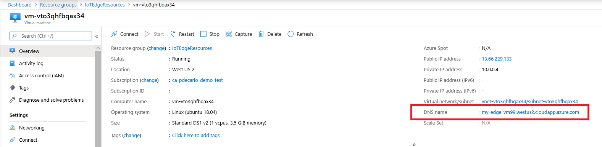

We can now deploy a virtual machine that uses our newly registered device identity to securely connect to the Azure cloud.  Since we are in the development phase, using a virtual machine will be a great way to test out our deployment before installing onto a physical device within the manufacturing facility.

In this unit, you'll deploy an Ubuntu Server VM with Azure IoT Edge runtime support from the Azure Marketplace.

## Deploy an Azure IoT Edge enabled Linux VM

If necessary, log in to your Azure portal using your Azure account credentials.

1. Make sure that you've activated the sandbox, using the button above. The sandbox will allow us to create the necessary resources without incurring any charges.

1. We'll deploy an Azure IoT Edge enabled Linux VM using the iotedge-vm-deploy ARM Template.  To begin, click the button below:

    

1. Ensure that you're logged in with the account used to create the sandbox and make sure that you're using the "Microsoft Learn Sandbox" subscription.

1. We will now fill in the available form fields:

    

    **Subscription**: Ensure "Concierge Subscription" is selected.

    **DNS Label Prefix**: Enter a name in the following format `az-220-vm-edgegw-{YOUR-ID}`.

    **Resource group**: Choose the pre-created entry that looks similar to  `learn-00000000-0000-0000-0000-000000000000`.

    **Admin Username**: Enter a username of your choice.

    **Device Connection String**: Enter the Device Connection string for the device that was created within your IoT Hub in the previous unit.

    **VM Size**, **Ubuntu OS Version**, and **Location**, should be left at their default values.

    **Authentication Type**: Select "password" from the dropdown.

    **Admin Password or Key**: Enter a password of your choice.

    When all fields have been filled in, select **Review + create**, then **Create**, to begin the deployment.

1. Verify that the deployment has completed successfully.  A virtual machine resource should have been deployed into the selected resource group.  Take note of the machine name, the value should be in the format `vm-0000000000000`. Also, take note of the associated **DNS Name**, which should be in the format `<dnsLabelPrefix>`.`<location>`.cloudapp.azure.com.

    The **DNS Name** can be obtained from the **Overview** section of the newly deployed virtual machine within the Azure portal.

    > [!div class="mx-imgBorder"]
    > 

Congratulations, that's the end of the unit! In the next unit, we will generate and configure IoT Edge Device CA Certificates to allow devices to securely connect to our IoT Edge Gateway.