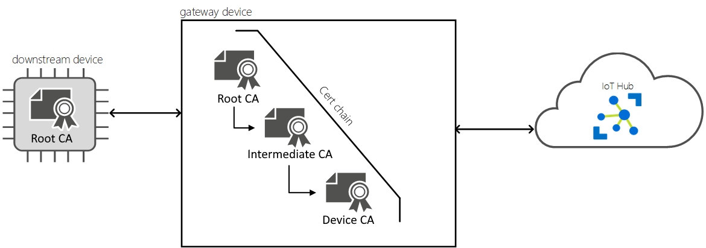
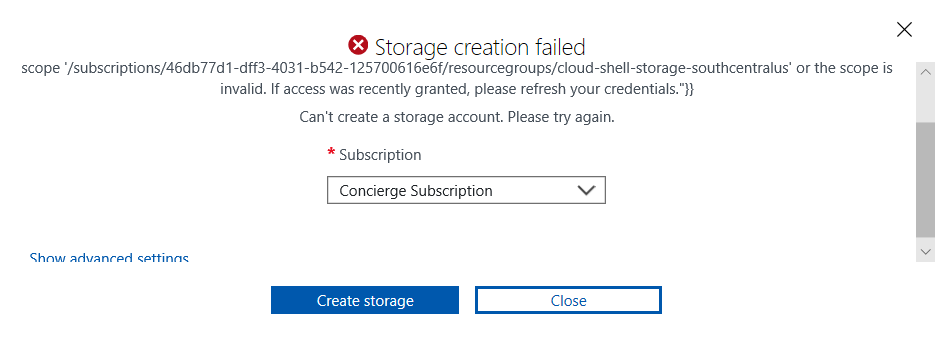

We need to ensure that only authorized devices can publish data into the IoT Edge Gateway.  Certificate-based authentication will allow us to keep out unauthorized devices and secure the transmission channel back to our IoT Hub.

[](../media/security.png#lightbox)

The process is similar to how we gain access into the physical manufacturing building.  

We present credentials to a guard (the IoT Edge Gateway), who validates that we are who we say we are.  If the credentials check out, then we can pass into our destination (the Azure IoT Hub).

[](../media/transparent-gateway-devices.png#lightbox)

In this unit, you'll generate test certificates using tooling on Linux. The certs will ensure that only securely authenticated downstream devices can communicate with the IoT Edge Gateway.

## Generate and configure IoT Edge device CA certificates

You'll complete these steps on the Azure IoT Edge Gateway that was deployed in the previous unit using the Azure Cloud Shell.

1. At the top of the Azure portal click on the **Cloud Shell** icon to open up the **Azure Cloud Shell** within the Azure portal. When the pane opens, choose the option for the **Bash** terminal within the Cloud Shell.

1. Follow the instructions to create the necessary storage accounts for use in the **Cloud Shell**.

    If you are using a sandbox account, you may receive the following error message when creating the Cloud Shell instance. If you receive this message, scroll down and select **Show advanced settings**:

    >[!div class="mx-imgBorder"]
    >[](../media/storage-creation-failed.png#lightbox)

    Next, supply appropriate names to create a new **Storage account** and **File share** then select **Create storage**:

   >[!div class="mx-imgBorder"]
    >[](../media/storage-creation-advanced-settings-named.png#lightbox)

    >[!NOTE]
    > The **Storage Account** and **File Share** resources must be given globally unique names.  If you receive an error that a given name is already in use, try to name the resource again with a unique value.

1. Navigate to the Azure IoT Edge Gateway Virtual Machine within the Azure portal.  It should be named according to the following format:
 `vm-0000000000000`

1. On the **Overview** pane of the **Virtual machine** blade, click the **Connect** button at the top.

1. Within the **Connect to virtual machine pane**, select the **SSH** option, then look for the section "**Run the example command below to connect to your VM.**".

    This section should contain an entry that looks similar to the text below:
    
    `ssh -i <private key path> usernam@az-220-vm-edgegw-{YOUR-ID}.westus.cloudapp.azure.com
    `

    This entry is a sample SSH command that will be used to connect to the virtual machine.  It contains the hostname for the VM and the Administrator username. Modify this command so that it is formatted similar to `ssh username@az-220-vm-edgegw-{YOUR-ID}.westus.cloudapp.azure.com`.

1. Within the Cloud Shell, paste in the modified `ssh` command, and press **Enter**.

1. When prompted with "**Are you sure, you want to continue connecting?**", type `yes` and press Enter. This prompt is a security confirmation since the certificate used to secure the connection to the VM is self-signed.

1. When prompted to enter the password, enter the Administrator password that was entered when the VM was provisioned.

1. Once connected, the terminal will change to show the name of the Linux VM, similar to the following.

    ```bash
    username@az-220-vm-edgegw-{YOUR-ID}:~$
    ```

1. The `Azure/IoTEdge` GitHub project contains scripts to generate non-production certificates. These scripts will help you create the necessary scripts to set up a Transparent IoT Edge Gateway. Run the following command:

    ```bash
     git clone https://github.com/Azure/iotedge.git
    ```
    >[!NOTE]
    >The Azure/iotedge open source project is the official open source project for Azure IoT Edge. This project contains source code for the Edge Agent, Edge Hub, and IoT Edge Security Daemon; in addition to the helper script used in this unit.

1. Run the following commands to create a working directory named ~/certificates that will be used for generating the certificates, then move to that directory:

    ```bash
     mkdir certificates
     cd certificates
    ```
1. To generate the certificates, the helper scripts need to be copied to the working directory. To perform this action, run the following commands:

    ```bash
     cp ../iotedge/tools/CACertificates/*.cnf .
     cp ../iotedge/tools/CACertificates/certGen.sh .
    ```
    These commands will copy just the necessary files for running the helper script for generating test CA certificates. The rest of the source files within the Azure/iotedge repository are not needed for this unit.

1. Within the working directory, run the following command to verify the helper script files have been copied correctly.

    ```bash
     ls 
    ```

    This command should output there are two files within the directory. The `certGen.sh` is the helper bash script, and the `openssl_root_ca.cnf` file is the configuration file needed for generating the certificates with the helper script using OpenSSL.

   ```bash
     username@AZ-220-VM-EDGEGW:~/certificates$ ls
     certGen.sh  openssl_root_ca.cnf
    ```

    Make note that the directory where you're running the script is located at `~/certificates`. This path maps to the `/home/<username>/certificates` directory, where `<username>` is the user your logged into SSH with. You will need to use this directory location later when configuring Azure IoT Edge to use the generated certificates.

1. The `certGen.sh` helper script is run with the `create_root_and_intermediate` parameter to generate the root CA certificate and one intermediate certificate. Run the script by executing the following commands:

    ```bash
     ./certGen.sh create_root_and_intermediate
    ```

    The script created several certificate and key files. Make note of the following root CA certificate file that will be referred to later:

    ```bash
      # Root CA certificate
     ~/certificates/certs/azure-iot-test-only.root.ca.cert.pem
    ```

1. Now that the root CA has been generated, the IoT Edge device CA certificate and private key need to be generated. Run the following command to generate the IoT Edge device CA certificate, and uses `MyEdgeDeviceCA` as the name for the CA certificate that is generated.

    ```bash
     ./certGen.sh create_edge_device_ca_certificate "MyEdgeDeviceCA"
    ```

    The generated certificates are created with the name specified to this command. If a name other than `MyEdgeDeviceCA` is used, then the generated certificates will reflect that name.
    
    This script created several certificate and key files. Make note of the following files that will be referred to later:

    ```bash
    # Device CA certificate
    ~/certificates/certs/iot-edge-device-ca-MyEdgeDeviceCA-full-chain.cert.pem
    # Device CA private key
    ~/certificates/private/iot-edge-device-ca-MyEdgeDeviceCA.key.pem
    ```

    >[!NOTE]
    > Now that the IoT Edge Device CA certificate has been generated, do not re-run the previous command that generates the root CA certificate. Doing so will overwrite the existing certificate with a new one that will no longer match the `MyEdgeDeviceCA` IoT Edge Device CA certificate that was just generated.

 1. To confirm that the Azure IoT Edge Runtime is installed on the VM, run the following command:
     ```bash
     iotedge version
     ```  

     This command will output the version of the Azure IoT Edge Runtime that is currently installed on the virtual machine.

    The version will be similar to the following output:

    ```bash
    username@AZ-220-VM-EDGEGW:~/certificates$ iotedge version
    iotedge 1.0.8 (208b2204fd30e856d00b280112422130c104b9f0)
     ```  

1. To configure Azure IoT Edge, the `/etc/iotedge/config.yaml` configuration file needs to be modified to contain the full path to the certificate and key files on the IoT Edge Device. Before the file can be edited, you must be sure the `config.yaml` file is not read-only. Run the following command to set the file to be writable:

    ```bash
    sudo chmod a+w /etc/iotedge/config.yaml
     ```  

1. Run the following command to open the `config.yaml` file within the vi/vim editor:

    ```bash
     sudo vi /etc/iotedge/config.yaml
    ```

    >[!NOTE]
    > When editing yaml files, spaces are very important when working with nested entries. Be sure to pay attention to the spacing indicated in the examples below, in some sections there will be a mix of 0 and 2 spaces. If you receive any errors when restarting the iotedge service, double-check that proper spacing has been employed after making modifications to the config.yaml file. 

1. Locate the **Certificate settings** section within the file, remove the leading `#` character before the certificate properties to uncomment those lines, then edit the certificate settings to contain the correct certificate and key paths. After changes are made, save the file and exit the editor.

    After the X.509 certificate settings changes have been made to the `config.yaml` file, this section of the file will look like the following entry:
    
    ```bash
    certificates:
       device_ca_cert: "/home/<username>/certificates/certs/iot-edge-device-ca-MyEdgeDeviceCA-full-chain.cert.pem"
       device_ca_pk: "/home/<username>/certificates/private/iot-edge-device-ca-MyEdgeDeviceCA.key.pem"
       trusted_ca_certs: "/home/<username>/certificates/certs/azure-iot-test-only.root.ca.cert.pem"
    ```

   Be sure to replace the `<username>` placeholder within the file locations with the Username of the user you are connected with in the SSH session.

    The X.509 certificates configured in this section are used for the following purposes: 

    | Setting  |  Purpose |
    |----------|:-------------:|
    | `device_ca_cert` |  This setting is for the Device CA Certificate for the IoT Edge Device. | 
    | `device_ca_pk` |    This setting is for the Device CA Private Key for the IoT Edge Device.   | 
    | `trusted_ca_certs` | This setting is for the Root CA Certificate. This certificate must contain all the trusted CA certificates required for Edge module communications.

    >[!NOTE]
    > Here are some tips for using **vi** when editing the `config.yaml file`: 
    >- Press the `i` key to put the editor into Insert mode, then you will be able to make changes.
    >- Press `Esc` to go stop Insert mode and return to Normal mode.
    >- To Save and Quit, type `:x`, and press `Enter`.
    >- Save the file, type `:w`, and press `Enter`.
    >- To quit vi, type `:quit` and press `Enter`.

1. Now restart the IoT Edge Service to take into account the new hostname and ensure that it starts successfully.  

    ```bash
    sudo service iotedge restart
    ```

    If the Edge runtime doesn't restart successfully, you'll want to double-check that you have modified `/etc/iotedge/config.yaml` appropriately.

1. The `MyEdgeDeviceCA` certificate must be downloaded from the Azure IoT Edge Gateway Virtual Machine so it can be used to configure the IoT Edge device enrollment within Azure IoT Hub Device Provisioning Service. Type `exit` in the **Azure Cloud Shell** to end the SSH session.  

    ```bash
     exit
    ```
1. Within the **Cloud Shell**, run the following commands to download the `~/certificates` directory and its contents from the virtual machine to the **Cloud Shell** storage:

    ```bash
     mkdir certificates
     scp -r -p <username>@<DNSName>:~/certificates .
     ```

     Replace the `<username>` placeholder with the username of the admin user for the VM, and replace the `<DNSName>` placeholder with the **DNS Name** of the VM.
    
    When executing the command, enter the Admin password for the VM when prompted.

1. Once the command has executed, it will have downloaded a copy of the `~/certificates` directory with the certificate and key files over SSH to the Cloud Shell storage. You can verify the file has been downloaded by running the `ls` command within the `~/certificates` directory to view its contents.

    ```bash
     User@Azure:~$ cd certificates
     User@Azure:~/certificates$ ls
     certGen.sh  csr        index.txt.attr      index.txt.old  openssl_root_ca.cnf  serial
     certs       index.txt  index.txt.attr.old  newcerts       private              serial.old
     ```
    
     Once the files are copied to the **Azure Cloud Shell** storage, you'll be able to easily download the IoT Edge Device certificate and key files to your local machine. The files can be downloaded from the Azure Cloud Shell using the `download <filename>` command.

     Congratulations, that's the end of the unit! In the next unit, we'll set up an IoT Edge Gateway Hostname.