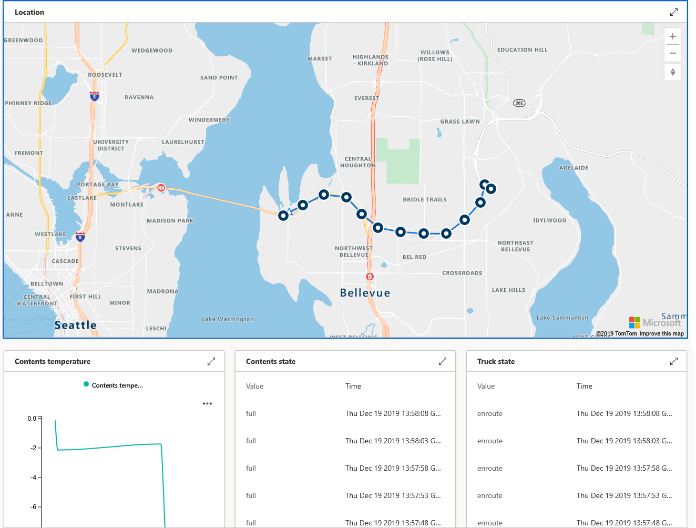

Azure IoT Central enables the easy monitoring and management of a fleet of remote devices.

This module builds on the application developed in the "Your first Azure IoT Central app" module, by adding rules and actions. It is not a requirement that you have completed the earlier module, but it may help your understanding of IoT Central if you do complete it.

The earlier module explains how to monitor and command the movements of a refrigerated truck. This module adds _rules and actions_ to the IoT Central app. Rules enable greater automation. A rule is triggered when one or more conditions are met, and one or more actions are the result. These actions include sending an email, and sending data to a website (a _webbhook_ action).

In this module, we build the IoT Central app from a pre-prepared JSON file defining all the device capabilities. The device app code is loaded and run, without detailed explanation of the sections of code. The focus is on creating a range of rules, and testing these rules out with the device and IoT Central apps up and running.

## Learning objectives

In this module you will:

- Create an Azure IoT Central custom app, using the IoT Central portal
- Import a device template for a custom device, using the IoT Central portal
- Import a programming project to simulate a refrigerated truck, with routes selected by Azure Maps, using Visual Studio Code, or Visual Studio
- Monitor and command the simulated device, from an IoT Central dashboard
- Create a range of rules, with associated actions, responding to events that occur in the field

## Prerequisites

- An introductory knowledge of the purpose of Azure IoT
- Ability to navigate Azure IoT portal
- Ability to use Node.js, or C#, at the beginner level
- Experience using Visual Studio, or Visual Studio Code, at the beginner level
- Must have, or can open, an Azure Maps account

## The scenario

Suppose you run a company that operates a refrigerated truck. You have already built an IoT Central app to monitor and control the truck. You now need to make the process more efficient, which you intend doing by adding IoT Central rules and actions.

In this module, you'll construct the app displayed in the above image, from supplied components. Then, you will add several rules and corresponding actions, and test that the rules trigger as expected.

## Create a custom IoT Central app

1. Navigate to [Azure IoT Central](https://apps.azureiotcentral.com/?azure-portal=true). It's a good idea to bookmark this URL, as it's the home for all your IoT Central apps.

1. Click on **Build** on the left-hand menu, then **Custom apps**.

1. Your **Application name** can be any friendly name, such as "Refrigerated Trucks". However, the **URL** _must_ be unique, which is why you'll add a unique ID to the end of the URL for the app. For example, `refrigerated-trucks-<your id>`, replacing `<your id>` with some unique ID.

1. Leave the **Application template** as **Preview application**.

1. Select the free **7 day free trial** option. Seven days is plenty of time to complete the scenario.

    

    > [!NOTE]
    > Click on any image in this module, to display a full-sized image.

1. Fill out your contact info, and click **Create**. Wait a few seconds whilst the app resource is built.

1. You should now see a **Dashboard** with a few default links.

The next time you visit your Azure central home page, select **My apps** in the left-hand menu, and an icon for your  **Refrigerated Trucks** app should appear.

## Download the source code, and capability model

You've now created the app. The next step is to download the required files. You can choose to build your project using C#, or Node.JS.

1. Navigate to the GitHub site containing the project files: [Your First IoT Central App Learn module](https://github.com/MicrosoftDocs/mslearn-your-first-iot-central-app).

1. Download these files to a location on your local machine.

1. You'll only be working with two files. Choose either the **Program.cs** file (for C# developers), the **app.js** file (for Node.js developers). All developers will need the **Refrigerated Truck Capability Model.JSON** file.

