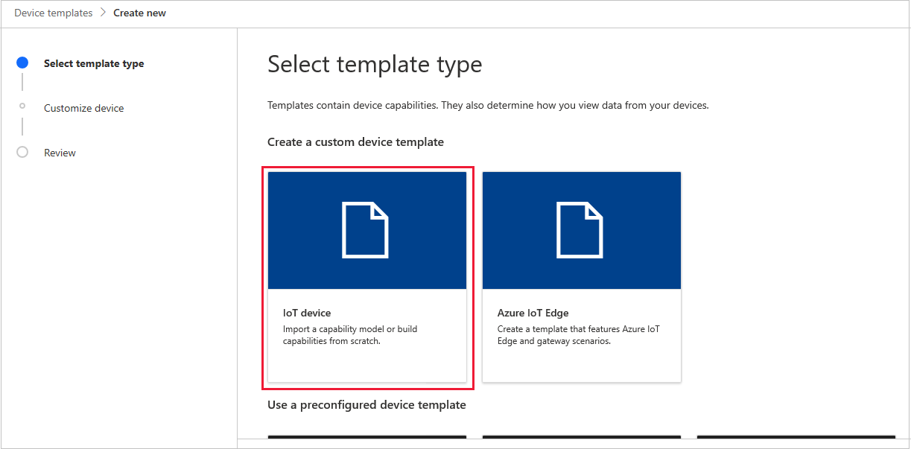
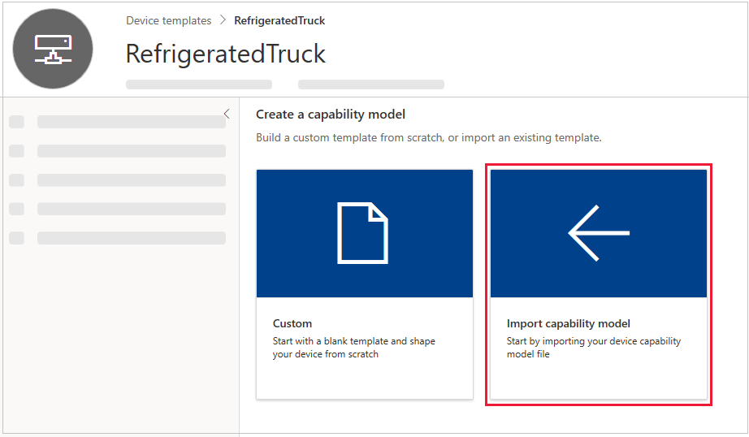
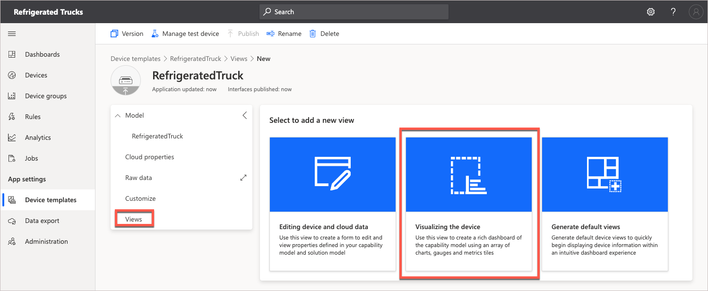
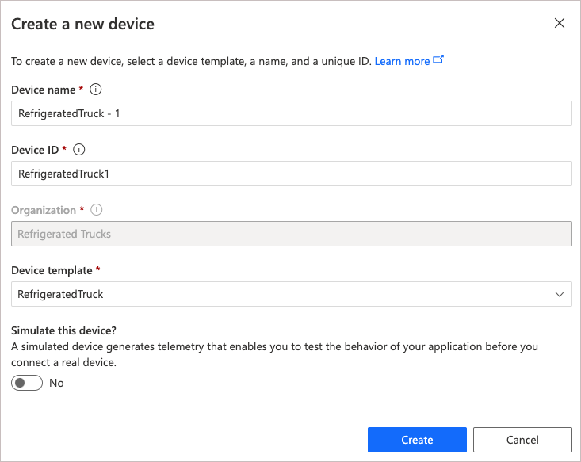

In this unit, you'll first download the required files, then import the capability model. Then we create a dashboard showing all the capabilities of the device template. Next, you'll create a real device, and record the connection settings needed for the remote device app. An Azure Maps account is created, if needed.

## Download the source code, and capability model

You've now created the IoT Central app. The next step is to download the required files for the device app. You can choose to build your project using C#, or Node.js.

1. Navigate to the GitHub site containing the project files: [Your First IoT Central App Learn module](https://github.com/MicrosoftDocs/mslearn-your-first-iot-central-app).

1. Download these files to a location on your local machine.

1. You'll only be working with two files. Choose either the **Program.cs** file (for C# developers), or the **app.js** file (for Node.js developers). All developers will need the **Refrigerated Truck Capability Model.JSON** file.

## Import the capability model into the IoT Central app

A _capability model_ contains a definition of a device template. A device template can be created from scratch, but for this module we'll import a pre-built capability model. The model defines the capabilities of a refrigerated truck.

1. In the IoT Central portal, click **Device templates** in the left-hand menu.

1. Click **+ New**, to create a new device template.

1. Click **IoT device**.

    [](../media/rules-actions-new-template.png#lightbox)

1. Click **Next: Customize**.

1. Give the template a name, such as "RefrigeratedTruck".

1. Don't select the **Gateway device** check box, click **Next: Review**. Then, **Create**.

1. Select **Import capability model**.

    [](../media/rules-actions-import-model.png#lightbox)

1. Navigate to where you downloaded the JSON file containing the capability model, and open that file. You should now see a **Summary** page of all the elements of the capability model.

    [](../media/rules-actions-model-summary.png#lightbox)

1. Click **Publish**, in the top-right menu bar, and then **Publish** again in the dialog that follows, to publish the capability model. Only a published model is available for your app to use.

## Create a rich dashboard

To visualize the movements and state of the refrigerated truck, we need to create a dashboard.

1. Click on the **Views** menu option, then on **Visualizing the device**.

    [](../media/refrigerated-trucks-add-view.png#lightbox)

1. You should now see a list with titles **Telemetry**, **Property**, and some other entries, of the capability model, each with a check box.

1. Click the **Location** check box, then **Add tile**. Dashboards are made up of tiles. The reason we choose the location tile first, is that we want to expand it from its default size. Drag the lower right-hard corner of the tile, so that the tile is at least twice the default size. This tile is the most fun, it will show the location of the truck on a map of the world.

1. Before adding more tiles, change the **View name** to something more specific, "Truck view", or something similar.

1. Now, click each of the rest of the telemetry and properties capabilities in turn, starting at the top, and **Add tile**. We're going for function over form here, we can prettify the dashboard later. For now, we just want a dashboard that will confirm all the telemetry being sent from our remote device. There's no need to add the commands to the dashboard, though that option does exist.

1. When you've added all the tiles, scroll around a bit on your dashboard, and check out the wording in the tiles. You can drag tiles around, and the portal will try to rearrange them neatly.

    [](../media/refrigerated-trucks-sample-tiles.png#lightbox)

1. When you are satisfied with your dashboard, click **Save**, then click **Publish**. You'll now notice that in the dialog that appears, that the **Views** entry is **Yes**. Click **Publish** in the dialog.

You can create as many views as you want to, giving each a friendly name. For this module though, one dashboard will work well.

The next step is to create a device.

## Create a real device

By "real" device, we mean IoT Central understands that there's a remote app running. The app can be in a real device, taking input from real sensors, or running a simulation. Both options are treated as a connection to a _real_ device.

1. Click **Devices** in the left-hand menu.

1. Click **RefrigeratedTruck** in the **Devices** menu, to ensure the device we create uses this device template.

1. Click **+ New**. Verify in the **Create a new device** dialog that the device template is **RefrigeratedTruck**.

    [](../media/refrigerated-trucks-create-new-device.png#lightbox)

1. Change the **Device name** to a friendlier name, say "RefrigeratedTruck - 1".

1. Change the **Device ID** to a friendlier name, say "RefrigeratedTruck1".

1. Leave the **Simulate this device?** setting at **No**. We're going to be building a real truck here. Well, a simulated _real_ truck! Setting this value to **Yes** instructs IoT Central to pump out random values for our telemetry. These random values can be useful in validating a device template.

1. Click **Create**. Wait a few seconds, then your device list should be populated with a single entry.
    > [!NOTE]
    > The **Device status** is **Registered**. Not until the device status is **Provisioned** will the IoT Central app accept a connection to the device. The coding unit that follows shows how to provision a device.

1. Click on the **RefrigeratedTruck - 1** name, and you'll see the live dashboard, with lots of **Waiting for data** messages.

1. Click on the **Commands** entry in the menu bar that includes **Truck view**. Notice that the commands that were in the capability model are ready to be run.

The next step is to create the keys that will allow a remote device to communicate with this app.

### Record the connection keys

1. For the device, click **Connect** in the top-right menu. Do _not_ click **Connect to gateway**.

1. In the **Device connection** dialog that follows, carefully copy the **ID scope**, **Device ID**, and **Primary key** to a text file. Typically, use a tool like Notepad, and save the file with a meaningful name, say "Truck keys.txt".

1. Leave the **Connect method** as **Shared access signature (SAS)**.

1. When you've saved off the IDs and key, click **Close** on the dialog.

Leave the IoT portal open in your browser, "waiting for data".

::: zone pivot="vs-node,vscode-node"

## Generate a connection string

The essential component for communication between a Node.js device app, and IoT Central, is the connection string. There are some tools that make generating these strings easy. In this unit, you'll access these tools in such as way that you can reuse them later on. To start with, you need some information on our real device.

All of the work to generate connection strings is handled through Azure Cloud Shell.

1. Navigate to the [Azure Cloud Shell](https://shell.azure.com/?azure-portal=true)

1. In the Azure Cloud Shell, create a refrigerated-truck folder, and navigate to it:

    ```bash
    mkdir ~/refrigerated-truck
    cd ~/refrigerated-truck
    ```

1. Install the Device Provisioning System (DPS) key generator (_dps-keygen_), in the refrigerated-truck folder:

    ```bash
    npm install dps-keygen
    ```

1. Download and install a DPS connection string utility (_dps-cstr_) from GitHub:

    ```bash
    wget https://github.com/Azure/dps-keygen/blob/ota/bin/linux/dps_cstr?raw=true -O dps_cstr
    ```

    > [!NOTE]
    > You may have noticed in the above URL that you are downloading the Linux version of dps-cstr. This is needed to run in Azure Cloud Shell.

1. To give dps-cstr the correct permissions, run the following command:

    ```bash
    chmod +x dps_cstr
    ```

1. Remember that in the previous section you stored a **Scope ID**, **Device ID**, and **Primary Key**, for our device. It's a good idea to keep a text document such as Notepad open, and create in it the following string, replacing **{scope-id}**, **{device-id}**, and **{primary-key}** with your own values. Using the text document enables you to create and validate the string before committing to running it.

    ```bash
    ./dps_cstr {scope_id} {device_id} {primary_key} > connection1.txt
    ```

1. Now copy this command from your text document into the refrigerated-truck folder of Azure Cloud Shell, and run it.

1. Use the **{ }** icon in Azure Cloud Shell to navigate to the connection1.txt file. You'll probably have to expand the **refrigerated-truck** node to locate it. Double-click on connection1.txt to open the file. Carefully copy all the contents to your text tool.

    [](../media/refrigerated-trucks-connection1.png#lightbox)

    > [!IMPORTANT]
    > The last element of the connection string is the Primary Key. Verify that the connection string in your text file ends with an exact copy of the Primary Key, and if not, correct the copy you've made of the correction string in your text document.

1. The connection string you'll use in the Node.js app (that follows in the next unit) starts with **HostName=**, so separate off this part of the string in your text document, so you've one line containing a string that looks similar to the following:

    ```js
    HostName=iotc-<your Scope ID>.azure-devices.net;DeviceId=<your Device ID>;SharedAccessKey=<your Primary Key>
    ```

1. Save off your text file.

You now have the all important connection string. The **Scope ID** identifies the app, the **Device ID** the real device, and the **Primary Key** gives you permission for the connection.

::: zone-end
::: zone pivot="vscode-csharp"

## Install the C# extensions

1. To use C# in Visual Studio Code, ensure both [.NET Core](https://dotnet.microsoft.com/download), and [C# extension](https://marketplace.visualstudio.com/items?itemName=ms-vscode.csharp) are installed.

::: zone-end

All developers also need an Azure Maps account.

## Create a free Azure Maps account

If you don't already have an Azure Maps account, you'll need to create one. 

1. Navigate to [Azure Maps](https://azure.microsoft.com/services/azure-maps/?azure-portal=true).

1. Follow the prompts to create a free account. When your account is set up, you'll need the **Primary Key** for the account. You'll find this key by selecting **Authentication** in the left-hand menu for your Azure Maps resource. Copy and paste this key into the "Truck keys.txt" document, with a note that it applies to Azure Maps.

You do not need an Azure Maps account to _render_ a map, as the rendering is done by an IoT Central dashboard. You need the Azure Maps account to use its API calls to calculate the best route to any given destination.

## Next steps

The next step is to create the device app.

Let's take a break and test your knowledge so far.
