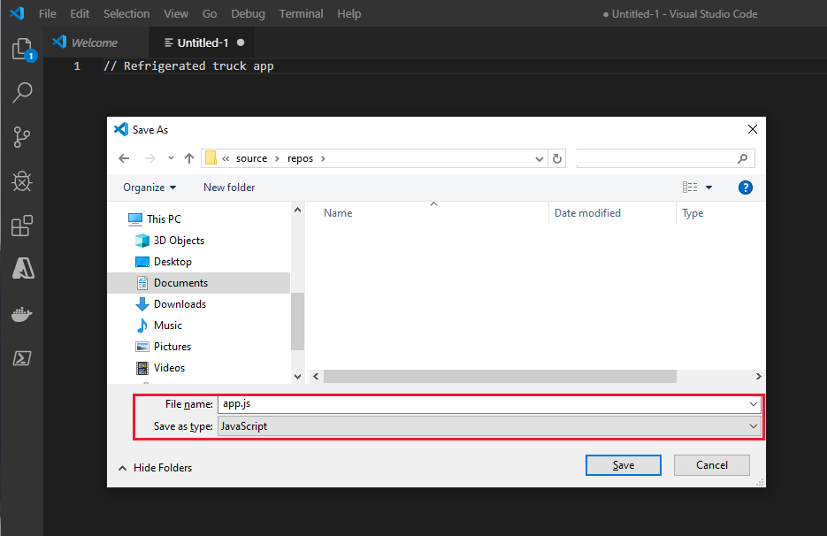
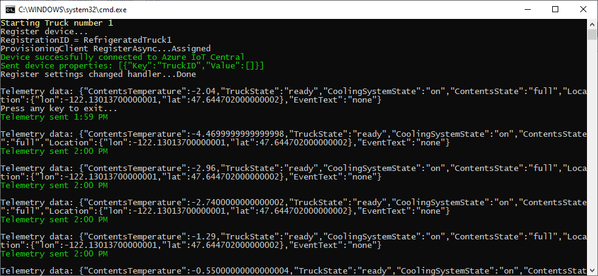
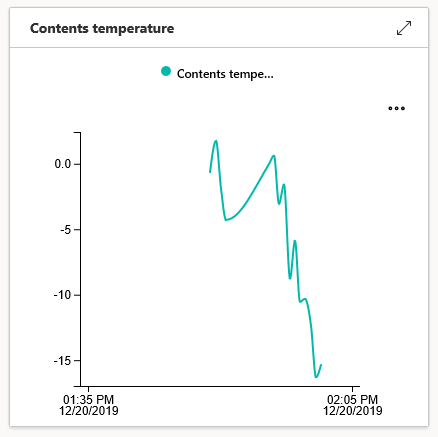

In this unit, you are going to create a programming project to simulate a sensor device in a refrigerated truck. This simulation enables you to test the code long before requiring a real truck! 

## Create the device app

Using your preferred development environment, build the device sensor app. Visual Studio Code and Visual Studio examples are available in this unit.

::: zone pivot="vscode-node"

Node.js is a platform for building server apps, based on JavaScript. All the JavaScript code you'll need is provided below, so you don't need to be a JavaScript developer to get this app up and running.

1. Open Visual Studio Code. From the **Terminal** menu, open a **New Terminal**.

1. In the opened terminal, create an empty folder where you'll develop your code, called "RefrigeratedTruck", by entering `mkdir RefrigeratedTruck`. Then, navigate to that folder with `cd RefrigeratedTruck`.

1. From the **File** menu, create a new file. Insert a single line as a comment, such as `// Refrigerated Truck app`. Save the file to the "RefrigeratedTruck" folder (locating this folder might involve a bit of navigation), with the name "app.js". By using the .js file extension, Visual Studio Code interprets this file as JavaScript and evaluates the contents with the JavaScript language service.

    [](../media/refrigerated-trucks-vscode.png#lightbox)

1. Back in the terminal, load the libraries you need with the following commands:

    ```CLI
    npm install azure-iot-device
    npm install azure-iot-device-mqtt
    npm install azure-maps-rest
    npm install chalk
    ```

1. After you've entered the code below into the app.js file, you can run it from the terminal by entering `node app.js`. Ensure that the `RefrigeratedTruck` folder is the current folder of the terminal, when you run the app.

::: zone-end
::: zone pivot="vscode-csharp"

1. Open a terminal in Visual Studio Code, and create a folder called "RefrigeratedTruck" (enter `mkdir RefrigeratedTruck`). Navigate to the RefrigeratedTruck folder.

1. Enter the following command in the terminal: `dotnet new console`. This command creates a Program.cs file in your folder, along with a project file.

1. Enter `dotnet restore` in the terminal. This command gives your app access to the required .NET packages.

1. In the terminal, install the required libraries:

    ```CLI
    dotnet add package AzureMapsRestToolkit
    dotnet add package Microsoft.Azure.Devices.Client
    dotnet add package Microsoft.Azure.Devices.Provisioning.Client
    dotnet add package Microsoft.Azure.Devices.Provisioning.Transport.Mqtt
    dotnet add package System.Text.Json
    ```

1. From the **File** menu, open up the Program.cs file, and delete the default contents.

1. After you've entered the code below into the Program.cs file, you can run the app with the command `dotnet run`. This command will run the Program.cs file in the current folder, so ensure you are in the `RefrigeratedTruck` folder.

::: zone-end
::: zone pivot="vs-node"

1. Navigate to the **JavaScript** project types, and create a new **Blank Node.js Console Application** project, called "RefrigeratedTruck".

    [](../media/refrigerated-trucks-vs-project.png#lightbox)

1. Right-click on the **npm** entry in Solution Explorer, and select **Install New npm Packages...**.

1. In the dialog that follows, search for and install the following libraries:

    * **azure-iot-device**
    * **azure-iot-device-mqtt**
    * **azure-maps-rest**
    * **chalk**

    [](../media/refrigerated-trucks-vs-npm.png#lightbox)

1. Delete the default contents of the app.js file.

1. When you've entered the code below, you'll be able to run the app with the **Start Without Debugging**, or **Start Debugging**, options. In the latter case you can set breakpoints, examine data, and perform other debugging tasks.

::: zone-end
::: zone pivot="vs-csharp"

1. Open Visual Studio, and create a new **Visual C#/Windows Desktop** project. Select **Console App (.NET Framework)**.

1. Give the project a friendly name, such as "RefrigeratedTruck".

1. Under **Tools/NuGet Package Manager**, select **Manage NuGet Packages for Solution**. Install the following libraries:
    * **AzureMapsRestToolkit**
    * **Microsoft.Azure.Devices.Client**
    * **Microsoft.Azure.Devices.Provisioning.Client**
    * **Microsoft.Azure.Devices.Provisioning.Transport.Mqtt**
    * **System.Text.Json**

1. Delete the default contents of the Program.cs file.

1. When you've entered the code below, you'll be able to run the app with the **Start Without Debugging**, or **Start Debugging**, options. In the latter case you can set breakpoints, examine data, and perform other debugging tasks.

::: zone-end

## Load and run the device app

::: zone pivot="vs-node"

1. Copy the app.js code that you downloaded, into the app.js file of the project.
1. Copy in the connection string, and the Azure Maps Key, into the locations marked in the code.
1. In Visual Studio, select **Debug/Start without Debugging**.

::: zone-end

::: zone pivot="vs-csharp"

1. Copy the Program.cs code that you downloaded, into the Program.cs file of the project.
1. Replace the strings in the code (`ScopeID`, `DeviceID`, `PrimaryKey`, and `AzureMapsKey`) with the ID and key strings you stored in your "Truck keys.txt" file.
1. In Visual Studio, select **Debug/Start without Debugging**.

::: zone-end
::: zone pivot="vscode-node"

1. Copy the app.js code that you downloaded, into the app.js file of the project.
1. Copy in the connection string, and the Azure Maps Key, into the locations marked in the code.
1. In the terminal, enter `node app.js`.

::: zone-end
::: zone pivot="vscode-csharp"

1. Copy the Program.cs code that you downloaded, into the Program.cs file of the project.
1. Replace the strings in the code (`ScopeID`, `DeviceID`, `PrimaryKey`, and `AzureMapsKey`) with the ID and key strings you stored in your "Truck keys.txt" file.
1. In the terminal, enter `dotnet run`.

::: zone-end

A console screen should open, with the text: **Starting Truck number 1**.

You are now ready to test the device app.

### Confirm the device app connects to Azure IoT Central

1. If one of the next lines on the console is **Device successfully connected to Azure IoT Central** you've made the connection. If you don't get this message, it usually means either the IoT Central app isn't running, or the connection key strings aren't correct.

1. The "connected" line should be followed by some text verifying the settings and properties were sent successfully.

    [](../media/refrigerated-trucks-connected.png#lightbox)

If all goes well, go straight into the second test.

### Confirm the telemetry functions send data on the specified interval

1. A console message should appear every five seconds, with the contents temperature.

1. Watch the telemetry for a short while, and mentally prepare for the main test of this module!

### Confirm the data is picked up correctly by IoT Central

1. To verify the data is being received at IoT Central, make sure your IoT Central pp is open, and the device selected. If not, select the **Devices** entry in the left-hand menu. Double-click the real device (**RefrigeratedTruck - 1**), in the list of devices.

1. Locate the **Contents temperature** tile, and verify approximately that the temperatures being sent by the device app, in the console window, match the data being shown in the telemetry view of the IoT Central app. There may be a short latency before the dashboard shows the incoming data.

    | IoT Central | Device app |
    | --- | --- |
    | [](../media/refrigerated-trucks-central.png#lightbox) | [](../media/refrigerated-trucks-console.png#lightbox) |

    > [!NOTE]
    > The screenshots in this module are taken from the C# version of the app. The Node.js app screens will be similar, but not identical.

1. Check the state tiles: **Truck state**, **Cooling system state**, and **Contents state** in the IoT Central app, to verify the truck and its contents are in the expected state.

1. Check the **Location** map view for the device. A blue circle near Seattle, USA shows our truck ready to go. You may have to zoom out a bit.

    [](../media/refrigerated-trucks-seattle.png#lightbox)

If all is well, this is great progress. The truck is at its base, and in the correct state.

The next step is to understand the role of rules and actions.
