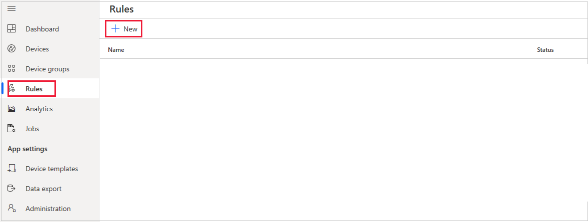
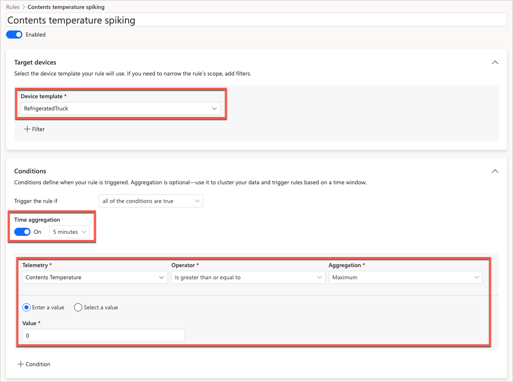
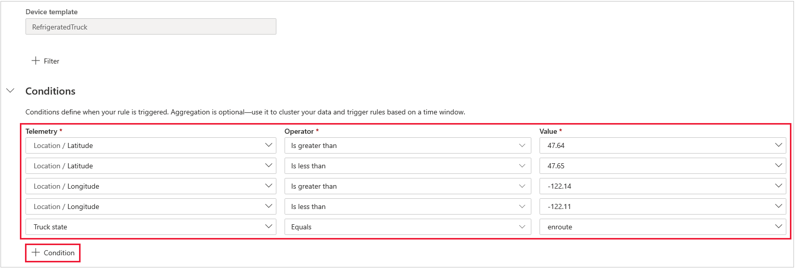
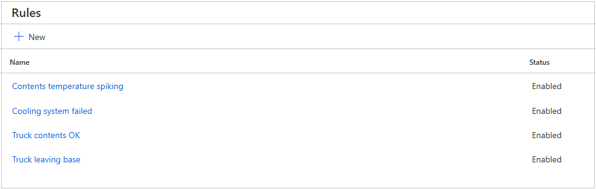

In this unit, we create four rules to be triggered by the state and movement of a refrigerated truck.

## Create a rule to fire when the cooling system fails

In this example, we'll create a rule with a single condition. Let's fire off an email if the cooling system on the truck fails.

1. In the IoT portal, select **Rules** in the left-hand menu, then **+ New**. Enter a meaningful name for the rule, such as "Cooling system failed". Press Enter.

    

1. Select **RefrigeratedTruck** for the device template.

1. Under **Conditions** notice that all the telemetry elements of the device template are available. Select **Cooling system state**.

1. For **Operator**, select **Equals**.

1. For value, type the word "failed", then click on **Select: "failed"**.

1. Leave **Time aggregation** as **Off**.

1. For actions, click on **+ Email**.

1. In **Display name**, enter a title for the email, perhaps "Cooling system failed"!

1. For **To**, enter the email you've used for your IoT Central account. And for **Note** enter some descriptive text that will form the body of the email.

1. Click **Done**.

    >[!NOTE]
    >There's no limit to the number of actions a rule can fire. You could add multiple emails and multiple webhooks to a single rule.

1. Click **Save**. This step is important, otherwise your rule entries will be lost.

1. Use the breadcrumbs, above the rule name, to navigate back to the **Rules** page. You should now see your first rule in the list, and that it's in an **Enabled** state.

    >[!NOTE]
    >If you wish to turn off a rule, set it to a **Disabled** state, rather than delete it. You might need to do this if you come up with a rule that fires too often. Disable it to give yourself a chance to think of more, or better, conditions.

## Create a rule to fire when the temperature of the contents is too high

In this section, we'll look at the time aggregation feature.

1. Create a new rule with a name such as "Contents temperature spiking".

1. Turn on **Time aggregation**, and select an interval of **5 minutes**.

    >[!NOTE]
    >5 minutes may be too short a time interval, but keeping it short let's us test the rule before selecting a more realistic interval. Rules can easily be edited after testing.

1. Select **Contents Temperature** for **Telemetry**.

1. In the range **Aggregation** values, select **Maximum**.

1. For **Operator**. select **Is greater than or equal to**. Then enter "0" for the value, and select that as the value.

    

1. For **Actions**, fire off another email. Give the email an appropriate title and note.

    The rule will fire off one email in a five-minute period, if the contents temperature exceeds or equals 0 degrees at any point during the five-minute period. You could enter a rule that would only fire if the _average_ temperature was above a certain threshold. When we get round to testing this rule, we can try out these different options.

1. Make sure to click **Save**, to save off this rule.

## Create a rule to fire when the truck leaves base

In this rule, we're going to investigate the use of multiple conditions to fire a rule. In our simulation of a refrigerated truck, we've not added a specific state to indicate that the truck has left the base. We can, however, get what we want with a clever use of conditions.

1. Select **Rules** in the left-hand menu, then **+ New**. Enter a meaningful name for the rule, such as "Truck leaving base". Press Enter.

1. Now, enter the following five conditions.

    | Telemetry | Operator | Value |
    | -- | -- | -- |
    | Location / Latitude | Is greater than | 47.64 |
    | Location / Latitude | Is less than | 47.65 |
    | Location / Longitude | Is greater than | -122.14 |
    | Location / Longitude | Is less than | -122.11 |
    | Truck state | Equals | enroute |

    >[!NOTE]
    >If we did not add the state that the truck is _enroute_, the rule would fire all the time the truck is at base. As it is, the rule will fire at least once, though maybe a few times, before the truck leaves the specified latitude/longitude area.

    

1. Again, enter your email as an action, giving it an appropriate title and note.

## Create a rule to fire when the temperature of the contents is OK

The rules we've entered so far trigger mostly when something goes wrong, though the "Truck leaving base" rule is an event, rather than an error.

An alternative way of looking at rules is to trigger them when everything is OK. For example, let's enter a rule that triggers every five minutes to let operators know everything is fine.

1. Enter a rule with a name such as "Truck contents OK".

1. Turn on **Time aggregation**, with a period of five minutes.

1. Enter conditions that fire if the _average_ **Contents Temperature** is less than -1 degrees Celsius, and greater than -18 degrees Celsius.

1. Again, enter an appropriate email action, and click **Save**.

    

These rules are enough for now! Let's get the app running, and test the rules out.
