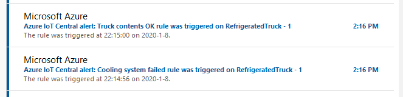
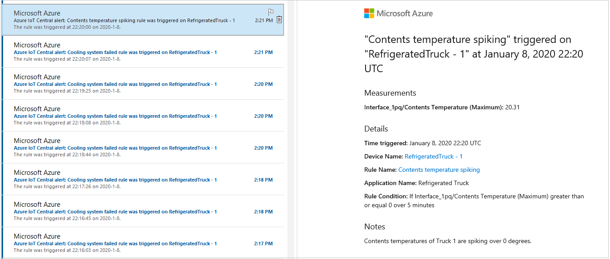

In this unit, we'll test out our rules with the device and IoT Central apps running.

## Test the IoT Central rules and actions

1. Ensure that the device app is running, sending out telemetry.

1. Navigate to the device dashboard in the IoT Central portal. A menu bar should give you the options of **Truck view** and **Commands**. Select **Commands**.

1. Give the truck a command to go to a customer. Valid customer IDs are "0" though "9".

1. Navigate back to the **Truck view**. Wait for the truck to get on its way, in the **Location** tile.

1. Open up the email account you used for your actions.

1. There may be a few minutes latency, but you should receive a "truck leaving base" email.

    

1. All going well, after five minutes of travel you might receive a mail that contents are OK.

    

1. If the cooling system fails, you'll start to receive more email, though the contents may be in an OK state for a while.

    

1. With a failed cooling system, sooner or later it's likely you'll start to receive "Contents temperature spiking" emails.

    

    > [!NOTE]
    > The exact order and content of the emails will depend on the customer number you choose, and random events in the simulator.

## Consider how to make improvements

Run the device app for as long as necessary for you to receive all four email actions. Consider how you might improve on the conditions for each action, to reduce the volume of email, but maintain the value of the information.
