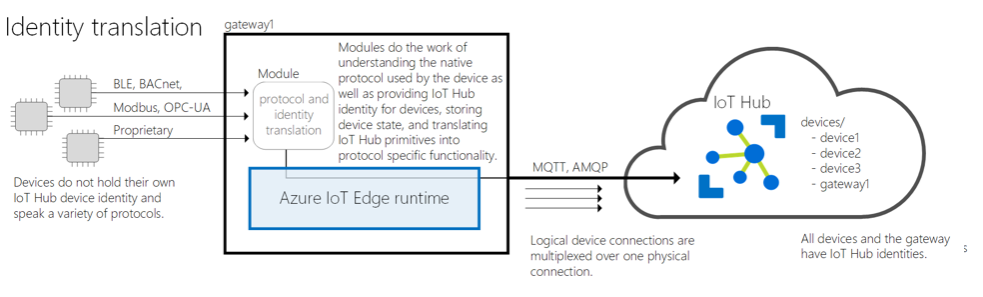

This module is theoretical and will walk you through how an IoT Edge device can be used as a gateway.

There are three patterns for using an IoT Edge device as a gateway: transparent, protocol translation, and identity translation:

- Transparent – Devices that theoretically could connect to IoT Hub can connect to a gateway device instead. The downstream devices have their own IoT Hub identities and are using any of the MQTT, AMQP, or HTTP protocols. The gateway simply passes communications between the devices and IoT Hub. The devices are unaware that they are communicating with the cloud via a gateway, and a user interacting with the devices in IoT Hub is unaware of the intermediate gateway device. Thus, the gateway is transparent. Refer to [Create a transparent gateway](https://docs.microsoft.com//azure/iot-edge/how-to-create-transparent-gateway) for specifics on using an IoT Edge device as a transparent gateway.

    

    This pattern is useful for environments where downstream devices need to proxy through a single secure endpoint for transmission to the cloud. This strategy can be beneficial in environments with limited bandwidth by governing messaging in an aggregated format and for ensuring the security of data leaving an internal network.

- Protocol translation – Also known as an opaque gateway pattern, devices that do not support MQTT, AMQP, or HTTP can use a gateway device to send data to IoT Hub on their behalf. The gateway understands the protocol used by the downstream devices, and is the only device that has an identity in IoT Hub. All information looks like it is coming from one device, the gateway. Downstream devices must embed additional identifying information in their messages if cloud applications want to analyze the data on a per-device basis. Additionally, IoT Hub primitives like twins and methods are only available for the gateway device, not downstream devices.

    

    This pattern can allow for translation of legacy data protocols into a secure endpoint for both translation and transmission up to the cloud.  The configuration is often used in environments that employ pre-existing sensors that do not support MQTT, AMQP, or HTTP.

- Identity translation - Devices that cannot connect to IoT Hub can connect to a gateway device, instead. The gateway provides IoT Hub identity and protocol translation on behalf of the downstream devices. The gateway is smart enough to understand the protocol used by the downstream devices, provide them identity, and translate IoT Hub primitives. Downstream devices appear in IoT Hub as first-class devices with twins and methods. A user can interact with the devices in IoT Hub and is unaware of the intermediate gateway device.

    This configuration allows for translation of legacy data protocols and treats downstream devices as unique entities, allowing for command and control using at the device level through device twins and direct methods in a secure manner by ensuring that control is passed through the gateway.

    

In this module, we will deploy a Transparent Gateway to forward data from a registered Downstream device into an Azure IoT Hub.

## Learning objectives

In this module you will:

- Create an IoT Edge Device Identity in IoT Hub using Azure portal
- Deploy an Azure IoT Edge enabled Linux VM
- Generate and Configure IoT Edge Device CA Certificates
- Set up an IoT Edge Gateway Hostname
- Open IoT Edge Gateway Device Ports for Communication with Downstream Devices
- Create a Downstream Device Identity in IoT Hub
- Connect a Downstream Device to IoT Edge Gateway
- Verify Event Flow from Downstream Device through IoT Edge Gateway to IoT Hub

## Prerequisites

- An introductory knowledge of the purpose of Azure IoT
- Ability to navigate Azure IoT portal
- Experience using Visual Studio, or Visual Studio Code, at the beginner level

## The scenario

You have been tasked to implement an IoT Edge solution into a manufacturing environment that employs a variety of sensors for ensuring quality control on a production line. The facility is under strict regulation to ensure that sensor data is only transported out of the network through a secure endpoint. This requirement ensures that mission-critical control mechanisms are not exposed to outside attacks and ensures that compliance regulations are satisfied.

To accommodate this requirement, an Azure IoT Edge Gateway will be employed to ensure that only trusted devices are able to pass data through the gateway endpoint into Microsoft Azure.  This strategy allows the site implementation to operate with all of the capabilities available to Azure IoT Edge Devices (offline operation, updating running modules from the cloud down to the field, high-throughput telemetry transmission via MQTT/AMQP protocols etc.) plus the added benefit of offering a secure route to the cloud for publishing telemetry and transmitting Cloud to Device messages down to devices in the factory.

Let's get started by demonstrating what it would be like to implement an onsite Azure IoT Edge Gateway using a Linux-based Virtual Machine.