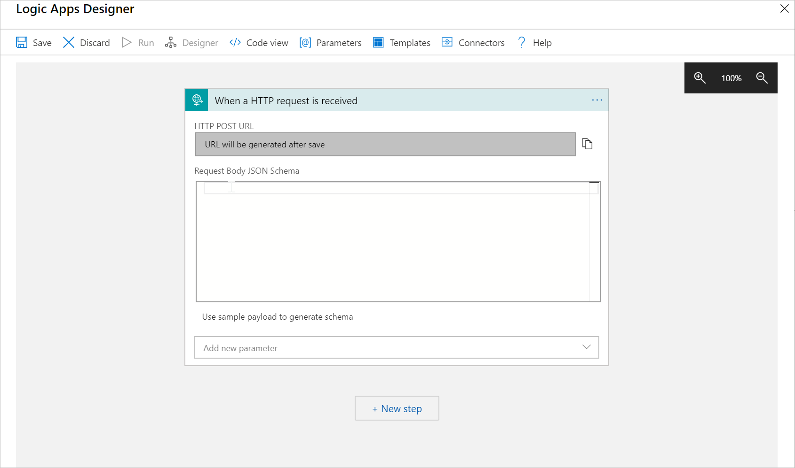
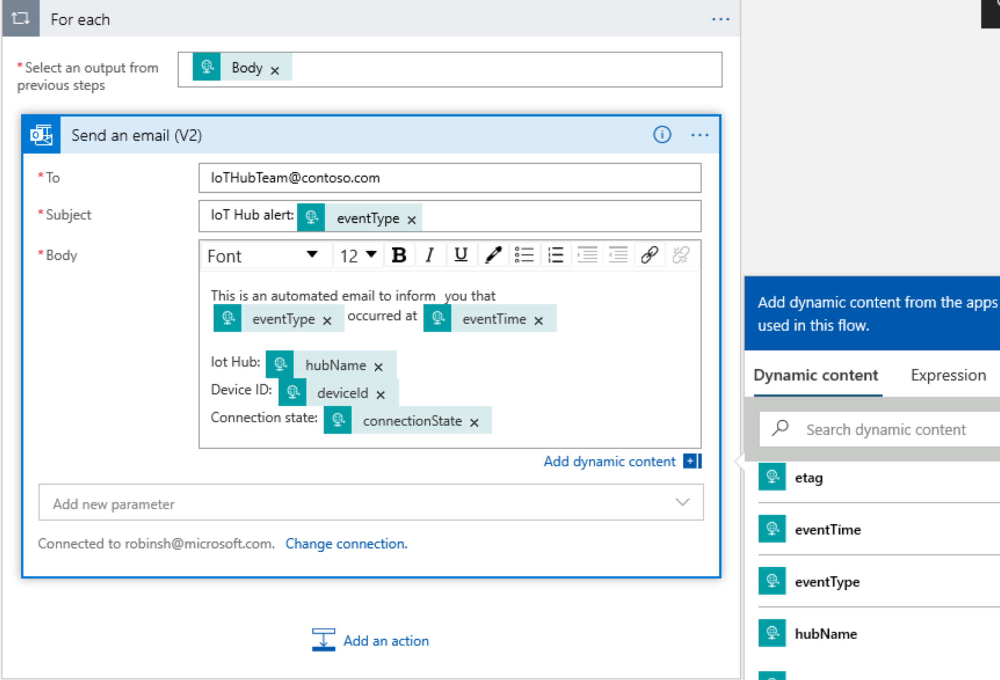

In this unit, you'll create a new logic app that will be triggered via an HTTP webhook. The app will send email by using an Outlook.com email address.

## Create the logic app

1. In the [Azure portal](https://portal.azure.com/learn.docs.microsoft.com?azure-portal=true) (which you might still have open), select **+Create a resource** to open Azure Marketplace.
1. On the **New** page, in the **Search the Marketplace** box, enter and search for **Logic App**.
1. In the search results, select the **Logic App** item.
1. On the **Logic App** item, select **Create**.
1. On the **Create Logic App** page, for **Subscription**, select **Concierge Subscription**.
1. In the **Resource group** drop-down list, select **Use Existing**. Then select the <rgn>[sandbox resource group name]</rgn> resource group.
1. For **Logic App Name**, enter a globally unique name in the **Registry name** field.

    To provide a globally unique name, enter **CheeseCaveLogicApp-&lt;your ID&gt;**.

    > [!IMPORTANT]
    > When you're entering a name, remember that logic app names are publicly discoverable. Logic app names must also be unique, because they form part of the Azure URL. We suggest that you replace &lt;your ID&gt; with your initials, followed by the current date in year, month, day format. For example, an ID of **AB20200213** will result in the resource name **CheeseCaveLogicApp-AB20200213**.

1. For the **Select the location** option, you have two choices: **Region** and **Integration Service Environment**. Select **Region**.

    > [!TIP]
    > For scenarios where your logic apps and integration accounts need access to an Azure virtual network, you would create and use an integration service environment (ISE). 
    >
    > An ISE is an isolated environment that uses dedicated storage and other resources that are kept separate from the public, "global," multitenant Azure Logic Apps service. This separation reduces any impact that other Azure tenants might have on your apps' performance. An ISE also provides you with your own static IP addresses. 
    >
    > To learn more about ISEs, see [Access to Azure Virtual Network resources from Azure Logic Apps by using integration service environments](/azure/logic-apps/connect-virtual-network-vnet-isolated-environment-overview).

1. In the **Location** drop-down list, choose the same Azure region that you used for the IoT hub that you created earlier.

1. Select **Review + create**. This option gives you a chance to verify your choices before selecting **Create** and building the logic app.

    > [!NOTE]
    > It will take a minute or two for the logic app deployment to finish.

## Configure the HTTP request trigger for the logic app

The logic app is triggered with an HTTP request. In the body of the request, we have information about the event that triggered it. We want to be able to extract and use this information in the following steps. Let's see how it's done in configuring the logic app trigger.

1. Go to the **Logic App** resource that was deployed.

1. When you're browsing to the logic app for the first time, the **Logic Apps Designer** pane is displayed.

    > [!TIP]
    > If the **Logic Apps Designer** pane doesn't open automatically, select the **Logic app designer** link under the **Development Tools** section on the **Logic App** pane.

1. The logic app we're creating will be triggered via an HTTP request that will be sent from an event grid. So, select the **When an HTTP request is received** trigger under the **Start with a common trigger** section to get started.

1. The **Logic Apps Designer** surface will open with the visual designer displayed, and with the **When an HTTP request is received** trigger selected.

    [](../media/logic-apps-designer1.png#lightbox)

1. On the **When an HTTP request is received** trigger, select the **Use sample payload to generate schema** link.

1. When you're prompted, paste the following sample JSON into the text box. Then change the IoT hub name to the one you used in the previous unit to create the Azure IoT Hub instance (cheesecavesmanager-&lt;your ID&gt;). Select **Done** when you're finished.

    ```json
     [{
      "id": "56afc886-767b-d359-d59e-0da7877166b2",
      "topic": "/SUBSCRIPTIONS/asubscriptionid/RESOURCEGROUPS/aresourcegroupname/PROVIDERS/MICROSOFT.DEVICES/IOTHUBS/ahubname",
      "subject": "devices/LogicAppTestDevice",
      "eventType": "Microsoft.Devices.DeviceCreated",
      "eventTime": "2018-01-02T19:17:44.4383997Z",
      "data": {
        "twin": {
          "deviceId": "LogicAppTestDevice",
          "etag": "AAAAAAAAAAE=",
          "deviceEtag": "null",
          "status": "enabled",
          "statusUpdateTime": "0001-01-01T00:00:00",
          "connectionState": "Disconnected",
          "lastActivityTime": "0001-01-01T00:00:00",
          "cloudToDeviceMessageCount": 0,
          "authenticationType": "sas",
          "x509Thumbprint": {
            "primaryThumbprint": null,
            "secondaryThumbprint": null
          },
          "version": 2,
          "properties": {
            "desired": {
              "$metadata": {
                "$lastUpdated": "2018-01-02T19:17:44.4383997Z"
              },
              "$version": 1
            },
            "reported": {
              "$metadata": {
                "$lastUpdated": "2018-01-02T19:17:44.4383997Z"
              },
              "$version": 1
            }
          }
        },
        "hubName": "cheesecavesmanager-<your ID>",
        "deviceId": "LogicAppTestDevice"
      },
      "dataVersion": "1",
      "metadataVersion": "1"
    }]
    ```

    This JSON is an example of the JSON that Azure Event Grid will POST to the webhook endpoint for the logic app after it's created.

    > [!NOTE]
    > If you see the message "Remember to include....Content-Type header set to application/json in your request," you can ignore it.

1. Notice that the **Request Body JSON Schema** box is now populated with a JSON schema that was automatically generated based on the sample JSON that was pasted in. It will allow the extraction of the information shared in the body of the trigger by the IoT hub.

## Add the send-email step to the logic app by using the event's information

Now we want to configure the next step of the logic app: sending an email. And we want to populate the email fields with the event's information received in the trigger.

1. Select the **+New step** button below the **When an HTTP request is received** trigger.

1. Enter **Outlook.com** in the search box. Then locate and select the **Send an email (V2)** action for the **Outlook.com** connector.

    > [!NOTE]
    > These instructions walk through configuring the logic app to send an email by using an **Outlook.com** email address. Alternatively, you can configure the logic app to send email by using the Office 365 Outlook or Gmail connectors.

1. On the **Outlook.com** connector, select the **Sign in** button. Follow the prompts to authenticate with an existing Outlook.com account.

1. In the **To** field, on the **Send an email** action, enter an email address to send email messages to.

    Enter an email address where you can receive emails, such as the Outlook.com account used for this connector.

    The Outlook.com account that was authenticated will be used to send the emails from that account. You can actually enter any email address that you want to send the notifications to.

1. Build your email template.

   * **To**: Enter the email address to receive the notification emails. For this tutorial, use an email account that you can access for testing.

   * **Subject**: Fill in the text for the subject. When you select the **Subject** text box, you can select dynamic content to include. Enter `IoT Hub alert:`. If you can't see dynamic content, select the **Add dynamic content** hyperlink to switch it on and off.

   * **Body**: Write the text for your email. Select JSON properties from the selector tool to include dynamic content based on event data. For this lab, add the following text and dynamic content: `This is an automated email to inform you that: {eventType} occurred at {eventTime} IoT Hub: {hubName} Device ID: {deviceID} Connection state: {connectionState}`.  
   
     If you can't see the dynamic content, select the **Add dynamic content** hyperlink under the **Body** text box. If it doesn't show you the fields you want, select **more** on the dynamic content screen to include the fields from the previous action.

    [](../media/email-content.png#lightbox)

1. Select **Save** to save all changes to the logic app workflow.

1. Expand the **When an HTTP request is received** trigger. Copy the displayed value for **HTTP POST URL**, and save it for future reference. You now have the webhook endpoint URL for the logic app that Event Grid will use to trigger the execution of the logic app workflow.

    [](../media/http-post.png#lightbox)

    The **HTTP POST URL** value will be similar to this sample:

    ```md
    https://prod-87.eastus.logic.azure.com:443/workflows/b16b5556cbc54c97b063479ed55b2669/triggers/manual/paths/invoke?api-version=2016-10-01&sp=%2Ftriggers%2Fmanual%2Frun&sv=1.0&sig=ZGqYl-R5JKTugLG3GR5Ir1FuM0zIpCrMw4Q2WycJRiM
    ```

    This URL is the webhook endpoint to call the logic app trigger via HTTPS. Notice the **sig** query string parameter and its value. The **sig** parameter contains the shared access key that's used to authenticate requests to the webhook endpoint.

    > [!TIP]
    > Make a note of the webhook endpoint URL. You'll need it as part of the scenario to integrate IoT Hub and Event Grid.

## Next steps

The next unit reviews the key features of Event Grid that allow easy integration with business applications through an event-grid architecture.