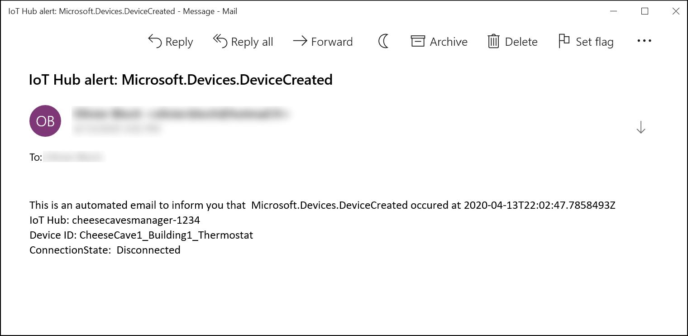
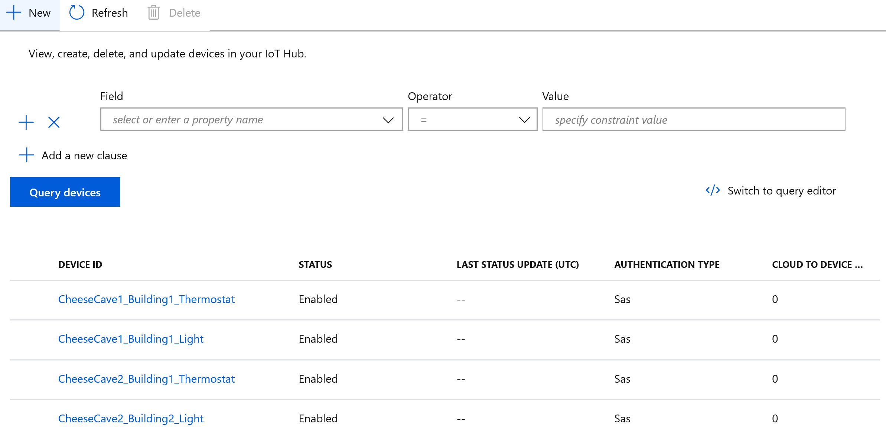

Test your logic app by creating a new device to trigger an event notification email.

1. From your IoT hub, select **IoT devices**.

2. Select **+ New**.

3. For **Device ID**, enter `CheeseCave1_Building1_Thermostat`.

4. Select **Save**.

   Creating this device will trigger the logic app and send and email that contains the event details. Here's how the email looks:

    

5. To test the event subscription filters, you can add multiple devices with different device IDs. Try these examples:

   * CheeseCave1_Building1_Thermostat
   * CheeseCave1_Building1_Light
   * CheeseCave2_Building1_Thermostat
   * CheeseCave2_Building2_Light

   If you added the four examples, your list of IoT devices should look like the following image:

    

6. After you've added a few devices to your IoT hub, check your email to see which ones triggered the logic app. Did you receive the emails that you expected?

## Next steps

You've nearly completed this module. All that's left is a summary and a knowledge check!
