The data communicated between a remote device, and IoT Central, is specified in a _device template_. The device template specifies all the required details about the data to be communicated, so that both the device and IoT Central have all they need to make sense of the communication.

In this unit we will create a device template for a refrigerated truck. When we do this, a simulated refrigerated truck device is created for us by default. This simulated device allows us to do some testing of the template before committing to real devices. In the following unit we will examine this first level of testing.

## Create a device template

1. Click on the app name in the home screen of your IoT Central apps, and then select **Device Templates** from the menu on the left-hand side.

2. On the right-hand side of the screen, click **+ New** to start the process.
3. You will next see a range  of **New Template** options, select **Custom**.
  > [!TIP]
  > Take note of the other options, **MXChip**, **Raspberry Pi**, and so on, just in case you need them in a future project!

4. Enter the name for your template: "RefrigeratedTruck".

5. Click on the template when it is created, and note that a template consists of **Measurements**, **Settings**, **Properties**, **Commands**, **Rules**, and a **Dashboard**. Our refrigerated truck will need entries in most of these.

  > [!NOTE]
  > We are creating this template with all we need for the modules that follow this one, so the purpose of these entries might not be immediately obvious to you, but all should become clear as you work through this set of modules. It is possible to complete a template, then come back to it and add more entries, but this can involve creating multiple _versions_ of a template, which we will avoid in this first set of Learn modules.

## Measurements

Measurements are data transmitted by the device, and covers four types of values: Telemetry, State, Event, and Location. Our scenario requires at least one of each of these for the refrigerated truck. We need to go through them carefully and enter all the required data. The most important entry is the **Field Name**. Make sure to enter this accurately, as this is the name that will be used when devices communicate values to the IoT Central app. When we come to write code in the next module, the reference in the code and the **Field Name** must be an exact match.

### Telemetry

Telemetry is the values transmitted by sensors. We only implement one sensor in our scenario, the temperature of a truck's contents. The frequency with which this information is transmitted is determined by the device. In order for an operator to respond to an abnormal situation, the frequency of the transmission will need to be set appropriately. 

Notice that a minimum and maximum value are specified for a telemetry value, these values are only used by a simulated device to mimic the values from a real device. A real device can transmit any value. The units of the telemetry is a text value to show on charts and tables, IoT Central does not have any inherent understanding of degrees Celsius, or any other possible physical unit.

1. Click **Measurements** and add the telemetry values from the image that follows.

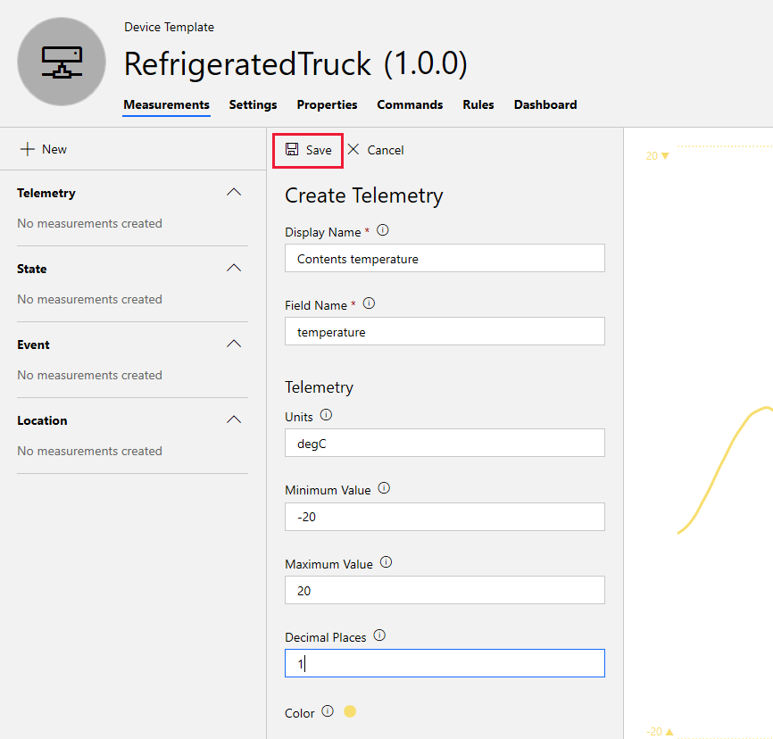

2. Remember to click the **Save** icon after entering the data, and to do this after all the following fields are added. If you are warned you are leaving a page with unsaved changes, it often means you have neglected to click the **Save** icon.

### State

States are important, they let the operator know what is going on. A state in IoT Central is a name associated with any number of values. In addition, you get to choose a color to associate with each value, which can make identifying what is going on (in particular, changes in state), much easier to identify in a visual display. It is easy to see why color is important, for example a "go" state might be a green color, a "failed" state a red or darker color, and so on.

1. Use the **Measurements** options to add a state for the truck's refrigerated contents: one of empty, full, and melting.

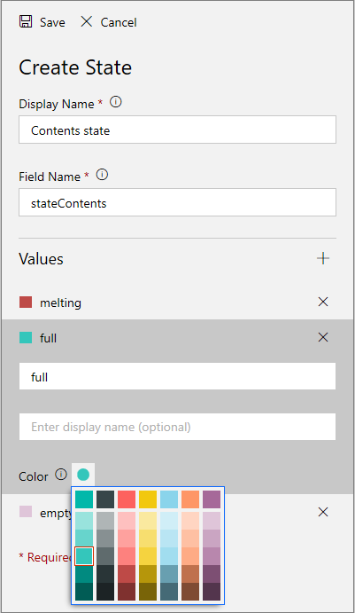

2. To add some uncertainty to our simulation, let's add a failure state for the cooling system, in addition to whether the system is on or off. If the cooling system fails, as you will see in the next module, the chances of the contents melting increase considerably! Add on, off and failed entries for a cooling system.

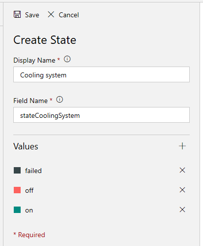

3. A more complex state is the state of the truck itself. If all goes well a truck's normal routing might be: _ready_, _enroute_, _delivering_, _returning_, _loading_, and back to _ready_ again.  However, we should add the _dumping_ state to cater for when melted contents needs to be disposed of! Create this state, and give each entry an appropriate color.

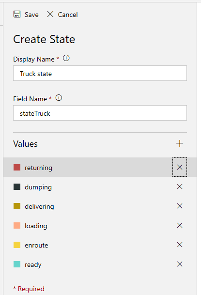

### Event

Events are issues triggered by the device and communicated to the IoT Central app. Events can be one of three types: error, warning, or informational. 

One possible event a device might trigger is a conflicting command. An example might be a truck is returning empty from a customer, but receives a command to deliver its contents to another customer. The conflict is caused by the device (the truck) being unable to act on the command. If this occurs, it is a good idea for the device to trigger an event to warn the operator of the IoT Central app, with a "warning" class of event.

1. Use the new Measurements UI to create an event to cover a conflicting command as follows.

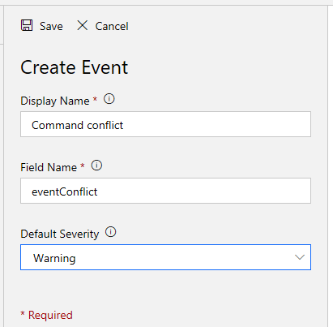

2. A second event that we will add is simply informational. When a truck receives a command to deliver to a customer, and the truck is able to perform the task, the truck trigger a change-of-customer-id event. Add this event now.

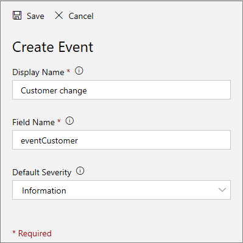

  > [!NOTE]
  > One reason we add this event is to keep track of which truck is going to which customer. In a later module we implement multiple trucks and a single dashboard to monitor them, and having this event helps provide a record of what is going on.

### Location

A location is probably the most important, and yet one of the easiest measurements to add to a device template. Under the hood, it consists of a latitude, longitude, and an optional altitude, for the device.

1. Add a location for our trucks as follows.

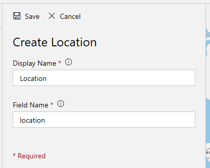

You should have now completed adding all the measurements we need. Validate the measurements you have created against the following screen.

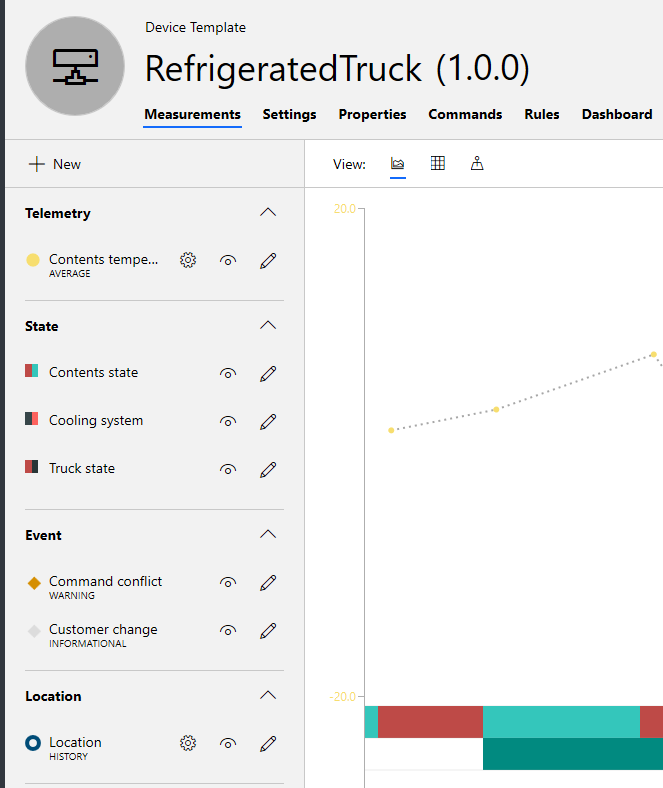

## Settings

A setting contains device configuration data. In our refrigerated truck example, we are going to define an optimal temperature for the contents as a setting. This optimal temperature might conceivably change with different types of content, different weather conditions, or whatever might be appropriate. A setting has an initial default value, which may not need to be changed, but the ability to change it easily and quickly is there, if needed.

A setting is a single value. If more complex sets of data need to be transmitted to a device, a command (see below) might be the more appropriate way of handling it.

1. Click on the **Settings** title under the device template name, and add a single setting to set an optimal contents temperature.

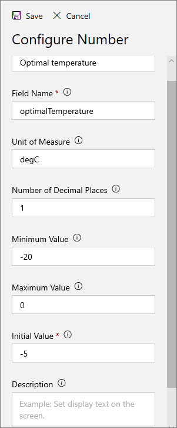

## Properties

Properties of a device are typically constant values, that are communicated to IoT Central app once when communication is initiated. In our refrigerated truck scenario, a good example of a property would be the license plate of the truck, or some similar unique Id.

1. Click on the **Properties** title under the device template name, and add a single property to contain a truck Id.

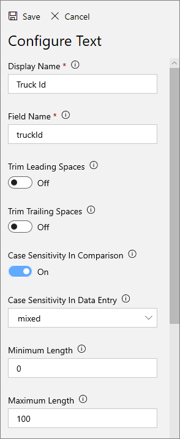

## Commands

Commands are sent by the operator of the IoT Central app to the remote devices.

For refrigerated trucks, there are two commands we should add: a command to deliver the contents to a customer (identified by a customer Id), and a command to recall the truck to base.

1. Click the **Commands** title under the device template name, then click **New Command**.
2. For the first command, to send the truck to a customer, enter the following display and field names, and click **+** beside the **Input Fields** title to enter a text field.

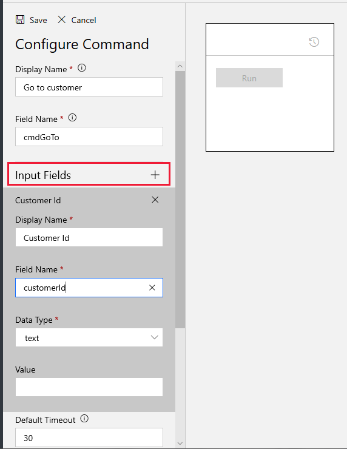

  > [!TIP]
  > You can use the corner icon in the lower-right corner of the box displaying the command, to stretch the bounding rectangle to display all elements of the command.

3. Enter another new command, this time with no input fields, but with "Recall" as the **Display Name**, and "cmdRecall" as the **Field Name**.
4. Validate that your two commands match the image below.

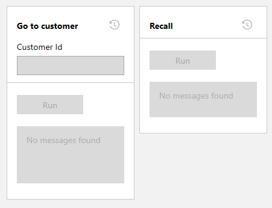

Commands are similar to settings, but note that a command can contain no, or multiple, input fields if necessary, whereas a setting is limited to a single value.

Now, in the next unit, we can validate that we have at least some of the device template entries correct.

