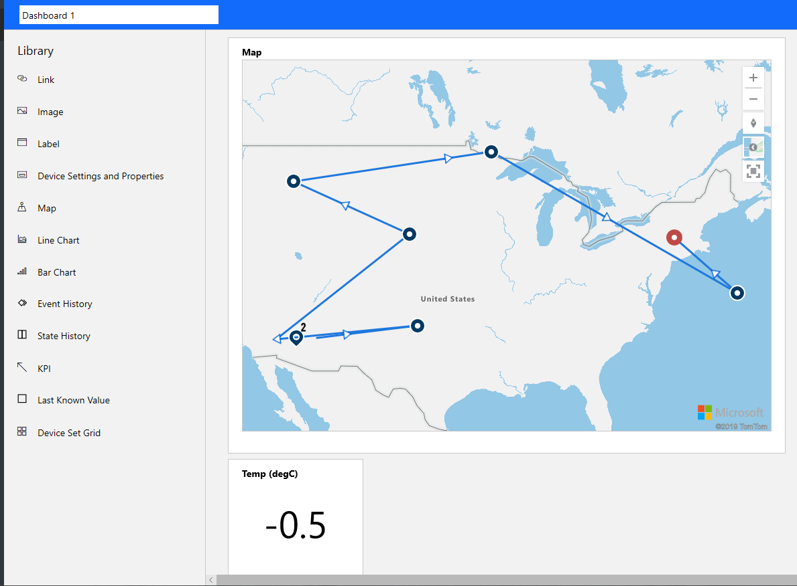

Even before a device template is complete, the automatically-created simulated device will start sending data. As you entered the measurements, and other entries for the device template, you will probably have noticed values appearing in line and bar charts to the right of the screen.

## Validate the device template

Complete validation of the device template will not be possible until you have some real devices. However, the simulated device allows us both to check the completeness of what we have done so far, and to provide a helpful UI to learn the ropes managing devices through IoT Central.

1. Select the **Devices** entry in the left-hand menu, then select the one device we have so far. In the range of **Views**, if it is not already selected, click the _chart_ entry (the left-most of the three view options, highlighted below).

2. This view shows the line chart of the telemetry, and bar charts for states and events. Note the column of eye icons, determining whether the field is visible or not. Some of these may be light-gray (not visible) so click the eye icons to turn the fields visible.

3. Notice that the temperature telemetry falls within the minimum (-20 degC), and the maximum (20 degC), we set when defining this field. Click on any telemetry, or any state in the bar charts, for a little more information.

4. The event chart is a bit less obvious than the telemetry and states, but notice the diamond icons (highlighted near the bottom edge of the image above) that represent an event that has been triggered. Clicking on any of these icons will give you more detail about the event. With the simulated device, this cannot be much more than that the event "occurred". With real devices, we can learn more about the event.

5. Now, click on the _table_ view (the second of the three views).

6. The table view gives time slots, and a text description of the telemetry, state, or event. Again, click on the event link for some extra information. The table view is probably the least used of the three views, but is helpful in aligning what happened in any one time slot.

7. Now click on the third of the three views, the map.

8. The map view is certainly a fun one, and you will probably be a bit surprised to see our "truck" has superpowers and ended up in the ocean after traveling directly to various random locations on land! The simulated device has no concept of anything other than a random location, but at least we have verified that location data is being transmitted, so has been set up correctly.

9. Clicking on any of the blue circles provides more location information.

10. Investigate the map icons top-right of the screen. You can zoom in and out, rotate the map, show various backgrounds, and reset the map to the starting point. Open up the background options, and select _night_ view.

11. We are interested in the night view, or the dark gray-scale view, as there is greater contrast with the device icons (the circles). This can be helpful when the map view shows state information for each device, which will be shown as different colored circles.

## Create an elementary dashboard

In this final exercise for this module, we create a simple dashboard. We are not going to reuse this dashboard later on in this series of modules, as we are going to create a more specific dashboard, for all devices, in the third of the three modules. However, some experience of dashboards would be good!

1. Click on **Dashboard** in the left-hand menu, then select **New** top-right of the screen.

2. Select the **Map** from the range of **Library** options. You will need to provide a device template name, then a device name, to indicate what is to be shown on the map.

3. Select **KPI** from the **Library**, and set this to the temperature telemetry from the simulated truck. This will add a tile to your dashboard, which can obviously be set to a much smaller size than the map.

4. Add any other elements to the dashboard that pique your interest. The dashboard is an alternative method of viewing device data in IoT Central, to the device views described above.

When you feel you have gained some insights into the workings of a dashboard, let's wrap up this first module.
