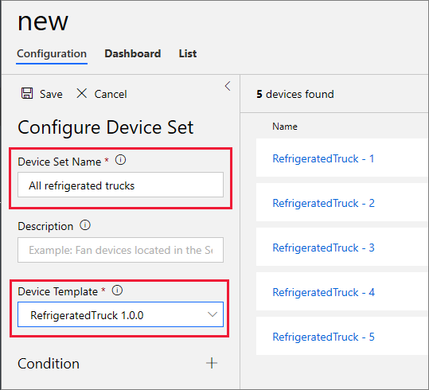
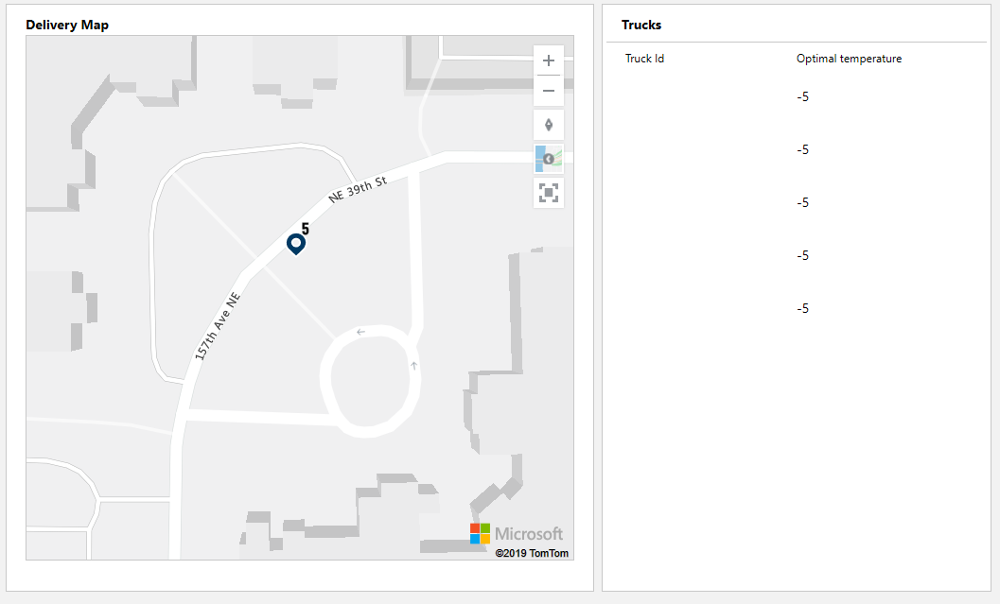

## Create a device set

1. In IoT Central, click the **Device sets** left-hand menu entry.
2. On the far right of your screen, click **+ New**.
3. Enter a device set name, and select the right template:

4. Click **Save**.
5. Click  **Dashboard** on the bar, click **Edit**, then click **Map** in the library of options. Give the map a title, such as "Delivery Map", the **Location** entry should just have the one option (**Location**), and select one of the three states to be displayed, say **Truck state**.
6. Click **Save**.
7. Click **Grid** in the library options, name it something like "Trucks", and add **Truck ID** and **Optimal temperature** to the columns to be displayed. And again, click **Save**.
8. Click **Done** to save your device set dashboard.
9. You may need to zoom out a bit on your Delivery Map, you should get a map with five trucks at base.

10. In order to make commanding the trucks easier, we should add links to the Commands page for each truck. Navigate through the **Devices** menu to the **Commands** for **RefrigeratedTruck - 1**. Copy the URL, which will be something like **https://refrigerated-trucks.azureiotcentral.com/details/device/<your device>/commands**. Now navigate back to the device set dashboard (the one named "All refrigerated trucks"), click **Edit**, and add a **Link** from the library. Call the link something like "Truck 1 commands", and paste in the URL.

11. Click **Done**, and test out your link, and order the truck to a customer. 

## Completing the dashboard

You have almost completed this module, great job. This section provides a few optional ideas to develop your dashboard further.

1. Rather than have link text, if you enter the library **Image** option, you can attach a link to an image on the dashboard. Consider adding five images to your dashboard, each linking to the Commands page for one of the five trucks. In the following image, Truck number 4 has been directed to a customer, the others remain at base:

2. Consider creating a _Job_, a command that applies to all devices (or, all devices with exceptions). Such a job could change the optimal temperature for all trucks, or perhaps recall all trucks. Consider adding a link to the job from the dashboard.

By building up the device set dashboard in this way, we can make controlling multiple devices a matter of a few clicks. You could add links, or images with links, to other device pages (the chart view, or table view, for example).

When you have completed your dashboard, order trucks to different customer IDs (valid range is "0" through "9"), and give any other commands or jobs you have created, and get a feel for IoT Central control of remote devices.

## Next steps

To finish the module, pass the following knowledge check!