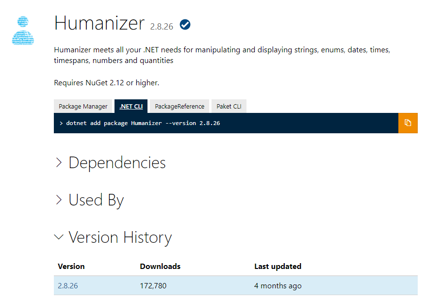
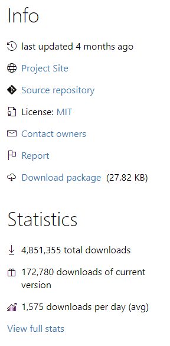

.NET comes with many core libraries that handle everything from managing files to HTTP to compressing files and more. There is, however, a huge ecosystem of third-party libraries. Thanks to NuGet, the .NET Package Manager, you can easily install these libraries and use them in your application. 

.NET and its ecosystem use the word *dependency* a lot. A package dependency is a third-party library, a piece of reusable code that accomplishes something and can be added to your application. The third-party library is something your application *depends on* to function, hence the word *dependency*.

The third-party library can be thought of as a package and stored in a registry. A package consists of one or more libraries that you can add into your application so you can take advantage of its features.

We will focus on package dependencies, but know that a .NET project can have other types of dependencies including frameworks, analyzers, project references, and shared project dependencies along side packaged dependencies.

## Determine whether you need a package

So how do you know if you need a package for your project? That's a complicated question that involves a few factors:

- **Getting better code**. Ask yourself if you're dealing with a task like security, for example, and are trying to implement authentication and authorization. It's a task that you need to *get right* to protect your data and your customer's data. There are standard patterns out there and libraries used by many developers. These libraries implement features you most likely will always need. And issues are patched as they arise. You should use such libraries instead of reinventing the wheel. The main reason is that you're not likely to do as good as job of writing the code yourself because there are so many edge cases that you'd need consider.  
- **Saving time**. You could probably build most things yourself, like utility or UI component libraries. But it takes time. Even if the end result is comparable to what's out there, it's not a good use of your time to replicate the work of writing this code if you don't have to.
- **Maintenance**. All libraries and apps need maintenance sooner or later. Maintenance involves adding new features and correcting bugs. Is it a good use of your or your team's time to maintain a library? Or is it better to let an open-source software team handle it?

## Evaluate a package

Before you install a library, you might want to inspect the dependencies it relies on. These dependencies might encourage you to use the package, or they might deter you. Here are some factors to consider when you select a dependency for your project:

- **Size**. The number of dependencies could create a large footprint. If you're on a limited bandwidth or have other hardware limitations, this factor could be a concern.
- **Licensing**. Licensing might be a factor if you're producing software that you intend to sell. If you have a license on a third-party library, and the creator of the library doesn't allow it to be included in software that's for sale, the creator could put you in a bad legal situation.
- **Active maintenance**. If your package relies on a dependency that's deprecated or hasn't been updated for a long time, that could be a problem.

You can learn more about a package before installing it by going to `https://www.nuget.org/packages/<package name>`. This URL will take you to a detailed page for the package. Select the **Dependencies** dropdown to see how many packages and which packages it relies on to function.

As for the listed dependencies, the number might not tell the whole truth. If you download a package, you might end up with a package dependency that contains thousands of packages. Why is that? Every package has a list of dependencies. To ensure you can use a package, all dependencies are crawled and downloaded when you run the `dotnet add package <package name>` command.

## Install a package

There are several ways to install packages. There is a built-in Package Manager command line and graphical user interface in Visual Studio and Visual Studio for Mac. You can manually add package reference to your project file. Or you can install them through a command-lin interface tool such as Paket or the .NET CLI. For this module, we will use the built-in .NET CLI to install packages. You can add a package to your .NET project by invoking a command in the terminal. A typical installation command looks like this one: `dotnet add package <name of package>`. When you run the `add package` command, the command-line tool connects to a global registry, fetches the package, and stores it in a cached folder location that all projects can use. After the installation and build of your project the references are added into your debug or release folders and your project directory looks something like this one:

```bash
-| bin/
---| Debug/
------| net3.1
--------| <files included in the dependency>
```

## Find a package

Individual developers might use the global registry at NuGet.org to find and download packages they need for their apps. A company might have a strategy in place for what packages are OK to use and where to find them. 


Packages might be located in many different places. Some of these sources might be publicly available. Some might be restricted and accessible only to employees of a specific company. Here are some places where packages might reside:

- **Registries**. An example of a registry might be a global registry like the NuGet.org registry. You can host your own registries that can be either private or public. Services such as GitHub and Azure DevOps make private registries available.
- **Files**. You can install a package from a local folder. Installation from a package is common when you're trying to develop your own .NET libraries and want to test the package locally or for some reason don't want to use a registry.


  
### The NuGet registry and dotnet tool

When you run `dotnet add package <name of dependency>`, .NET goes to a global registry called the NuGet.org registry and looks for the code to download. It's located at `https://nuget.org`. You can browse this page for packages as well, if you visit it by using a browser. Every package has a dedicated website you can go to. 



On these sites, you can learn more about where the source code resides and find other information, like metrics on downloads, and information about maintenance.



### dotnet commands

So far, you've learned how you can install dependencies by using the dotnet tool. But this tool can do a lot more. The dotnet command-line tool has quite a few commands. The commands help you with tasks like installing packages, authoring packages, and initializing .NET projects. You don't need to know all the commands in detail. When you start out with .NET, you're likely to use only a subset of the commands. As you expand your use of .NET, you might use more and more commands from a variety of categories.

To help you remember what the commands do, it helps to think of them as belonging to categories:

- **Manage dependencies**. There are a number of commands that cover installation, removal, and cleaning up after package installations. There are commands for updating packages as well.
- **Run programs**. The dotnet tool can help you manage flows in your application development. Examples of application flows are running tests, building code, or running migrate commands to upgrade projects.
- **Author and publish packages**. There are several commands that can help you with tasks like creating a compressed package and pushing the package to a registry.

If you want a detailed list of all commands, enter `dotnet --help` in the terminal.

### How to install a package

You use the `dotnet add package <dependency name>` command to install a normal dependency that's meant to be used as part of your application. 

There are also packages that you can install *globally*. These packages are not meant to be imported into your project. For that reason, many global packages are CLI tools or templates. These *global* tools can be installed from a package repository as well. Tools can be installed using the `dotnet tool install <name of package>` command a template are installed with the `dotnet new -i <name of package>` command.

### After installation

The packages installed are listed in the `dependencies` section of your `.csproj `. If you want to see what packages are in the folder, you can enter `dotnet list package`. 

```output
Project 'ManipulateData' has the following package references
   [net5.0]:
   Top-level Package      Requested   Resolved
   > Humanizer            2.7.9       2.7.9
```

This command only lists the top-level packages and not dependencies of those packages that we call transitive packages. This is nice to take a quick look, but if you want a more in-depth view you will want to see all transitive packages. To help with this problem, you can list all package transitives. When you do so, the `list` command looks like this one:

```bash
dotnet list package --include-transitive
```


Including transitives will allow you to see all packages that are included in your installed packages and the  dependencies that they consist of. If you run `dotnet list package --include-transitive`, you might see this output:

```output
Project 'ManipulateData' has the following package references
   [net5.0]:
   Top-level Package      Requested   Resolved
   > Humanizer            2.7.9       2.7.9

   Transitive Package               Resolved
   > Humanizer.Core                 2.7.9
   > Humanizer.Core.af              2.7.9
   > Humanizer.Core.ar              2.7.9
   > Humanizer.Core.bg              2.7.9
   > Humanizer.Core.bn-BD           2.7.9
   > Humanizer.Core.cs              2.7.9
   ...
```

## Restore dependencies

When you create or clone a project the included dependencies are not downloaded or installed until you build your project. You can manually restore dependencies as well as project-specific tools that are specified in the project file by running the `dotnet restore` command. In most cases, you don't need to explicitly use the command, since NuGet restore is run implicitly if necessary when you run commands including `new`, `build`, `run`, and more.


## Clean up dependencies

Sooner or later, you're likely to realize that you no longer need a package. Or you might realize that the package you installed isn't the one you need. Maybe you've found one that will accomplish a task better. Whatever the reason, you should remove dependencies that you aren't using. Doing so keeps things clean. Also, dependencies take up space. 

To remove a package from your project, you use the `remove` command like so: `dotnet remove <name of dependency>`. This command will remove the package from the `.csproj` file for your project.
