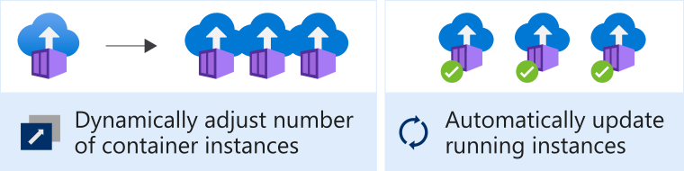
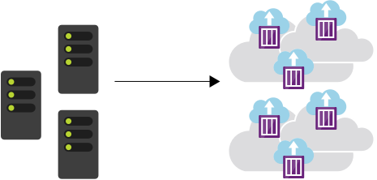

The decoupled design of microservices combined with the atomicity of containers makes it possible to scale out apps, respond to increased demand by deploying more container instances, and scale back if demand is decreasing. In complex solutions the process of deploying, updating, monitoring, and removing containers introduces challenges.

## Container management

Container management is the process of organizing, adding, removing, or updating a significant number of containers.

The Contoso Pizza Company website consists of multiple microservices responsible for tasks like caching, data processing, and a shopping cart. Each of these services is hosted in a container and can be deployed, updated, and scaled independently from one another.

If you increase the number of shopping-cart container instances and need to deploy a new version, you'll have to update *every single instance* of that container.

Container management helps with these tasks.

## Container orchestration

A container orchestrator is a system that automatically deploys and manages containerized apps. For example, the orchestrator can dynamically respond to changes in the environment to increase or decrease the deployed instances of the managed app. It can also ensure all deployed container instances get updated if a new version of a service is released.

## Kubernetes

Kubernetes is a portable, extensible open-source platform for managing and orchestrating containerized workloads. Kubernetes abstracts away complex container management tasks, and provides you with declarative configuration to orchestrate containers in different computing environments. This orchestration platform gives you the same ease of use and flexibility you may already know from platform as a service (PaaS) or infrastructure as a service (IaaS) offerings.

### Benefits

The benefits of using Kubernetes are based on the abstraction of tasks.

These tasks include:

- Self-healing of containers; for example, restarting containers that fail or replacing containers
- Scaling deployed container count up or down dynamically based on demand
- Automating rolling updates and rollbacks of containers
- Managing storage
- Managing network traffic
- Storing and managing sensitive information such as usernames and passwords

Because Kubernetes is a tool to orchestrate containerized workloads, and you can deploy .NET microservices into containers, you can use Kubernetes to orchestrate your .NET microservices. That's what the rest of this module will teach you.
