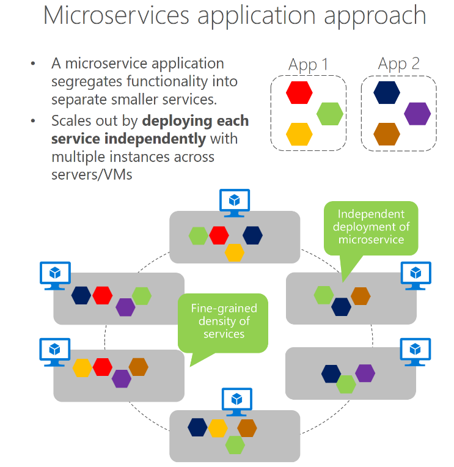
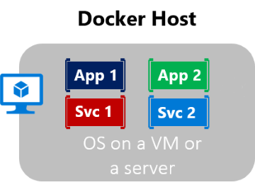

The cloud drives today's application development and IT system management. Modern cloud applications need to be fast, agile, massively scalable, and reliable. 

Containers help applications achieve all of those requirements. But putting an application into a container without following a design pattern is like getting into a vehicle and hoping to find way to a new city without a map (or GPS-enabled phone). You may end up at your destination, but the route probably wasn't the most efficient.

This is where a microservice architecture comes in. Microservices enable an approach to software development and deployment that is perfectly suited to the agility, scale, and reliability requirements of modern cloud applications.

## What is a microservice architecture?

As the name implies, a microservices architecture is an approach in which a large application is split up into a set of smaller services. Each service runs in its own process and communicates with other processes using protocols such as HTTP/HTTPS, WebSockets, or AMQP. Each microservice implements a specific end-to-end domain or business capability within a certain context boundary, and each must be developed autonomously and be deployable independently. Finally, each microservice should own its related domain data model and domain logic, and could be based on different data storage technologies (SQL, NoSQL) and different programming languages.

Some key characteristics of microservices are:

- Microservices are small, independent, and loosely coupled.
- Each microservice has a separate codebase, which can be managed by a small development team.
- Microservices are deployed independently. A team can update an existing microservice without rebuilding and redeploying the entire application.
- Microservices are responsible for persisting their data or external state in their respective databases. Unlike the monolithic architecture, microservices don't share databases.
- Microservices communicate with each other by using well-defined APIs. Internal implementation details of each service are hidden from other services.
- Supports polyglot programming. For example, microservices don't need to share the same technology stack, libraries, or frameworks.

> [!VIDEO https://aka.ms/docs/player?id=4c104952-cc11-4995-8de4-5fdc2ccc23bf]

## Why develop in a microservice architecture?

The benefits of microservices are that each one typically encapsulates simpler customer-requirement functionality, which you can scale out or in, test, deploy, and manage independently. One important benefit of a microservices approach is that teams are driven more by customer scenarios than by technology. Smaller teams develop a microservice based on a customer scenario and use any technologies they want to use.

Microservices provide long-term agility. Microservices enable better maintainability in complex, large, and highly scalable systems by letting you create applications based on many independently deployable services that each have granular and autonomous lifecycles.

As another benefit, microservices can scale out independently. Instead of having a single monolithic application that you must scale out as a unit, you can instead scale out specific microservices. That way, you can scale just the functional area that needs more processing power or network bandwidth to support demand, rather than scaling out other areas of the application that don't need to be scaled. That means cost savings because you need less hardware.

The microservices approach allows agile changes and rapid iteration of each microservice, because you can change specific, small areas of complex, large, and scalable applications.

Architecting fine-grained microservices-based applications enables continuous integration and continuous delivery practices. It also accelerates delivery of new functions into the application. Fine-grained composition of applications also allows you to run and test microservices in isolation, and to evolve them autonomously while maintaining clear contracts between them. As long as you don't change the interfaces or contracts, you can change the internal implementation of any microservice or add new functionality without breaking other microservices.

## What role do containers play?

Containerization is an approach to software development in which an application or service, its dependencies, and its configuration (abstracted as deployment manifest files) are packaged together as a container image. You can test the containerized application as a unit, and deploy them as a container image instance to the host operating system (OS).

Just as shipping containers allow goods to be transported by ship, train, or truck regardless of the cargo inside, software containers act as a standard unit of software deployment that can contain different code and dependencies. Containerizing software this way lets developers and IT professionals deploy them across environments with little or no modification.

If that sounds like containerizing an application would be a great way to implement the microservice architecture pattern, it is. The benefits of containers almost line up exactly to the benefits of microservices one-to-one.

> [!NOTE]
> Containerizing an application is not the only way to deploy microservices. You could deploy microservices as individual services in Azure App Service, or via virtual machines, or any number of ways. However, containers are the tool that we'll use for the rest of this module in which to deploy our microservices.

Another benefit of containerization is scalability. You can scale out quickly by creating new containers for short-term tasks. From an application point of view, instantiating an image (creating a container) is similar to instantiating a process like a service or a web app.

In short, containers offer the benefits of isolation, portability, agility, scalability, and control across the whole application-lifecycle workflow.

The microservices you'll build in this module will run in a container, specifically a Docker container.

### Docker

[Docker](https://www.docker.com/) is an [open-source project](https://github.com/docker/docker) for automating the deployment of applications as portable, self-sufficient containers that can run in the cloud or on-premises. [Docker](https://www.docker.com/) is also a company that promotes and evolves this technology, working in collaboration with cloud, Linux, and Windows vendors, including Microsoft.

Docker containers can run anywhere on Azure: on-premises in the customer's datacenter, in an external service provider, or in the cloud. Docker image containers can run natively on Linux and Windows.

### What is an image?

When a developer uses Docker, they create an app or service and package it and its dependencies into a container image. An image is a static representation of the app or service and its configuration and dependencies.

It's this image that, when run, becomes our container. The container is the in-memory instance of an image.

A container image is immutable. Once you've built an image, the image can't be changed. Since you can't change an image, if you need to make changes, you'll create a new image. This feature is our guarantee that the image we use in production is the same image used in development and QA.

### What is a Dockerfile?

A Dockerfile is a text file that contains instructions on how to build a Docker image. Dockerfiles are written in a minimal scripting language designed for building and configuring images. They also document the operations required to build an image starting with a base image.

To create a Docker image containing your application, you'll typically begin by identifying a base image to which you add more files and configuration. The process of identifying a suitable base image usually starts with a search on Docker Hub for a ready-made image that already contains an application framework and all the utilities and tools of a Linux distribution like Ubuntu or Alpine. For example, if you have an ASP.NET Core application that you want to package into a container, Microsoft publishes an image called `mcr.microsoft.com/dotnet/core/aspnet` that already contains the ASP.NET Core runtime.

You can customize an image by starting a container with the base image and making changes to it. Changes usually involve activities like copying files into the container from the local filesystem, and running various tools and utilities to compile code.

In other words, a Docker file is a set of instructions that builds up a Docker image with the exact software you need in it to run your application - including your application itself.

## Why build microservices in .NET?

Starting with .NET Core and continuing all the way through the present iterations, .NET was built to be cloud native first. It runs cross-platform, so your Docker image could be based on a flavor of Linux and your .NET code will still run. In addition, there are already .NET images created for Docker by Microsoft. Plus, .NET is extremely fast, with the ASP.NET's Kestrel web server routinely outperforming other web servers.
