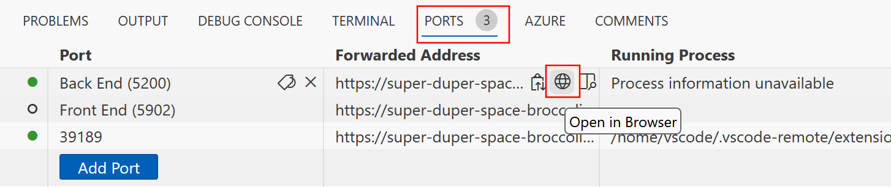

In this exercise, you learn to create a microservice endpoint and containerize it by using Docker.

> [!NOTE]
> You complete this exercise in an instance of GitHub Codespaces that has [Docker](https://www.docker.com/products/docker-desktop) and the [.NET SDK](https://dotnet.microsoft.com/download) preinstalled. When you use these tools and techniques in your own development environment, make sure that you have these prerequisites installed.

## Create a new GitHub codespace

Start by creating a new GitHub codespace that hosts the exercise.

You can set up a [preconfigured GitHub codespace](https://codespaces.new/MicrosoftDocs/mslearn-dotnet-cloudnative?devcontainer_path=.devcontainer%2Fdotnet-docker%2Fdevcontainer.json).

GitHub takes several minutes to create and configure the codespace. When it's finished, you see the code files for the exercise. The code that's used for the remainder of this module is in the */dotnet-docker* directory.

## Edit the Dockerfile to configure the Products back end

You can use a Dockerfile to containerize the Products web service.

1. When the setup is complete, within the top level directory, open the file named **DockerfileProducts**. This file is empty.
2. Enter the following code:

    ```dockerfile
    FROM mcr.microsoft.com/dotnet/sdk:8.0 AS build

    WORKDIR /DataEntities
    COPY "DataEntities/DataEntities.csproj" .
    RUN dotnet restore
    COPY "DataEntities" .
    RUN dotnet publish -c release -o /app
    ```

    This code sets up the DataEntities library in the Products Docker image by completing these steps:

    1. Pull the *mcr.microsoft.com/dotnet/sdk:8.0* image and name the image *build*.
    1. Set the working directory within the image to */DataEntities*.
    1. Copy the file named *DataEntities.csproj* found locally to the */DataEntities* directory that you created.
    1. Call `dotnet restore` on the project.
    1. Copy everything in the local *DataEntities* directory to the image.
    1. Call `dotnet publish` on the project.

3. Directly below the last line, enter this code:

    ```dockerfile
    WORKDIR /src
    COPY Products/Products.csproj .
    RUN dotnet restore
    COPY Products .
    RUN dotnet publish -c release -o /app
    ```

    This code performs the following steps sequentially when invoked:

    1. Set the working directory within the image to */src*.
    1. Copy the file named *Products.csproj* found locally to the */src* directory that you created.
    1. Call `dotnet restore` on the project.
    1. Copy everything in the local *Products* directory to the image.
    1. Call `dotnet publish` on the project.

4. Directly below the last line, enter this code:

    ```dockerfile
    FROM mcr.microsoft.com/dotnet/aspnet:8.0
    WORKDIR /app
    EXPOSE 80
    EXPOSE 443
    COPY --from=build /app .
    ENTRYPOINT ["dotnet", "Products.dll"]
    ```

    This code performs the following steps sequentially when invoked:

    1. Pull the *mcr.microsoft.com/dotnet/aspnet:8.0* image.
    1. Set the working directory within the image to */app*.
    1. Expose port 80 and port 443.
    1. Copy everything from the *app* directory of the *build* image that you created into the *app* directory of this image.
    1. Set the entrypoint of this image to `dotnet` and pass `Products.dll` as an argument.

## Create the Docker image

The next step is to use it to create a Docker image:

1. In a new terminal, run this command to go to the code root:

    ```cli
    cd dotnet-docker
    ```

1. To create the image for the Products back-end service, select the **TERMINAL** tab and run this command:

    ```bash
    docker build -t productsbackend -f DockerfileProducts .
    ```

    This code runs the commands in *DockerfileProducts* in the current directory and applies the tag `productsbackend` to the image.

1. After much output, the image is built. Enter `docker images` to see a list of all images in your codespace, including *productsbackend*. The other image is the one for the codespace itself.

## Run the container and test the service

Now you can use the image to run and host the Products service.

1. To create and run a container from the new *productsbackend* image and expose the service on port 5200, run this command:

    ```bash
    docker run -it --rm -p 5200:8080 --name productsbackendcontainer productsbackend
    ```

1. To test the service, select the **Ports** tab. Then, to the right of the local address for the **Back End** port, select the globe icon. The browser opens a new tab at that address.

    

1. To query some products, append the address with `/api/product`, and then select Enter. You should see some product information listed in JSON format.
