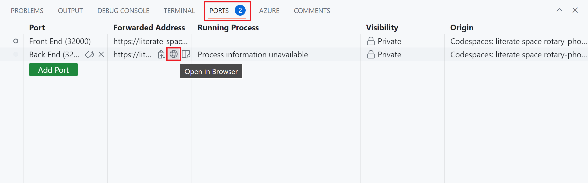

In this exercise, you'll learn to create a microservice endpoint and containerize it using Docker.

> [!NOTE]
> You will complete this exercise in a GitHub Codespace that has [Docker](https://www.docker.com/products/docker-desktop) and the [.NET SDK](https://dotnet.microsoft.com/download) pre-installed. When you use these techniques in your own development environment, make sure you have these prerequisites installed.

## Connect to the codespace

Let's start by connecting to the GitHub codespace that hosts the exercise.

### Pre-configured Codespace
You can setup a pre-configured GitHub Codespace with [this Codespace creation link](https://codespaces.new/MicrosoftDocs/mslearn-dotnet-cloudnative?devcontainer_path=.devcontainer%2Fdotnet-docker%2Fdevcontainer.json).

### Manually create new Codespace

1. Open a browser and go to the [eShopLite repository](https://github.com/MicrosoftDocs/mslearn-dotnet-cloudnative).
1. Select **Code** and then select the **Codespaces** tab.
1. Select **...** and then **New with options...**. Change the Dev container configuration to **eShopLite - dotnet-docker** and select **Create codesspace**.  GitHub creates and configures the codespace. This might take a few minutes.

    
1. The code used for the rest of this module is in the `/dotnet-docker` directory. 

## Edit the Dockerfile to configure the Products backend

Now we can use a Dockerfile to containerize the Products web service.

1. When the setup is complete, within the top level directory, open the file named **DockerfileProducts**. This file is empty.
2. Enter the following code:

    ```dockerfile
    FROM mcr.microsoft.com/dotnet/sdk:8.0 AS build

    WORKDIR /DataEntities
    COPY "DataEntities/DataEntities.csproj" .
    RUN dotnet restore
    COPY "DataEntities" .
    RUN dotnet publish -c release -o /app
    ```

    This code will sets up the DataEntities library in the Products docker image, by completing these steps:

    - Pull the `mcr.microsoft.com/dotnet/sdk:8.0` image and name the image `build`.
    - Set the working directory within the image to `/DataEntities`.
    - Copy the file named **DataEntities.csproj** found locally to the `/DataEntities` directory that you created.
    - Call `dotnet restore` on the project.
    - Copy everything in the local **DataEntities** directory to the image.
    - Call `dotnet publish` on the project.

3. Directly below the last line, enter this code:

    ```dockerfile
    WORKDIR /src
    COPY Products/Products.csproj .
    RUN dotnet restore
    COPY Products .
    RUN dotnet publish -c release -o /app
    ```

    This code performs the following steps sequentially when invoked:

    - Set the working directory within the image to `/src`.
    - Copy the file named **Products.csproj** found locally to the `/src` directory that you created.
    - Calls `dotnet restore` on the project.
    - Copy everything in the local **Products** directory to the image.
    - Calls `dotnet publish` on the project.

4. Directly below the last line, enter this code:

    ```dockerfile
    FROM mcr.microsoft.com/dotnet/aspnet:8.0
    WORKDIR /app
    EXPOSE 80
    EXPOSE 443
    COPY --from=build /app .
    ENTRYPOINT ["dotnet", "Products.dll"]
    ```

    This code performs the following steps sequentially when invoked:

    - Pull the `mcr.microsoft.com/dotnet/aspnet:8.0` image.
    - Set the working directory within the image to `/app`.
    - Expose port 80 and 443.
    - Copy everything from the **app** directory of the **build** image you created into the **app** directory of this image.
    - Sets the entrypoint of this image to `dotnet` and passes `Products.dll` as an argument.

## Create the Docker image

Having completed the Dockerfile, the next step is to use it to create a Docker image:

1. In a new terminal run this command to navigate to the code root:

    ```cli
    cd dotnet-docker
    ```

1. To create the image for the Products backend service, go to the **TERMINAL** tab and run this command:

    ```bash
    docker build -t productsbackend -f DockerfileProducts .
    ```

    This code runs the commands in **DockerfileProducts** in the current directory and applies the tag **productsbackend** to the resulting image.

1. After much output, the image will be built. Entering `docker images` shows you a list of all images in your codespace including **productsbackend**. The other image is the one for the codespace itself.

## Run the container and test the service

Now you can use the image to run and host the Products service.

1. To create and run a container from the new **productsbackend** image and expose the service on port 5200, run this command:

    ```bash
    docker run -it --rm -p 5200:8080 --name productsbackendcontainer productsbackend
    ```

1. To test the service, switch to the **PORTS** tab, then to the right of the local address for the **Back End** port, select the globe icon. The browser opens a new tab at that address.

    

1. To query some products, append the address with **/api/product** and then press <kbd>Enter</kbd>. You should see some product information listed in JSON format.
