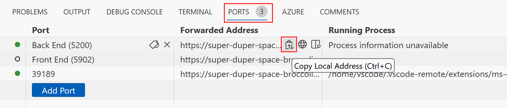

The Contoso outdoor equipment company has two services that they'd like to group together to build and deploy as a single unit. They decided to use Docker Compose to build the services together.

In this exercise, you create a Docker Compose YAML file, then use the Docker Compose utility to both build the Docker container images and run them.

## Connect to the codespace

If you need to connect to the codespace, follow these steps:

1. Open a browser and go to the [eShopLite repository](https://github.com/MicrosoftDocs/mslearn-dotnet-cloudnative).
2. Select **Code** and then select the **Codespaces** tab.
3. Select the codespace you created in the previous exercise. GitHub opens the codespace.
4. Change to the `/dotnet-docker` directory.

## Create the docker-compose file

Now we can use the docker-compose file to configure images for both the backend and frontend services:

1. In the topmost folder of the codespace (the same folder with README.md), open the file named **docker-compose.yml**.
2. Add the following code to the **docker-compose.yml** file:

    ```yml
    version: '3.4'

    services: 

        frontend:
            image: storeimage
            build:
                context: .
                dockerfile: DockerfileStore
            environment: 
               - ProductEndpoint=http://backend:8080
               - ImagePrefix=http://localhost
            ports:
               - "5902:8080"
            depends_on: 
               - backend
        backend:
            image: productservice
            build: 
                context: .
                dockerfile: DockerfileProducts
            ports: 
               - "5200:8080"
    ```

    This code does several things:

   - First, it creates the frontend website, naming it **frontend**. The code tells Docker to build it, pointing to the **DockerfileStore** file.
   - Then the code sets an environment variable for the website: `ProductEndpoint=http://backend:8080`. This code is how the frontend service finds the Products backend service.
   - A second environment variable specifies where images for products can be found.
   - The code opens a port and declares it depends on the backend service.
     - The backend service named **backend** gets created next. The same Dockerfile you created in the previous exercise builds it. The last command specifies which port to open.

3. Switch to the **PORTS** tab, then to the right of the local address for the **Back End** port, select the **Copy** icon. 

    

4. Paste this URL into the `ImagePrefix` environment variable in the **docker-compose.yml** file, replacing the text `http://localhost`. 
5. Append `images` to the pasted text:

    ```docker-compose
    environment: 
      - ProductEndpoint=http://backend:8080
      - ImagePrefix=https://super-duper-space-broccoli-5200.app.github.dev/images
    ```

## Build the images and run the containers

Now, lets use Docker Compose to build and start both front end and back end components:

1. To build the container images, switch to the **TERMINAL** tab, and then run the following command:

    ```bash
    docker compose build
    ```

1. Then, to start both the front end website and the back end web API, run this command:

    ```bash
    docker compose up
    ```

1. After a bit of output, the website and web API will be running. You should get something similar to the following output:

    ```output
    Attaching to docker-aspnet-products_backend_1, docker-aspnet-products_frontend_1
    ```

1. To test the front end service, switch to the **PORTS** tab, then to the right of the local address for the **Front End** port, select the globe icon. The browser displays the homepage. 
1. Select **Products**. The catalog shows Contoso's merchandise.
