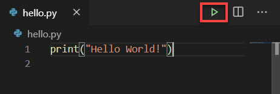
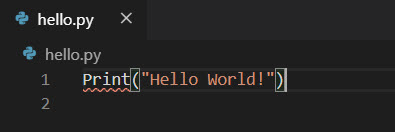
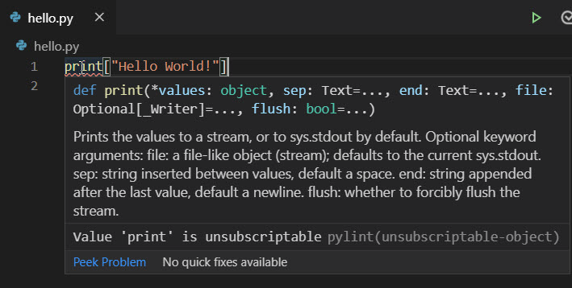

The easiest way to learn programming is to write dozens (if not hundreds) of tiny programs that help you understand fundamental ideas and practice crucial techniques.

## What you'll build

In this unit, you start building a program that prints a message to screen by using a single line of code.  This activity requires you to navigate Visual Studio Code and work in the code editor.

### Step 1 - Create a new folder for your first Python project

1. Create a folder structure, on your computer, where you'll store your work.  

   > [!NOTE]
   > We recommend that you create a single folder to contain all of the exercises for each module.  You can call this new parent folder anything you like, such as *python* or *learn*.  Use the tools and techniques you're comfortable with, and create the folder in a place on your hard drive that's easy to find.  

1. Create a subfolder, in this top-level folder,  for the exercise files you'll work with in this module.  You can call the new child folder anything you like, such as **hello**.

    > [!TIP]
    > In upcoming Python modules, when you're instructed to create a new folder, be sure to create new subfolders as children to the parent folder you're creating in this step.

### Step 2 - Open Visual Studio Code

Use the technique you're comfortable with to open Visual Studio Code from your operating system.

1. Open the folder you created in Visual Studio Code, select **File** > **Open Folder**.  

1. Look for and select the folder that you created, in the **Open Folder** window.

    The name of the folder is listed in the left pane of Explorer view.

### Step 3 - Create and save a new file

To create and save a file, you will use the UI in Visual Studio Code.

1. Select **File** > **New File**.  

    This action adds a new tab titled "Untitled-1" in the editor pane.

1. Select **File** > **Save As**, and then name the file _hello.py_.

### Step 4 - Add code to the file

The new _hello.py_ file is empty, but you will add code to it next.

Type the following code, in the editor pane:

```python
print("Hello World!")
```

> [!Important]
> Enter the code exactly as you see it here, typing the parentheses and quotation marks in the correct order and using lowercase letters for the word *print*.  If you type even one character incorrectly, it could cause your program to have an error and not work.

### Step 5 - Save the file and execute your program

1. After typing the code, select **File** > **Save**.

    > [!Note]
    > You can see that your file needs to be saved if there's a white dot to the right of the file name on the tab.

1. Select the green arrow to the right of the tabs, to execute your program.  

    If you hover over the arrow, you'll see the tooltip "Run Python File in Terminal."  That lets you know you're in the right place.

    

    When the code is run, two lines appear in the **Terminal** window:

    - The first line is the command to compile and execute the code file.  

      ```output
      C:\python\hello>C:/Users/<user>/AppData/Local/Programs/Python/Python38-32/python.exe c:/python/hello/hello.py
      ```

      > [!NOTE]
      > The output varies depending on your operating system.  Also, from Windows, your path will be different.  For *\<user>*, substitute your user name.

    - The other line printed to the Terminal window appears below the code window:

      ```output
      Hello World!
      ```

    Success!

### Wait, I got an error

It's possible to experience an error when you attempt to run the code. An error can happen for many different reasons.

For example, you might have used an uppercase *P* instead of a lowercase *p* in *print*, as shown:

```python
Print("Hello World!")
```

An uppercase *P* would produce the following error message in your output:

```output
Traceback (most recent call last):
  File "c:/python/hello/hello.py", line 1, in <module>
    Print("Hello World!")
NameError: name 'Print' is not defined
```

> [!Important]
> As discussed earlier, precision is critical when you're writing code.  Python is case-sensitive, which means that *print* and *Print* are two different things. There's no function called `Print` with an uppercase *P*.

Fortunately, Visual Studio Code can help you spot mistakes like this before you run the code.  You should see a red squiggly line under *Print*.  If you hover over the word, a tooltip displays the phrase "Undefined variable 'Print'".  The specific message requires more explanation, but for now you can at least spot potential problems in your code.



> [!Important]
> You must save the changes to your file to display the red squiggly line.

### Syntax error, transposed character order

You can use this same technique to locate other types of issues in your code. For example, let's say you transposed the order of certain characters, such as the closing parenthesis and closing quotation mark. 

1. Type the following code in the editor pane and save it:

    ```python
    print("Hello World!)"
    ```

1. Run the code, you see the following error message:

    ```output
      File "c:/python/hello/hello.py", line 2
    
                             ^
    SyntaxError: unexpected EOF while parsing
    ```

  Here again, the error message might not be meaningful yet. After you save the file, Visual Studio Code adds a red squiggly line under the closing quotation mark, which should at least provide a useful clue as you self-diagnose the error.

  This code doesn't work because it doesn't follow the syntax rules of Python.  Syntax in code is similar to grammar in human language.  We'll explain why this code violates Python syntax rules in a moment.

### Syntax error, brackets over parenthesis

Some errors are easy to spot and easy to fix.  Others require a bit more effort.  

1. Use square brackets instead of parentheses, as shown here:

    ```python
    print["Hello World!"]
    ```

    After you save the file, a red squiggly line appears under *print*.  This time, when you hover over the red squiggly line, you see a paragraph with additional information.  

    

    We'll discuss what this information means in another module, but we can skip over it for now because it's a bit advanced at this point.  The main takeaway is that there's a problem with the code.

1. Run the program, the following error message appears in the output:

    ```output
    Traceback (most recent call last):
      File "c:/python/hello/hello.py", line 1, in <module>
        print["Hello World!"]
    TypeError: 'builtin_function_or_function' object is not subscriptable
    ```

    Unfortunately, this error message isn't helpful, because it doesn't describe the problem: to invoke a function, you need to replace the square brackets with parentheses.

In future situations like this, you'll need to lean on your knowledge of Python and a keen eye to spot the problem.

You gain both knowledge and a keen eye through experience.  It may seem daunting at first but, with practice, you will master this information and much more.

## How did your program work?

You invoked a *function* named `print`.  A function contains code that works together to complete a single task in a software system.  The function is given a name so that you can call it by that name to invoke its functionality.  The `print` function's only job is to send information to output, and that output can be displayed via a command line or terminal window.

To invoke a function, you use a set of parentheses called function invocation operators.  The set of parentheses is your instruction to the Python interpreter that you want it to execute that function for us.

Later, you'll learn how to create your own functions.  At first, you'll use functions that the creators of Python have created to help you write applications more quickly.  Also, you'll learn how to utilize third-party libraries that dramatically expand the functionality that's available to your Python programs to perform a vast array of tasks.

Some functions allow you to pass an argument, which the function can use to complete its task.  In this case, you sent the `print` function a *literal string* containing your message, `Hello World!`.  You pass arguments inside of the function invocation operators.

A literal string is a hard-coded value containing alphanumeric characters.  In other words, you want to print to output exactly this string of characters: `H`, `e`, `l`, `l`, `o`, an empty space, `W`, and so on.  You define a literal string by using a pair of quotation marks or a pair of single quotation marks.

When the Python compiler evaluates code, it checks for syntax errors and then converts the code into a compact syntax called *bytecode*, which consists of only zeros and ones.  The Python interpreter understands how to read this syntax, and it processes each instruction therein, line by line.  

In our scenario, there's only one line of code.  If there were more, it would work from the top to the bottom. Then, after it has executed the last line, it would exit the program and return control to the operating system.

## Recap

Let's take a moment to recap the most important lessons from this first unit:

- **Writing Python code is an exercise in precision**.  Use the correct spelling, capitalization, and symbols when you type code.
- **`print()` function for output**. Use the `print` function to display textual information to output via a command line or terminal interface.
- **A literal string**, is a string of individual characters that you want to use exactly as written in your program.  You define a literal string by using a pair of quotation marks or single quotation marks.
- **Visual Studio Code helps authoring and running code**. Visual Studio Code makes it easy to create a code file, save your work, and then run your code by selecting the green arrow icon.
- **Compiler indicates errors**. If your code includes invalid syntax, the Python compiler stops the execution and displays an error.  By using the clues provided by the compiler, you can fix the error and try again.
- **Visual clues helps indicate problems**. When you save your code file, Visual Studio Code analyzes the code and adds a visual clue that helps you spot potential errors before you attempt to run the program.
