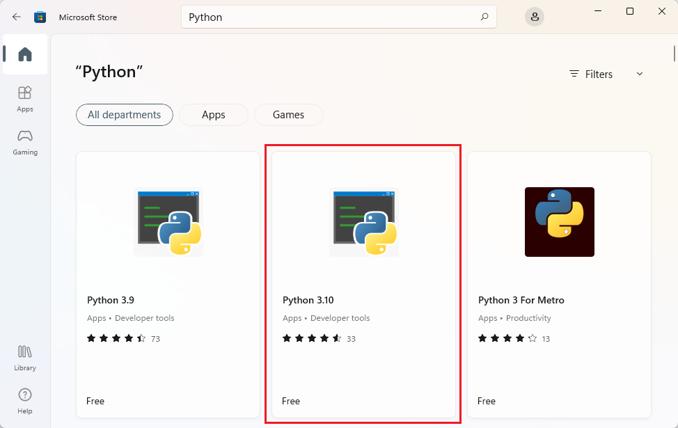
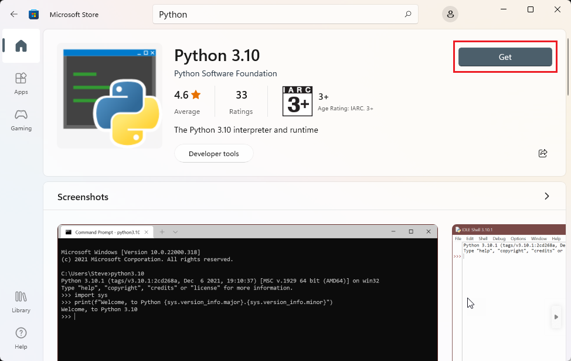
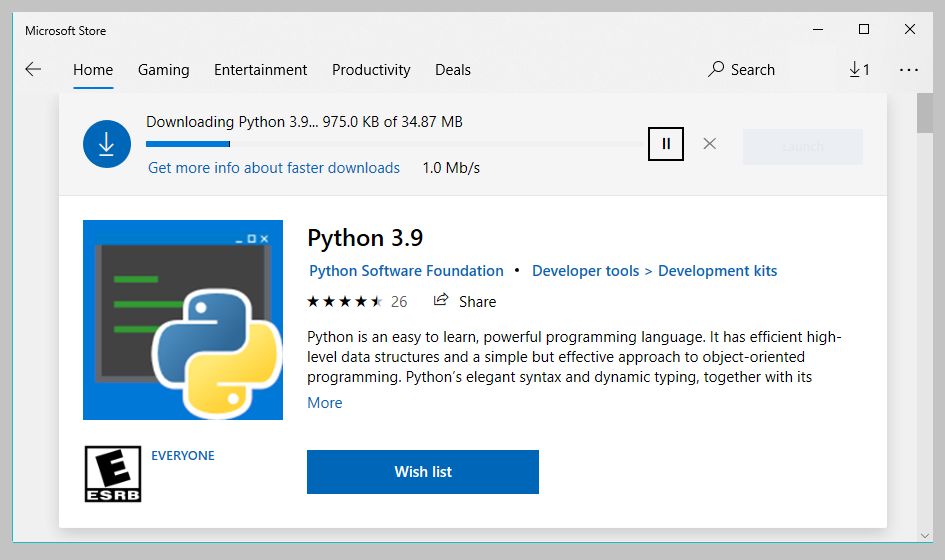

Previously you ran a command to determine whether you had Python 3 installed. If you need to install Python 3, choose your operating system at the top of this page, and then follow the instructions.

If you determine you already have Python 3 installed, you can scroll to the bottom of this page and select **Continue**.

::: zone pivot="windows"

## Install Python on Windows from the Microsoft Store

When this module was written, Python 3.9 was the latest version of Python available, so we'll be referring to that version in the following instructions.

> [!NOTE]
> These instructions are specifically for Windows 10. If you're using a previous version of Windows, refer to the [official Python downloads page](https://www.python.org/downloads/?azure-portal=true) for more information.

> [!NOTE]
> At the time of this writing, Python 3.9.0 is the most current version of Python, so we refer to that version in these instructions. You should install the latest version available. If you install a different version, the text on buttons and the filenames that you see might be slightly different from the ones in these instructions.

1. Open the Microsoft Store by selecting *Start*, typing *start* and *Microsoft Store*. 

1. Once open, search for **Python**.

    You'll be presented with a list of various options.

1. Select the most recent version of Python, which at the time of this writing is Python 3.9.

    

1. Select *Install*, on the details screen.

    

    Python will be installed in the background. The installation may take a couple of minutes depending on the speed of your system.

    

    After Python installs, return to the command prompt. 

1. Enter the following command `python --version` and then select <kbd>Enter</kbd> to see the version of Python:

    ```bash
    python --version
    ```

::: zone-end

::: zone pivot="linux"

## Install Python on Linux

When this module was written, Python 3.9 was the latest version of Python available, so we'll be referring to that version in the following instructions.

The package manager you use depends on the version of Linux. Most popular Linux distributions include either APT (an acronym for "Advanced Packaging Tool") or YUM (an acronym for "Yellowdog Updater, Modified").

We provide instructions for APT and YUM in this unit. If your distribution of Linux uses a different package manager, you might need to search for **\<your Linux distribution> install python 3**.

### Install by using APT

If you use APT, you can use these instructions to install Python 3.

1. Open a terminal window.

1. Enter the following command to update APT package indexes.

    ```bash
    sudo apt-get update
    ```

    The `apt-get update` command updates the list of packages (the package indexes) from the repositories and Personal Package Archives (PPAs) that it's aware of. This update enables `apt-get` to find the latest versions of the packages that you want to install and their dependencies.

    > [!NOTE]
    > The `sudo` command temporarily elevates your permissions to root, the most powerful level of the system. When you use `sudo`, you'll usually be asked for your user account's password.

    `apt-get update` displays all the items it will update. It might prompt you to approve by entering `y` or `yes`, and then pressing <kbd>Enter</kbd>.

1. Run the following command to install Python 3 at a Bash prompt

    ```bash
    sudo apt-get install python3
    ```

    > [!NOTE]
    > `apt-get install` locates the appropriate packages from the package index, downloads the necessary files, and installs the files into the appropriate folders.

1. Run `python3`, To confirm that Python 3 installed correctly:

    ```bash
    python3 --version
    ```

    You should see the word `Python` with a set of numbers separated by `.` characters. The following example shows the output you might see.

    ```output
    Python 3.9.1
    ```

    As long as the first number is `3`, Python 3 installed successfully.

    If the installation failed, you might see an error message. Enter the exact error message into a search engine's search box to find possible causes and solutions.

### Install by using YUM

The YUM package manager is used mainly by Red Hat systems, like Red Hat Enterprise Linux and Fedora, and by CentOS. If APT isn't installed on your system, you can try YUM instead.

1. Open a Terminal window

1. Run `sudo yum update`, to update the YUM package indexes

    ```bash
    sudo yum update
    ```

    `yum update` will make sure all packages and their dependencies are up to date. It's a good idea to update the package list before you install new software.

1. Run the following command `yum install` to install Python 3

    ```bash
    yum install rh-python39
    ```

1. Run `python3 --version` to verify installation:

    ```bash
    python3 --version
    ```

    You should see the word `Python` with a set of numbers separated by `.` characters. The following example shows the output you might see.

    ```output
    Python 3.9.1
    ```

    As long as the first number is `3`, Python 3 installed successfully.

    If the installation failed, you might see an error message; step 5 will help your resolve any error message.

#### (Optional) Enable the Software Collections feature in Bash

Software Collections enables you to install multiple versions of the same software components on your system. You need to specify which version of Python you want to run in the shell.

1. Run the following command `scl enable` at a Bash prompt:

    ```bash
    scl enable rh-python39 bash
    ```

1. Again, verify that everything is ok by running `python3 --version`.

    ```bash
    python3 --version
    ```

    You will see an output resembling the following:

    ```output
    Python 3.9.1
    ```

    As long as the first number is `3`, Python 3 installed successfully, in the context of a Software Collection.

    `scl enable` starts a new Bash session, setting Python 3.6 as the default Python version. But Python 3.6 is the default version only for the current shell session. If you exit the session or open a new session from another terminal, Bash will revert to Python 2.7 as the default Python version.

    For more information, see
    [Red Hat Software Collections 2.4](https://access.redhat.com/documentation/en-us/red_hat_software_collections/2/html/2.4_release_notes/chap-rhscl?azure-portal=true).

    > [!IMPORTANT]
    > If you needed to use `scl enable` to run `python3 --version`, you might need to run that command every time you want to work in Python. There are workarounds, but this is the intended functionality of Software Collections.  See [Make a Red Hat Software Collection persist](https://access.redhat.com/solutions/527703?azure-portal=true) for a possible workaround.

::: zone-end

::: zone pivot="macos"

## Install Python on macOS

Follow these steps to download the Python installer from the Python website.

> [!NOTE]
> At the time of this writing, Python 3.9.0 was the most current version, so we refer to that version in these instructions. You should install the latest version available. If you install a different version, the text on buttons and the filenames that you see might be slightly different from the ones in these instructions.

> [!NOTE]
> Alternatively, you can use Homebrew to install Python and Visual Studio Code. For instructions, see 
[Homebrew documentation](https://docs.brew.sh/Homebrew-and-Python?azure-portal=true).

1. Download installer from [Python download page](https://www.python.org/downloads/?azure-portal=true).

    The website should automatically direct you to a page specifically for macOS. Select **Download Python 3.9.0**.

    You might see a window prompting you to allow downloads from python.org. Select **Allow**.

    After a moment, a file named _python-3.9.0-mascosx10.9.pkg_ should download to the Downloads stack in your Dock.

    > [!NOTE]
    > the name of the downloaded file varies depending on what's the latest version of Python.

1. Double-click the _.pkg_ file that you downloaded to start the installer. The Python installer will prompt you to install, verify, and accept various options and license agreements. Take the time to read through these prompts to understand what the installer will do to your computer.

    When the installation process finishes, a Finder window showing the contents of the Python folder will appear. You also should see a congratulations screen when the installation finishes. At that point, you can select **Close**.

    If you're prompted to move the Python installer to the trash, you can do so.

1. Verify installation by running `python3 --version` in a terminal window:

    ```bash
    python3 --version
    ```

    You should see the word `Python` with a set of numbers separated by `.` characters. The following example shows the output you might see.

    ```output
    Python 3.9.0
    ```

    As long as the first number is `3`, Python 3 installed successfully.

::: zone-end

You have now successfully installed Python on your local system.
