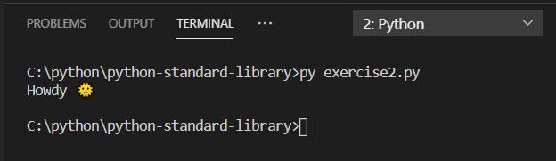

While the Python standard library has extensive support for a wide array of features, it can't possibly address every possible solution.  Fortunately, an open-source software community has created thousands of packages that fill in the gaps.

In this exercise, you'll use `pip`, a utility that accesses a popular Python package index named Python Package Index (PyPI).  Combining the two, you can find packages you need for just about any purpose imaginable.

Suppose you want to enhance your output with emoticons, like a smiley face or thumbs up symbol.  The Python standard library does not support that.  However, you can find candidate packages available on PyPI and use `pip` to install a package locally for development.

### What is a Python package?

A Python package is a means of organizing, collecting, and distributing code so that it can be used by other developers.  Packages provide a hierarchical folder and file system means of organizing your code, and allow dependencies to be distributed along with your code as well.

Creating packages is beyond the scope of this module, but you should at least know what it is and how `pip` installs both the package you need and the dependencies it relies on.

### What is a dependency?

A dependency is any separate package that your code needs in order to function properly.  Suppose you wanted to create a package with some functionality that you think would benefit others.  One of the steps required when you package your code is to specify the name and version of the packages you depend on in a manifest file named `setup.py`.  When another developer wants to use your package, they'll use `pip`.  The `pip` utility will look at the manifest and also install (or update) any required dependencies you specified so that your package will work properly on their computer.

### Step 1 - Add a code file to your working directory for this exercise

Assuming you're continuing from the previous unit, use the techniques you learned in previous modules to add a new code file in the current folder dedicated to this module.  For example, you might create a file named `exercise2.py`.

### Step 2 - Navigate in your web browser to the Python Package Index (PyPI)

In your web browser, navigate to the [Python Package Index](https://pypi.org/?azure-portal=true).

The PyPI boasts over 200,000 different projects.  Use the search bar on the home page to search for the term "emoji."  This will return 16 pages worth of search results.

You are looking for the project called "emoji," which should be one of the top results.  You can find the direct hyperlink at the following URL:

[https://pypi.org/project/emoji/](https://pypi.org/project/emoji/?azure-portal=true)

This URL displays a project description, example, installation instructions, the license, authors, and more.

We're interested in the installation instructions and example code.

### Step 3 - Use `pip` to install the `emoji` package

Back in the Visual Studio Code terminal, enter the following command on Linux and macOS.

```bash
pip install emoji
```

On Linux and macOS, if you get a message that you do not have sufficient privileges, then you must use the super user account.  Enter the following command.

```bash
sudo pip install emoji
```

If you're on Windows, you may need to use the `py` utility to execute `pip`.  Try the following command on Windows.

```cmd
py -m pip install emoji
```

> [!IMPORTANT]
> If you still can't get it to work using `pip`, substitute with the word `pip3` instead.

### Step 4 - Add code to import and call the new package's functionality

The example code on the PyPI page demonstrates how to use the `emoji` package's `emojize` function to encode a string representation of an emoticon that can be displayed by the `print()` function.

Using a similar technique to what we learned in the previous unit, add the following code to `import` the package you installed, and call the function that will encode the emoticon.

```python
import emoji
message = emoji.emojize('Howdy :sun_with_face:')
print(message)
```
When you execute the code, you should see the following output.




### Recap

- Visit PyPI to find candidate packages that address your programming need instead of trying to build the code logic yourself.  Use information from the PyPI package documentation to install and use the package's functionality in your program.
- Use the `pip install <packagename>` command to install a package locally along with all of its dependencies.
