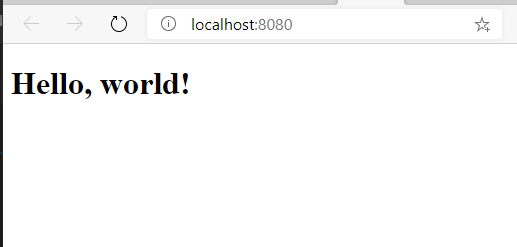

The most common way to start any programming course is to display the text "Hello, world". We're going to continue with this tradition, and use React to display the famous text.

We'll create two items that will act as the base for our entire project:

- **index.html** acts as the host for our React application.
- **index.jsx** is responsible for mounting our application.

## Create the application host

1. In Visual Studio Code, create a new file in the **public** folder named **index.html**.
1. Add the following HTML:

    ```html
    <!DOCTYPE html>
    <html lang="en">
    <head>
        <title>Recipes</title>
    </head>
    <body>
        <div id="app"></div>
        <script type="module" src="/dist/index.js"></script>
    </body>
    </html>
    ```

### Exploring the code

There are two key lines in our HTML:

- `<div id="app"></div>`
  - Creates the HTML element that hosts our React application.
  - We call this element by its ID to render our application.
- `<script type="module" src="/dist/index.js"></script>`
  - Loads the JavaScript.

> [!NOTE]
> You'll notice that the name of the file we are importing is **index.js**. You might be wondering why we are not using **index.jsx**. The reason is that browsers are unable to render JSX files. We always need a bundler (Snowpack in our case) to generate JavaScript, and we reference the JavaScript rather than the JSX.
>
> If you are unfamiliar with the `type="module"` attribute, this allows us to use `import` statements in our JavaScript (or JSX) files. This is relatively new to browsers, and makes it much easier to import the necessary packages and components.

## Create the entry point for our React application

We need code to render our React application inside the HTML. This is traditionally done in a file named **index.jsx**.

1. Create a new file inside the **src** folder named **index.jsx**.
1. Add the following code:

    ```jsx
    import React from 'react';
    import ReactDOM from 'react-dom';

    ReactDOM.render(
        <h1>Hello, world!</h1>,
        document.getElementById('app')
    );
    ```

### Exploring the code

Our **index.jsx** file starts by importing two key libraries. The first, `React`, allows us to uses JSX and will be imported in every component or JSX file we create. The second, `ReactDOM`, is used to render our application inside the HTML.

`render` takes two parameters. The first is the HTML we wish to display (an `h1` in this case). The second is the HTML element we wish to use to display our HTML, the element with an ID of `app` that we created earlier.

Notice how we are able to use HTML inside our JavaScript. This is the power of JSX!

## Launch the page

With our code created, let's see our site in action!

1. Open the integrated terminal in Visual Studio Code by selecting **View** > **Terminal** (or selecting **Ctl-\`** (or **Cmd-\`** on a Mac).
1. Use the following command to start Snowpack's dev server:

    ```bash
    npm start
    ```

Your default browser should automatically open and display your page. If this does not happen automatically, open your browser and navigate to **http://localhost:8080**. You should now see your page!



### Exploring the generated code

There is no magic in JSX. As highlighted earlier, our JSX is converted into the appropriate HTML and JavaScript for display in the browser. If you open **http://localhost:8080/dist/index.js**, which is the JavaScript generated by Snowpack, you'll see the following:

```javascript
import React from "../web_modules/react.js";
import ReactDOM from "../web_modules/react-dom.js";
ReactDOM.render(/* @__PURE__ */ React.createElement("h1", null, "Hello, world!"), document.getElementById("app"));
```

The line of code to focus on is the one that generates the `h1` element and places the text inside it:

```javascript
React.createElement("h1", null, "Hello, world!")
```

This is similar to using `document.createElement` with vanilla JavaScript. The tooling provided by Snowpack and other bundlers allows us to use JSX knowing the appropriate browser-friendly code is automatically generated.
