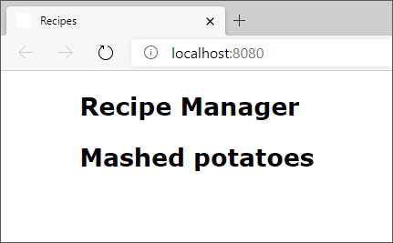

Components allow you to break an application down into logical components. We might want to create a component for the title of a recipe. Let's explore both how to create and import components into `App`, and also how we can display data dynamically.

## Display dynamic data

If you want to display dynamic data inside a component, you use the syntax `{ }`, sometimes known as handlebars. This style of syntax is relatively common with HTML templating tools. With `{ }` you're effectively switching into JavaScript mode, which allows you to execute almost any valid JavaScript. If you wanted to display the current time, you could use the following code:

```javascript
<div>{ Date.now() }</div>
```

## Create a RecipeTitle component

In our example, we create a component for the title of a recipe. We use a JavaScript variable for the title of the recipe to demonstrate how React can display dynamic data. In future units you'll see how you can work with more complex data.

1. Create a new file in the **src** folder named **RecipeTitle.jsx**.
1. Add the following code to **RecipeTitle.jsx**:

    ```jsx
    import React from 'react';

    function RecipeTitle() {
        const title = 'Mashed potatoes';
        return (
            <h2>{ title }</h2>
        )
    };
    export default RecipeTitle;
    ```

### Exploring the code

Notice that we create a constant named `title`. We then use the `{ }` or handlebar syntax to tell React we want to display the value of `title` inside the `<h2>` element. This is one of the great features of JSX, allowing us to mix JavaScript and HTML.

## Use the RecipeTitle component

Let's display `RecipeTitle` in our application by adding it to `App`.

1. Open **src/App.jsx**.
1. Below the line that reads `import React from 'react';` (which should be line 2), add the following:

    ```javascript
    import RecipeTitle from './RecipeTitle'
    ```

1. Use `RecipeTitle` as an HTML element by adding the following code below the syntax that reads `<h1>Recipe Manager</h1>`:

    ```jsx
    <RecipeTitle />
    ```

### Exploring the code

The entire contents of **src/App.jsx** should now be:

```jsx
import React from 'react';
import RecipeTitle from './RecipeTitle'

function App() {
    return (
        <article>
            <h1>Recipe Manager</h1>
            <RecipeTitle />
        </article>
    )
}

export default App;
```

Much in the same way we were able to use `<App />` as if it were an HTML element, we can use `RecipeTitle`. This is the core to creating React applications - creating and using components to build your application.

## See the results

Save all files. The browser should automatically refresh and display the updated page, with **Mashed potatoes** now displayed.


