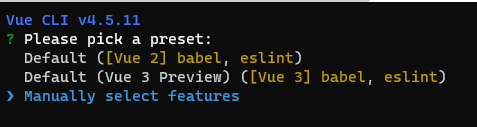
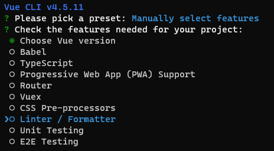
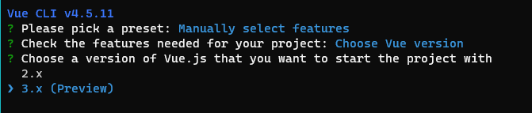
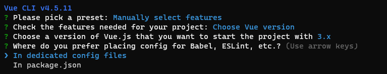

We want to create an application to allow someone to book a cruise to the moon for our fictitious company Relecloud. We'll use Vue CLI to bootstrap our application.

## Install Vue CLI

Vue CLI is available through [npm](https://www.npmjs.com/?azure-portal=true), the packaging tool that Node.js uses. The npm tool is automatically installed when you install Node.js. To ensure that you have npm and Node.js installed on your system, open a command or terminal window and run the following commands:

```bash
node -v
npm -v
```

> [!IMPORTANT]
> Vue CLI is typically installed globally via npm, which requires elevated permissions if you've installed Node.js directly. Using Node Version Manager (nvm) allows you to perform the installation as a regular user. You can install [nvm on Linux, Windows Subsystem for Linux (WSL), or macOS](https://github.com/nvm-sh/nvm#installing-and-updating/?azure-portal=true), or install [nvm-windows on Windows](/windows/nodejs/setup-on-wsl2/?azure-portal=true).

To install Vue CLI, open a command or terminal window and run the following command:

```bash
npm install -g @vue/cli
```

The installation of Vue CLI on your system takes a couple of minutes.

## Bootstrap an application

The fastest way to bootstrap a Vue application is through Vue CLI. We'll now create a starter application by using Vue CLI.

1. In a command or terminal window, go to a folder where you want to store your application.
1. Create a Vue application by running the following command:

    ```bash
    vue create relecloud
    ```

1. When you're prompted, use the arrow keys to move to **Manually select features**, and then select the <kbd>Enter</kbd> key.

    

1. When you're prompted for features needed for your project, use the arrow keys to move to **Babel**, and select the <kbd>Spacebar</kbd> to disable it. Then use the arrow keys to move to **Linter / Formatter**, and select the <kbd>Spacebar</kbd> to disable it.

    

1. Select the <kbd>Enter</kbd> key to confirm the feature choice.

    > [!NOTE]
    > For production projects, you might decide to add more features. These features are outside the scope of this module.

1. When you're prompted to choose a version of Vue.js, use the arrow keys to move to **3.x**, and then select the <kbd>Enter</kbd> key.

    

1. When you're prompted to choose where you prefer to place configuration files, leave the default of **In dedicated config files** and select the <kbd>Enter</kbd> key.

    

1. When you're prompted to save this information as a preset, select the <kbd>Enter</kbd> key to accept the default of **No**.

Your project will now be created, and the necessary libraries will be installed. The process takes a few moments.

## Explore the code

Let's explore the code that Vue CLI has created.

1. When the installation finishes, change directories into *relecloud* and open it in Visual Studio Code by running the following commands:

    ```bash
    cd relecloud
    code .
    ```

1. In Visual Studio Code, open *package.json*.
1. `vue` is listed as a dependency, and `@vue/cli-service` is listed as a `devDependency`.
    > [!NOTE]
    > The `@vue/cli-service` part is responsible for building your application and running the development server.
1. Note the two scripts:

   - The `serve` script will start the development server.
   - The `build` script will create the JavaScript, HTML, or CSS when you're ready to publish your project.
1. Open *public/index.html*, which will host the Vue application.
1. Open *src/main.js* and note the code that imports `App` from *App.vue*.
1. Open *src/App.vue*, which contains the core component that we'll explore in the next unit.
    > [!NOTE]
    > Visual Studio Code might prompt you with a suggested extension. We'll install the extension in a later module.
1. Note the *src/components* folder, which is where all components will be stored.

## Run the development server

Let's start the development server and see the default page.

1. Open a new terminal window in Visual Studio Code by selecting **Terminal** > **New Terminal**.
1. In the integrated terminal, run the following command to start the development server:

    ```bash
    npm run serve
    ```

1. Open your browser and go to `http://localhost:8080`.

    The default Vue application appears.

    :::image type="content" source="../media/vue-default.png" alt-text="Screenshot of the default Vue page.":::

Congratulations! You've now created a Vue application by using Vue CLI.
