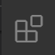
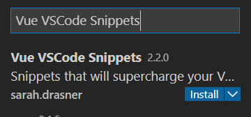
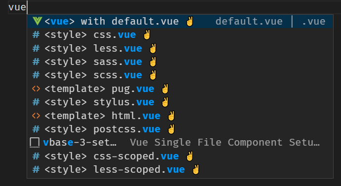
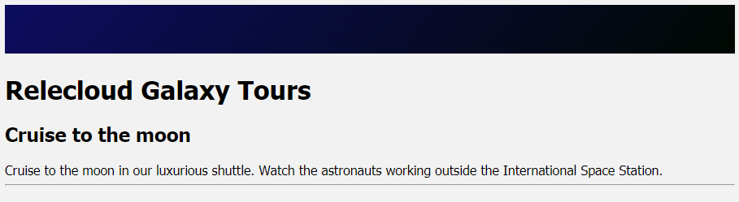

We want to create an application that allows a user to create bookings on a cruise to the moon. Over the course of a few exercises, you create a component for the form the user completes when creating a booking, and another to display the list of created bookings. The first component that you create will host both child components.

## Install Visual Studio Code extensions

Visual Studio Code has numerous extensions in the [Visual Studio Marketplace](https://marketplace.visualstudio.com/vscode/?azure-portal=true) to help in your development endeavors. Here, we take advantage of two:

- [Volar](https://marketplace.visualstudio.com/items?itemName=Vue.volar) enables support for *.vue* files in Visual Studio Code.
- [Vue VSCode Snippets](https://marketplace.visualstudio.com/items?itemName=sdras.vue-vscode-snippets&azure-portal=true) from Sarah Drasner enables snippets in Visual Studio Code.

1. In Visual Studio Code, open the **Extensions** workbench.

    

1. Enter **Vue VSCode Snippets** in the search box.
1. Select **Install** under **Vue VSCode Snippets** to install both Vue VSCode Snippets and Volar.

    

## Create the Host component

Let's create the *Host* component.

1. In *src/components*, create a file named *Host.vue*.
1. In *Host.vue*, type **vue**, and then select **\<vue\> with default.vue** from the snippets menu.

    

    The snippet creates the default structure.

## Update the script section

The snippet creates the `script` element for us, with `export default` already created. The `export default` command allows another component to load this component in Vue. Let's add the needed code into this section.

Inside the curly braces (`{ }`) of `export default`, add the following code to name the component, register the data, and add two comments for the future:

```javascript
name: 'Host',
data() {
    return {
        cruise: {
            name: 'Cruise to the moon',
            description: 'Cruise to the moon in our luxurious shuttle. Watch the astronauts working outside the International Space Station.',
            cabins: [
                { name: 'Coach', price: 125000 },
                { name: 'Business', price: 275000 },
                { name: 'First', price: 430000 },
            ]
        },
        bookings: [
            { name: 'Sample', price: 0 }
        ]
    }
},

// TODO: Add components

// TODO: Add methods

```

The `name` field sets the name of the component. The `data()` part registers the `cruise` object as data for the component. We'll use `bookings` later to store a list of cruise bookings. The `TODO` comments serve as markers for the future.

> [!NOTE]
> `TODO` comments are a great way to place notes in your code for tasks that need to be completed later.

## Add the template

With the data registered, let's add the HTML to the `template` element to display the core information. Let's also add a couple of placeholders for the future.

Inside the `template` element in *Host.vue*, add the following HTML to display the name and description of the cruise. The HTML includes a placeholder for two components that we'll create later.

```html
<section>
<div class="nav-bar"></div>
<h1>Relecloud Galaxy Tours</h1>

<div>
    <h2>{{ cruise.name }}</h2>
    <div>{{ cruise.description }}</div>
    <hr />

    <div class="row">
        <div>
            <!-- TODO: Add booking-form -->

        </div>
        <div>
            <!-- TODO: Add booking-list -->

        </div>
    </div>
</div>
</section>
```

## Add the style

With the HTML created, let's add the style for our application.

Inside the `style` element in *Host.vue*, add the following CSS:

```css
body {
    background-color: #f2f2f2;
    margin: 0, 5%;
    font-family: tahoma;
}

.row {
    display: grid;
    grid-template-columns: 1fr 1fr;
    vertical-align: middle;
    margin: 2em;
}

.button {
    background-color: #39495c;
    border-radius: 5px;
    color: white;
    text-align: center;
}

.nav-bar {
    background: linear-gradient(-50deg, #010801, #0d0d60);
    height: 60px;
    margin-bottom: 25px;
}
```

This CSS adds some structure and color to our application.

## Set the Host component as the entry point into the application

Vue CLI creates a *main.js* file, which loads *App.vue* as the entry point into the application. We created a new component called *Host* for this purpose. Let's update *main.js* to use our component.

Open *main.js* and replace the contents by using the following code:

```javascript
import { createApp } from 'vue'
import Host from './components/Host.vue'

createApp(Host).mount('#app')
```

## Test the application

With our component created and the script updated, let's test the page.

1. Save all files by selecting **File** > **Save all**.
1. Return to your browser and refresh the tab that displays `http://localhost:8080`.

    Your updated page now appears.

    

You just created your first single-file component in Vue.js!
