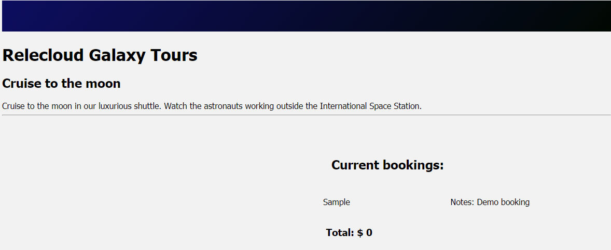

Let's continue building our application by creating a component to display the current list of bookings. You'll add in a form that the user can use to add bookings, so create a static array for now.

## Create the component

Start by creating the component.

1. In Visual Studio Code, create a file named *BookingList.vue* in *src/components*.
1. In *BookingList.vue*, type **vue**, and then select **\<vue\> with default.vue** from the snippets menu.

    

    The snippet will create the default structure.

## Register the props and computed value

We're expecting an array of information about bookings, so we'll declare our prop as type `Array`. Because you're creating a component, you can also take advantage of computed properties to automatically calculate values for you. You'll add a computed property to add the total price and return a display value that you can use.

1. Open *src/components/BookingList.vue* if it's not already open.
1. Inside the curly braces (`{ }`) for `export default`, add the following code to create a prop named `bookings` and the `computed` property:

    ```javascript
    props: {
        bookings: Array
    },
    computed: {
        totalDisplay() {
            let totalCost = 0;
            if (this.bookings && this.bookings.length > 0) {
                totalCost = 
                    this.bookings.map(b => b.price)
                                .reduce((a, b) => a + b);
            }
            return '$ ' + totalCost.toLocaleString('en-US');
        }
    }
    ```

    Notice how `totalDisplay` can access the `bookings` prop by using `this`, which is how we would be able to access data or other properties declared as part of our component. We create the code to calculate the total of all prices listed in `bookings`, and to create a string display.

## Add the template for display

Let's add the template to display the information for our bookings. You'll use `v-for` to loop through all bookings and the `totalDisplay` computed property that we created earlier.

1. Open *src/components/BookingList.vue* if it's not already open.
1. Inside the `<template>` element, add the following HTML:

    ```html
    <section>
    <h2>
        Here's your current bookings:
    </h2>

    <div class="row" v-for="(booking, index) in bookings" :key="index">
        <div>{{ booking.name }} </div>
    </div>

    <h3 class="row">
        Total: {{ totalDisplay }}
    </h3>
    </section>
    ```

    Our code iterates through all bookings with `v-for` and displays `cabin`. We then call `totalDisplay` to display the total cost of all bookings.

## Add the component to the main page

Let's use the component that we created and pass in a list of bookings.

1. Open *src/components/Host.vue*.
1. Add a new line below the opening `<script>` tag and before `export default`.
1. Add the following code (including the comment) to import the `BookingList` component:

    ```javascript
    import BookingList from './BookingList.vue';
    // TODO: Register next component
    ```

1. Register the component by adding the following code (including the comment) below the `TODO: Add components` comment:

    ```javascript
    components: {
        BookingList,
        // TODO: Add next component

    },
    ```

    > [!IMPORTANT]
    > The two commas are required because we'll add more values in the future.

## Use the component

With the component registered, let's call it in our page. We'll use the `bookings` array that we created earlier to seed the list of bookings on the page.

1. Open *src/components/Host.vue* if it's not already open.
1. Below the `TODO: Add booking-list` comment, add the following code to use the `booking-list` component:

    ```html
    <booking-list :bookings="bookings"></booking-list>
    ```

## Test the page

With the component registered and configured, let's test the page!

1. Save all files by selecting **File** > **Save all**.
1. Return to your browser window with `http://localhost:8080` and refresh the page.
   
    The page now displays the sample booking.

    

Congratulations! You've created a component with props.
