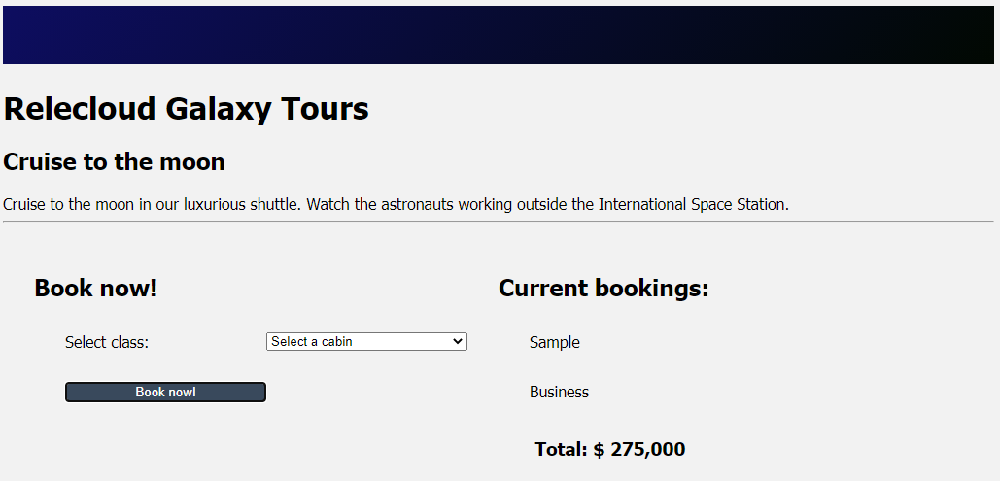

Let's complete the application by adding a form. The form will have a drop-down list for the user to select their desired cabin, and a button to book the cruise. You'll set this up as a new component and create an event for the button. You'll finish by calling this new component from *Host.vue*.

## Create the component

Start by creating the component.

1. In Visual Studio Code, create a file named *BookingForm.vue* in *src/components*.
1. In *BookingForm.vue*, type **vue**, and then select **\<vue\> with default.vue** from the snippets menu.

    

    The snippet will create the default structure.

## Add the code for the component

Let's add the code that the component will use, including registering the props, emits, data, and methods.

1. Open *src/components/BookingForm.vue* if it's not already open.
1. Inside the curly braces (`{ }`) for `export default`, add the following code to configure the component:

    ```javascript
    props: {
        cabins: Array,
    },
    emits: ['bookingCreated'],
    data() {
        return {
            cabinIndex: -1
        }
    },
    methods: {
        bookCabin() {
            if(this.cabinIndex < 0) return;
            this.$emit('bookingCreated', this.cabinIndex);
            this.cabinIndex = -1;
        },
    }
    ```

    This code starts by creating a `cabins` prop to display the list of available cabins. We expose one event named `bookingCreated` by using `emits`. We create a data item named `cabinIndex` to store the selected cabin index.

    We finish by creating a method named `bookCabin`. This method checks the value of `cabinIndex` and runs only if the value is 0 or greater (meaning that the user selected a cabin). If this validation passes, we emit the event returning the selected `cabinIndex`, and reset the `cabinIndex` to -1.

## Add the display template

With the code added, we can turn our attention to the display. We want to have a drop-down list for cabin selection, and a button to book the trip. The button will call the `bookCabin` function that you created earlier.

1. Open *src/components/BookingForm.vue* if it's not already open.
1. Add the following code inside the `<template>` tags to create the display:

    ```html
    <section>
    <h2>Book now!</h2>
    <form>
        <div class="row">
            <label for="cruise-cabin">Select class:</label>
            <select id="cruise-cabin" v-model="cabinIndex">
                <option disabled value="-1">Select a cabin</option>
                <option v-for="(cabin, index) in cabins" :value="index" :key="index">
                    {{ cabin.name }} $ {{ cabin.price.toLocaleString('en-US') }}
                </option>
            </select>
        </div>
        <div class="row">
            <button class="button" type="button" @click="bookCabin">Book now!</button>
        </div>
    </form>
    </section>
    ```

    The HTML creates the form. We loop through the `cabins` prop by using `v-for` to create the drop-down list. We bind the model of the `select` tag to `cabinIndex`, which will be returned when the user selects a cabin and selects the button. We then set up the button to call `bookCabin` when it's selected.

## Add BookingForm to the page

Finish by adding the newly created `BookingForm` to the application by adding it to *Host.vue*.

1. Open *src/components/Host.vue*.
1. Import `BookingForm` by adding the following code after the `TODO: Register next component` comment:

    ```javascript
    import BookingForm from './BookingForm.vue';
    ```

1. Add `BookingForm` to the list of available components by adding the following code after the `TODO: Add next component` comment:

    ```javascript
    BookingForm
    ```

1. Add the method to handle the `bookingCreated` custom event by adding the following code after the `TODO: Add methods` comment:

    ```javascript
    methods: {
        addBooking(cabinIndex) {
            const cabin = this.cruise.cabins[cabinIndex];
            const booking = {
                cabin: cabin.name,
                price: cabin.price
            }
            this.bookings.push(booking);
        }
    }
    ```

    The `addBooking` function retrieves the selected cabin by using the index. The function then creates a new `booking` object by using `cabin.name` and `cabin.price`. We then add `booking` to the `bookings` array.

1. Use the `booking-form` component by adding the following code after the `TODO: Add booking-form` comment:

    ```html
    <booking-form @booking-created="addBooking" :cabins="cruise.cabins"></booking-form>
    ```

    We connect the `addBooking` function to the `booking-created` event, and we pass the list of cabins for display.

## Display the cabin type

Let's modify the template to display the information for our bookings. Instead of the "Sample" booking message that we showed in the last exercise, we'll display the cabin type for each booking.

1. Open *src/components/BookingList.vue*.

1. Inside the `<template>` element, change the field name in the div from `booking.name` to `booking.cabin`:

   ```html
   <div class="row" v-for="(booking, index) in bookings" :key="index">
       <div>{{ booking.cabin }} </div>
   </div>
   ```

## Test the page

With all the code added, let's test the page!

1. Save all files by selecting **File** > **Save all**.
1. Go to `http://localhost:8080` and refresh the page.
1. Select a cabin from the drop-down list and select the button.

   Your new booking displays.

   

You've now created and called a component with a custom event!
