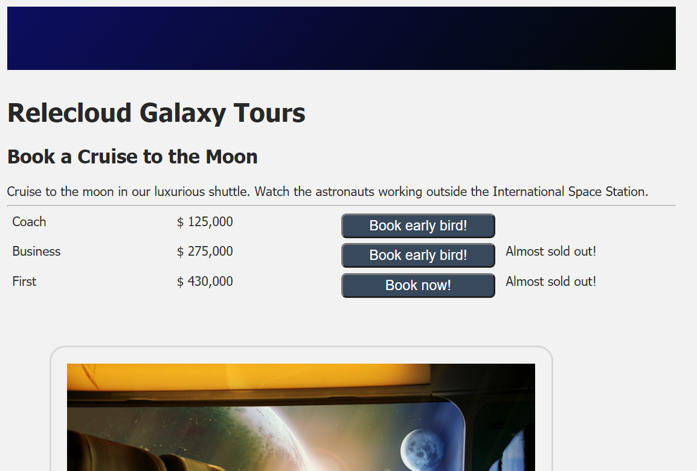

Let's update your display to highlight options that are almost sold out and to display the appropriate button labels for booking a trip. If the seating class offers "early-bird" booking, you'll set the button label appropriately. If early-bird booking isn't available, you'll prompt the user to book now. If fewer than 10 seats are available, you'll display a message saying that the class is almost sold out.

## Add code to update the display

1. In Visual Studio Code, open *index.html*.
1. On the line after the commented line that reads "More to come," add the following HTML:

    ```html
    <!-- More to come -->
    <button v-if="productClass.earlyBird" class="button">Book early bird!</button>
    <button v-else class="button">Book now!</button>

    <div v-show="productClass.seatsAvailable < 10">Almost sold out!</div>
    ```

1. Save your changes.

## Test the display

Return to the browser. The display should now be updated. If it isn't, refresh the page. It should now look like the following screenshot:


