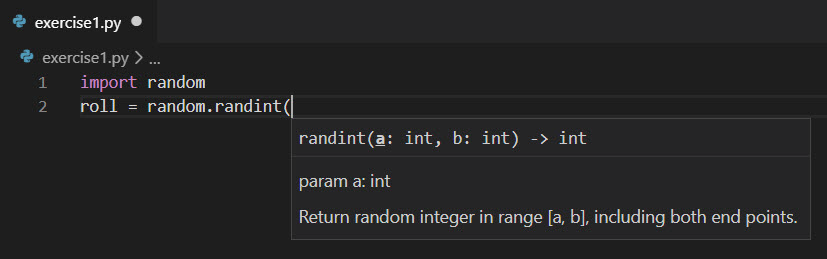

In this exercise, you'll use the `random` module to generate a random value.  This is useful when building simulations or games to introduce randomness.  The important takeaway from this module is how to use the `import` and `import ... as` statements in your programs.

### Step 1 - Create a new working folder and python code file.

Using the techniques you learned in previous modules, create a new folder for your work in this module.  For example, you might create a folder named `python-standard-library`.

Inside that folder, create a file for this exercise.  For example, you might create a file named `exercise1.py`.

When you're instructed to execute your code, you can use the Python Tools for Visual Studio Code integration by selecting the green arrow, or you can use a command in the integrated terminal using techniques we learned about in previous modules.

### Step 2 - Import the `random` module from the Python Standard Library.

The syntax of the `import` statement is simple.  You must use the `import` statement before you actually attempt to use the functions contained within the module you are importing.  Also, by convention, you should add the `import` statement to the top of your code file before any other code.

Add the following `import` statement to your code file.

```python
import random
```

### Step 3 - Type the word `random` and the member access operator to view Intellisense.

Even without reading the documentation for the `random` module closely, you can explore its functions, constants, and service by using Intellisense in Visual Studio Code.  Intellisense will pop up as you type in the code editor providing contextual prompts that display your best options.  You can navigate by typing the first letters of the option you want to use or you can navigate navigable by selecting the <kbd>up arrow</kbd> and <kbd>down arrow</kbd>.  The highlighted option will display documentation to the right side in a separate pop-up window.  Once you find the option you want to use, you can select the <kbd>enter</kbd> or <kbd>tab</kbd> keys to automatically type the remainder of the word for you.

To invoke Intellisense for the `random` module, type the next line of code in the code listing below.  Pause after you type the member access operator `.` after the identifier `random`.

```python
import random
roll = random.
```

If you stopped typing, you should see the Intellisense window displaying all of the functions available from the `random` module.

You can learn a lot about the functionality of a module by merely perusing its functions.  Locate the `randint` function by selecting the <kbd>up arrow</kbd> and <kbd>down arrow</kbd> keys.  Once you find it, what you see in your copy of Visual Studio Code should match the following screenshot:


Now select the <kbd>enter</kbd> or <kbd>tab</kbd> keys to automatically type the remainder of the function name `randint` for you.

Next, type the opening parenthesis symbol `(` to display Intellisense again.  This time, it displays the fact that the `randint` function takes two input arguments that define the range, "including both endpoints".  



When defining a range of values in programming, "inclusive" usually means that the value you supply is in bounds.  "Exclusive" means the value you supply is out of bounds.  So, if we want a random value between 1 and 10, and short form Intellisense documentation says we can define those by passing in the values `1` and `10` as arguments.

So, the entire line of code should match the following code listing:

```python
roll = random.randint(1, 10)
```

### Step 3 - Add code to print the value generated by the random module.

Complete the code example by adding a `print()` statement that formats the line using an f-string.  Make sure your code matches the following code listing: 

```python
import random
roll = random.randint(1, 10)
print(f'You rolled {roll}.')
```

When you execute the code, you should see the following output (the number will be random):

```output
You rolled 3.
```
The number will likely change each time you execute the program.  


### Step 4 - Modify your code to create an alias for the name of the module.

You may not like using the module name `random` throughout your code.  It may not describe the role you want the module to play in your program, or you're already using the identifier `random` in your program and using it again will cause a conflict.  In those cases, you can add the `as` clause to your `import` statement to create an alias.

Modify your code to match the following code listing:

```python
import random as alias
roll = alias.randint(1, 10)
print(f'You rolled {roll}')
```

In this specific example, the name `random` is descriptive enough, however for the purpose of illustration, you may want to alias the name.  Whatever your reasons may be, you can now access the functionality of the `random` module by using the identifier `alias`.

When you run the program, you will see the same random value printed again.

```output
You rolled 6.
```

We chose the identifier `alias` to illustrate the concept, however you are free to use any valid identifier using the same naming rules as Python variables.

Let's change the name of the alias.  Replace the identifier `alias` with the identifier `dice`.

```python
import random as dice
roll = dice.randint(1, 10)
print(f'You rolled {roll}')
```

When you execute the program, it should still work.

## Recap

- Use the `import` statement to include a package from the Python Standard Library in your program.  All of the module's functionality is available through the use of the member access operator `.`.
- In Visual Studio Code, the Intellisense feature can show you the members (functions, constants, and services) that are available after typing the member access operator.
- Use the `import ... as` statement to create an alias for the module if it will help describe its role in your software system.
- The `random` package provides a way to generate a random value.  This will come in handy as we build more interesting code examples in upcoming Microsoft Learn modules.