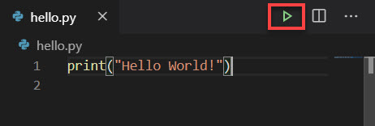
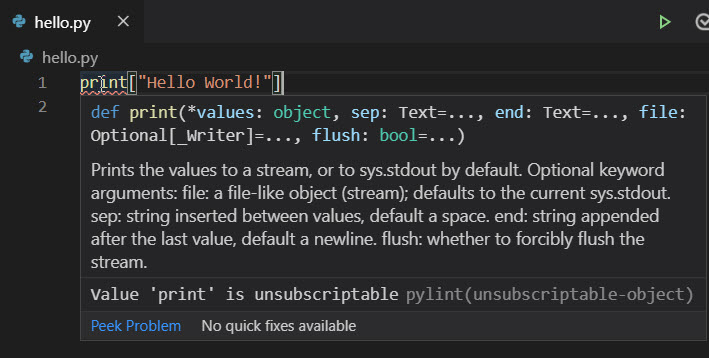

The easiest way to learn programming is to write dozens (if not hundreds) of tiny programs that help you understand fundamental ideas and practice crucial techniques.

## What you'll build

We'll start off building a program that prints a message to screen using a single line of code.  This will require you to navigate Visual Studio Code and work in the code editor.

### Step 1 - Create a new folder for your first Python project

First, you'll want to create a folder structure on your computer where you'll store your work.  

We recommend that you create one folder that will contain all of the exercises for each module.  You can call the new parent folder anything you like, such as `python` or `learn`.  Use the tools and techniques you're comfortable with and make sure to create it in a place on your hard drive that is easy to find.  

Second, inside of your top-level folder, you'll want to create a subfolder for the exercise files you'll work with in this module.  You can call the new child folder anything you like, such as `hello`.

In upcoming Python modules, when instructed to create a new folder, make sure you create new subfolders as children to the parent folder you created in this step.

### Step 2 - Launch Visual Studio Code

Use the technique you're comfortable with to launch Visual Studio Code from your OS.

### Step 3 - Open the folder you just created

Choose the File menu's Open Folder option.  

Use the dialog to navigate to the folder you created previously in Step 1.

The name of the folder will appear in the Explorer view on the left side.

### Step 4 - Create and save a new file

Choose the File menu's New File option.  This will add a new tab in the main editor window with the title "Untitled-1".

From the File menu, choose Save As...  You'll be asked to provide a name for the file.  Name the file `hello.py`.

### Step 5 - Add code to the file

The new `hello.py` file is empty.  Type the following code into the code editor.

```python
print("Hello World!")
```

> [!Important]
> It's extremely important that you type the code precisely, making sure you use the exact characters like parentheses and double-quotes, in the correct order, using lower-case letters for the word `print`.  If you type even one letter incorrectly, it could cause your program to have an error and not work.

### Step 6 - Save the file and execute your program

After typing the code, select the File menu's Save option.

> [!Note]
> You can see if your file needs to be saved if there's a white dot to the right of the file name in the tab.

To execute your program, click the green arrow to the right of the tabs.  If you hover over the arrow, you'll see the tooltip "Run Python File in Terminal".  That lets you know you're in the right place.



When it executes, you'll see two lines appear.

The first line in the Terminal window is the command to compile and execute the code file.  

```output
C:\python\hello>C:/Users/rotabor/AppData/Local/Programs/Python/Python38-32/python.exe c:/python/hello/hello.py
```

The following line printed to the Terminal window that appears below the code window:

```output
Hello World!
```
Success!

### Wait, I got an error

It's possible that you experienced an error when you attempted to run it.  This can happen for many different reasons.

For example, if you used an upper-case `P` in `print`, like so:

```python
Print("Hello World!")
```
Then you would see the following error message in your output:

```output
Traceback (most recent call last):
  File "c:/python/hello/hello.py", line 1, in <module>
    Print("Hello World!")
NameError: name 'Print' is not defined
```
As we said earlier, you must be precise when writing code.  Python is case-sensitive meaning that `print` and `Print` are two different things, and there's no such function called `Print` with an upper-case `P`.

Fortunately, Visual Studio Code can help you spot mistakes like this.  You should see a red squiggly line under `Print`.  If you hover your mouse cursor over the word `Print`, you will see a popup that includes the phrase "Undefined variable 'Print'".  The specific message will require more explanation, but for now you can at least spot potential problems in your code.


> [!Important]
> You must save the changes to your file to see the red squiggly line appear.

You can use this same technique to locate other types of issues in your code.  For example, what if you transposed the order of certain characters like the closing parenthesis and the double-quote character like so:

```python
print("Hello World!)"
```
If you were to run the code, you would see the following error message:

```output
  File "c:/python/hello/hello.py", line 2

                         ^
SyntaxError: unexpected EOF while parsing
```
Here again, the error message may not be meaningful yet, however once you save the file, Visual Studio Code will add a red squiggly line under the last double-quote, which should at least provide a useful clue in self-diagnosing the error.

The reason this doesn't work is because it doesn't follow the syntax rules of Python.  Syntax is similar to grammar in a human-language.  We'll explain the reason this violates Python's syntax rules in just a moment.

Some errors are easy to spot and easy to fix.  Others require a bit more effort.  Suppose you used a set of square brackets instead of a set of parenthesis like so:

```python
print["Hello World!"]
```
Once you save the file, you will see a red squiggly line under `print`.  This time when you hover your mouse cursor over the red squiggly line, you see a large dialog with additional information.  



We'll talk about what all this information means in another module, but let's just skip over it for now since it's a bit advanced at this point.  The main takeaway is that there's a problem with the code.

When you run the program, you see the following error message in the output.

```output
Traceback (most recent call last):
  File "c:/python/hello/hello.py", line 1, in <module>
    print["Hello World!"]
TypeError: 'builtin_function_or_function' object is not subscriptable
```
Unfortunately, this error message isn't helpful because it doesn't just come out and tell you the exact problem: that you need to replace the square brackets for a set of parenthesis.

In these situations, you will need to lean on your knowledge of Python and your keen eye to spot the problem -- that you cannot use square brackets when invoking a function.  You must use a set of parenthesis.

You gain both the knowledge and the keen eye through experience.  It may seem daunting at first, but with practice you will master this and much more.

## How did your program work?

You invoked a **function** named `print`.  A function contains code that works together to complete a single task in a software system.  The function is given a name so that you can call it by its name to invoke its functionality.  The `print` function's only job is to send information to output, and that output may be displayed via a command line or terminal window.

To invoke a function, we must use a set of parentheses called the function invocation operators.  This is our instruction to the Python interpreter that we want it to actually execute that function for us.

Later, you'll learn how to create your own functions.  At first, you'll use functions that the creators of Python have created to help you write applications more quickly.  Also, you'll learn how to leverage third-party libraries that dramatically expand the functionality available to your Python programs to perform a vast array of tasks.

Some functions allow you to pass an argument, which the function can use to complete its task.  In this case, we sent the `print` function a **literal string** containing our message `Hello World!`.  We pass arguments inside of the function invocation operators.

A literal string is a hard-coded value containing alphanumeric characters.  In other words, we literally want this string of characters -- `H`, `e`, `l`, `l`, `o`, an empty space, `W`, and so on -- printed to output.  You define a literal string using a pair of double-quotation or a pair of single-quotation marks.

When the Python compiler evaluates our code, it checks for syntax errors, then converts the code into a compact syntax called bytecode consisting of only zeros and ones.  The Python interpreter understands how to read this syntax, and processes each instruction therein, line by line.  In this case, there's only one line of code.  If there were more, it would work from the top to the bottom, then once it has executed the last line, it would exit the program and return control to the operating system.

## Recap

Let's take a moment to recap the most important lessons from this first unit:

- Writing Python code is an exercise in precision.  Use the correct spelling, capitalization, and symbols when typing code.
- Use the `print` function to display textual information to output via a command line or terminal interface.
- A literal string is literally a string of individual characters that you want to use in your program.  You define a literal string using double-quotation marks or a pair of single-quotation marks.
- Visual Studio Code makes it easy to create a code file, save your work and run your code using the green arrow icon.
- If your code includes invalid syntax, the Python compiler will stop and display an error.  Using the clues provided by the compiler, you'll have to fix the error and try again.
- When you save your code file, Visual Studio Code will analyze your code and add a visual cue that will help you spot potential errors before your attempt to execute your program.