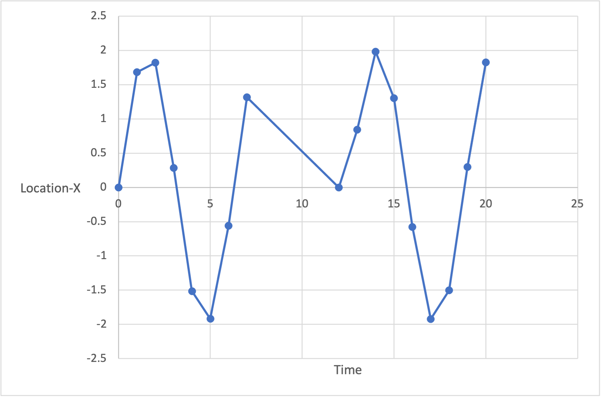
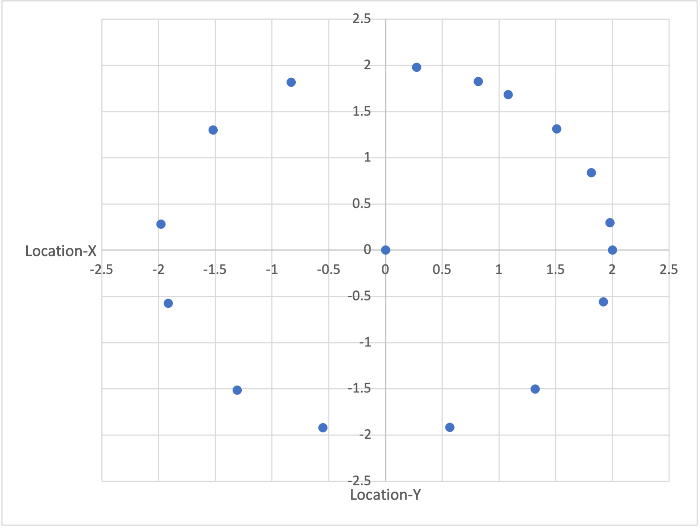

Data scientists visualize data to understand it better. They might scan the raw data, examine summary measures such as averages, or graph the data. Graphs are a powerful means of visualizing data, and data scientists often use graphs to discern moderately complex patterns quickly.

## Representing data visually

Graphing is done to provide a fast qualitative assessment of our data, which can be useful for understanding results, finding outlier values, examining how numbers are distributed, and so on.

While sometimes we know ahead of time what kind of graph will be most useful, other times we use graphs in an exploratory way. To understand the power of data visualization, consider the following data: the location (x,y) of a self-driving car. In the data's raw form, it's hard to see any real patterns. The mean or average tells us that the car's path was centred around x=0.2 and y=0.3, and the range of numbers appears to be between about -2 and 2.

|Time|Location-X|Location-Y|
|---|---|
|0|0|2|
|1|1.682942|1.080605|
|2|1.818595|-0.83229|
|3|0.28224|-1.97998|
|4|-1.5136|-1.30729|
|5|-1.91785|0.567324|
|6|-0.55883|1.920341|
|7|1.313973|1.507805|
|12|0.00001|0.00001|
|13|0.840334|1.814894|
|14|1.981215|0.273474|
|15|1.300576|-1.51938|
|16|-0.57581|-1.91532|
|17|-1.92279|-0.55033|
|18|-1.50197|1.320633|
|19|0.299754|1.977409|
|20|1.825891|0.816164|

If we now plot Location-X over time, we can see that we appear to have some missing values between times 7 and 12.

If we graph X versus Y, we end up with a map of where the car has driven. It’s instantly obvious that the car has been driving in a circle and at some point drove to the center of that circle.

Graphs aren't limited to 2D scatter plots like those above. They can be used to explore other aspects of your data; for example, proportions (pie charts and stacked bar graphs) and how the data are spread (histograms and box-and-whisker plots). Often, when we're trying to understand raw data or results, we might experiment with different types of graphs until we come across one that explains the data in a visually intuitive way.
