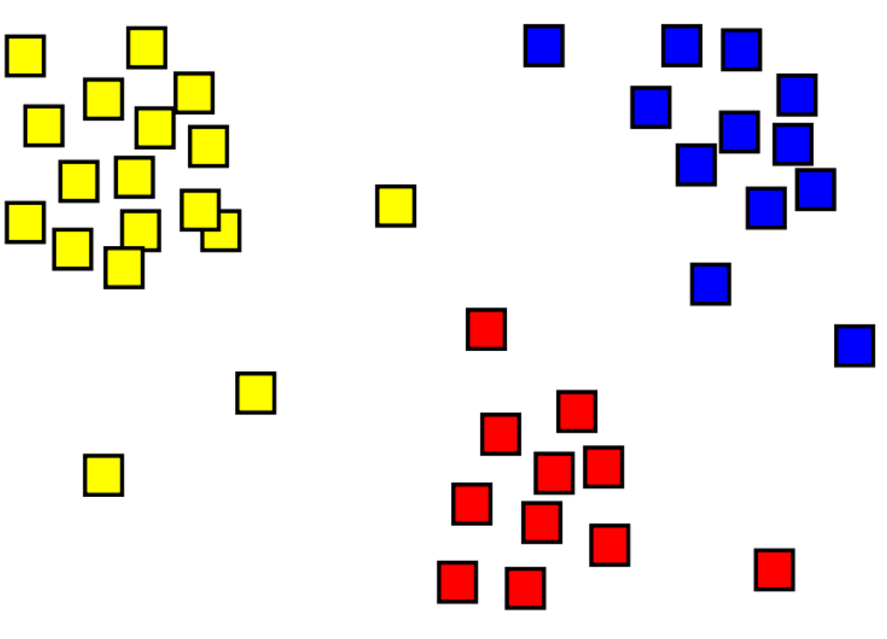

Clustering is the process of grouping objects with similar objects. For example, in the image below we have a collection of 2D coordinates that have been clustered into three categories - top left (yellow), bottom (red), and top right (blue).

A major difference between clustering and classification models is that clustering is an ‘unsupervised’ method, where ‘training’ is done without labels. Instead, models identify examples that have a similar collection of features. In the preceding image, examples that are in a similar location are grouped together.

Clustering is common and useful for exploring new data where patterns between data points, such as high-level categories, aren't yet known. It's used in many fields that need to automatically label complex data, including analysis of social networks, brain connectivity, spam filtering, and so on.
