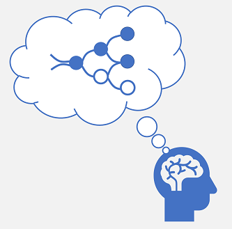
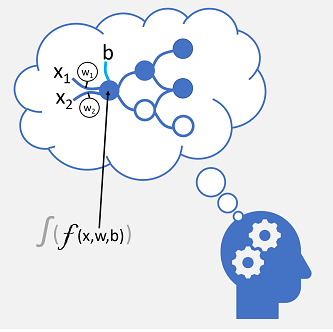

*Deep learning* is an advanced form of machine learning that tries to emulate the way the human brain learns.

In your brain, you have nerve cells called neurons, which are connected to one another by nerve extensions that pass electrochemical signals through the network.

When the first neuron in the network is stimulated, the input signal is processed, and if it exceeds a particular threshold, the neuron is *activated* and passes the signal on to the neurons to which it is connected. These neurons in turn may be activated and pass the signal on through the rest of the network. Over time, the connections between the neurons are strengthened by frequent use as you learn how to respond effectively. For example, if someone throws a ball towards you, your neuron connections enable you to process the visual information and coordinate your movements to catch the ball. If you perform this action repeatedly, the network of neurons involved in catching a ball will grow stronger as you learn how to be better at catching a ball.

Deep learning emulates this biological process using artificial neural networks that process numeric inputs rather than electrochemical stimuli.

The incoming nerve connections are replaced by numeric inputs that are typically identified as ***x***. When there's more than one input value, ***x*** is considered a vector with elements named ***x1***, ***x2***, and so on.

Associated with each ***x*** value is a *weight* (***w***), which is used to strengthen or weaken the effect of the ***x*** value to simulate learning. Additionally, a *bias* (***b***) input is added to enable fine-grained control over the network. During the training process, the ***w*** and ***b*** values will be adjusted to tune the network so that it "learns" to produce correct outputs.

The neuron itself encapsulates a function that calculates a weighted sum of ***x***, ***w***, and ***b***.  This function is in turn enclosed in an *activation function* that constrains the result (often to a value between 0 and 1) to determine whether or not the neuron passes an output onto the next layer of neurons in the network. 
