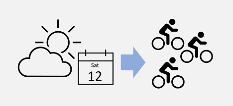

*Regression* is where models predict a number.

In machine learning, the goal of regression is to create a model that can predict a numeric, quantifiable value, such as a price, amount, size, or other scalar number.

Regression is a statistical technique of fundamental importance to science because of its ease of interpretation, robustness, and speed in calculation. Regression models provide an excellent foundation for understanding how more complex machine learning techniques work.

In real world situations, particularly when little data are available, regression models are very useful for making predictions. For example, if a company that rents bicycles wants to predict the expected number of rentals on a given day in the future, a regression model can predict this number. You could create a model using existing data, such as the number of bicycles that were rented on days where the season, day of the week, and so on, were also recorded.

## Prerequisites

* Knowledge of basic mathematics
* Some experience programming in Python
* Familiarity with Jupyter notebooks

## Learning objectives

In this module, you will:

* When to use regression models.
* How to train and evaluate regression models using the Scikit-Learn framework.
