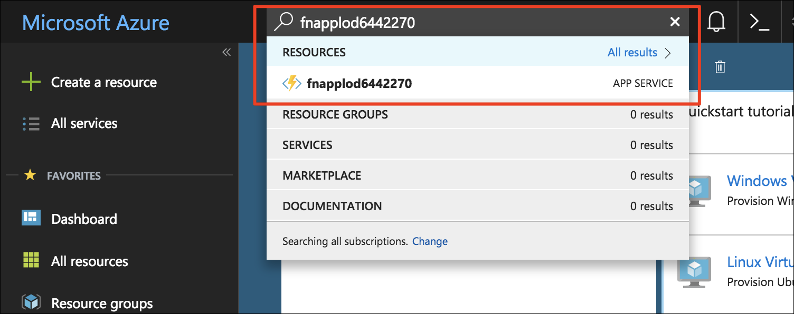
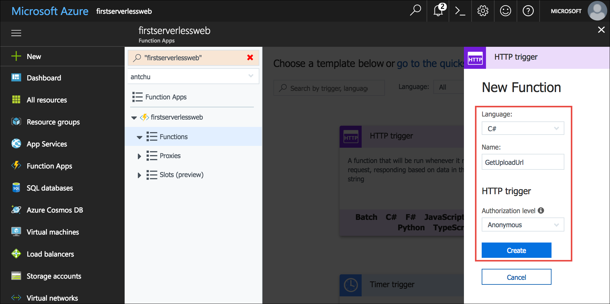

The application that you're building is a photo gallery. It uses client-side JavaScript to call APIs to upload and display images. In this module, you create an API using a serverless function that generates a time-limited URL to upload an image. The web application uses the generated URL to upload an image to Blob storage using the [Blob storage REST API](https://docs.microsoft.com/rest/api/storageservices/blob-service-rest-api).

## Create a blob storage container for images

The application requires a separate storage container to upload and host images.

1. Ensure you are still signed in to the Cloud Shell (bash). If not, select **Enter focus mode** to open a Cloud Shell window.

1.  Create a new container named **images** in your storage account with public access to all blobs.

    ```azurecli
    az storage container create -n images --account-name <storage account name> --public-access blob
    ```

## Create an Azure Function app

Azure Functions is a service for running serverless functions. A serverless function can be triggered (called) by events such as an HTTP request or when a blob is created in a storage container.

An Azure Function app is a container for one or more serverless functions.

1. Create a new Azure Function app with a unique name in the resource group you created earlier named **first-serverless-app**. Function apps require a Storage account; in this tutorial, you use the existing storage account.

    ```azurecli
    az functionapp create -n <function app name> -g first-serverless-app -s <storage account name> -c westcentralus
    ```


## Create an HTTP-triggered serverless function

The photo gallery web application makes an HTTP request to serverless function to generate a time-limited URL to securely upload an image to Blob storage. The function is triggered by an HTTP request and uses the Azure Storage SDK to generate and return the secure URL.

1. After the Function app is created, search for it in the Azure Portal using the Search box and click to open it.

    

1. In the function app window's left hand navigation, hover over **Functions** and click **+** to start creating a new serverless function.

    

1. Click **Custom function** to see a list of function templates.

1. Find the **HttpTrigger** template and click the language to use (C# or JavaScript).

1. Use these values to create a function that generates a blob upload URL.

    | Setting      |  Suggested value   | Description                                        |
    | --- | --- | ---|
    | **Language** | C# or JavaScript | Select the language you want to use. |
    | **Name your function** | GetUploadUrl | Type this name exactly as shown so the application can discover the function. |
    | **Authorization level** | Anonymous | Allow the function to be accessed publicly. |

    

1. Click **Create** to create the function.

1. **C#** 

    1. When the function's source code appears, replace all of **run.csx** with the content of [**csharp/GetUploadUrl/run.csx**](https://raw.githubusercontent.com/Azure-Samples/functions-first-serverless-web-application/master/csharp/GetUploadUrl/run.csx).

1. **JavaScript** 

    1. (JavaScript) This function requires the `azure-storage` package from npm to generate the shared access signature (SAS) token required to build the secure URL. To install the npm package, click on the Function App's name on the left navigation and click **Platform features**.

    1. (JavaScript) Click **Console** to reveal a console window.

        

    1. (JavaScript) Ensure the current directory is **d:\home\site\wwwroot** by running the command `cd d:\home\site\wwwroot`.

    1. (JavaScript) Run the command `npm init -y` to create an empty **package.json** file.

    1. (JavaScript) Run the command `npm install --save azure-storage` in the console to install the package and save it in **package.json**. It may take a minute or two to complete the operation.

    1. (JavaScript) Click on the function name (**GetUploadUrl**) in the left navigation to reveal the function, replace all of **index.js** with the content of [**javascript/GetUploadUrl/index.js**](https://raw.githubusercontent.com/Azure-Samples/functions-first-serverless-web-application/master/javascript/GetUploadUrl/index.js).
    
        

1. Click **Logs** below the code window to expand the logs panel.

1. Click **Save**. Check the logs panel to ensure the function is successfully compiled.

The function generates what is called a shared access signature (SAS) URL that is used to upload a file to Blob storage. The SAS URL is valid for a short period of time and only allows a single file to be uploaded. Consult the Blob storage documentation for more information on [using shared access signatures](https://docs.microsoft.com/azure/storage/common/storage-dotnet-shared-access-signature-part-1).


## Add an environment variable for the storage connection string

The function you just created requires a connection string for the Storage account so that it can generate the SAS URL. Instead of hardcoding the connection string in the function's body, it can be stored as an application setting. Application settings are accessible as environment variables by all functions in the Function app.

1. In the Cloud Shell, query the Storage account connection string and save it to a bash variable named **STORAGE_CONNECTION_STRING**.

    ```azurecli
    export STORAGE_CONNECTION_STRING=$(az storage account show-connection-string -n <storage account name> -g first-serverless-app --query "connectionString" --output tsv)
    ```

    Confirm the variable is set successfully.

    ```azurecli
    echo $STORAGE_CONNECTION_STRING
    ```

1. Create a new application setting named **AZURE_STORAGE_CONNECTION_STRING** using the value saved from the previous step.

    ```azurecli
    az functionapp config appsettings set -n <function app name> -g first-serverless-app --settings AZURE_STORAGE_CONNECTION_STRING=$STORAGE_CONNECTION_STRING -o table
    ```

    Confirm that the command's output contains the new application setting with the correct value.


## Test the serverless function

In addition to creating and editing functions, the Azure portal also provides an built-in tool for testing functions.

1. To test the HTTP serverless function, click on the **Test** tab on the right of the code window to expand the test panel.

1. Change the **Http method** to **GET**.

1. Under **Query**, click *Add parameter** and add the following parameter:

    | name      |  value   | 
    | --- | --- |
    | filename | image1.jpg |

1. Click **Run** in the test panel to send an HTTP request to the function.

1. The function returns an upload URL in the output. The function execution appears in the logs panel.

    


## Configure CORS in the function app

Because the app's frontend is hosted in Blob storage, it has a different domain name than the Azure Function app. For the client-side JavaScript to successfully call the function you just created, the function app needs to be configured for cross-origin resource sharing (CORS).

1. In the left navigation bar of the function app window, click on the name of your function app.

1. Click on **Platform features** to view a list of advanced features.

1. Under **API**, click **CORS**.

    

1. Add an allow origin for the application URL from the previous module, omitting the trailing **/** (for example: `https://firstserverlessweb.z4.web.core.windows.net`).

    

1. Click **Save**.

1. C#

   1. (C#) Navigate back to the `GetUploadUrl` function, and then select the **Integrate** tab.

   1. (C#) Under Selected HTTP methods, select **OPTIONS**.

      **GET**, **POST**, and **OPTIONS** should all be selected. CORS uses the OPTIONS method, which is not selected by default for C# functions.  

   1. (C#) Click **Save**.

1. Still in the portal, navigate to the function app, select the **Overview** tab, and then click **Restart** to make sure that the changes for CORS take effect.

## Configure CORS in the Storage account

Because the app also makes client-side JavaScript calls to Blob Storage to upload files, you also have to configure the Storage account for CORS.

1. Run the following command to allow all origins to upload files to the Storage account.

    ```azurecli
    az storage cors add --methods OPTIONS PUT --origins '*' --exposed-headers '*' --allowed-headers '*' --services b --account-name <storage account name>
    ```


## Modify the web app to upload images

The web app retrieves settings from a file named **settings.js**. In the following steps, you create the file using Cloud Shell, then set `window.apiBaseUrl` to the URL of the Function app and `window.blobBaseUrl` to the URL of the Azure Blob Storage endpoint.

1. In the Cloud Shell, ensure that the current directory is the **www/dist** folder.

    ```azurecli
    cd ~/functions-first-serverless-web-application/www/dist
    ```

1. Query the function app's URL and store it in a bash variable named **FUNCTION_APP_URL**.

    ```azurecli
    export FUNCTION_APP_URL="https://"$(az functionapp show -n <function app name> -g first-serverless-app --query "defaultHostName" --output tsv)
    ```

    Confirm the variable is correctly set.

    ```azurecli
    echo $FUNCTION_APP_URL
    ```

1. To set the base URI of API calls to your function app, create **settings.js** and add the function app URL like the following.

    `window.apiBaseUrl = 'https://fnapp@lab.GlobalLabInstanceId.azurewebsites.net'`

    You can make the change by running the following command or by using a command-line editor like VIM.

    ```azurecli
    echo "window.apiBaseUrl = '$FUNCTION_APP_URL'" > settings.js
    ```

    Confirm the file was successfully written.

    ```azurecli
    cat settings.js
    ```

1. Query the Blob Storage base URL and store it in a bash variable named **BLOB_BASE_URL**.

    ```azurecli
    export BLOB_BASE_URL=$(az storage account show -n <storage account name> -g first-serverless-app --query primaryEndpoints.blob -o tsv | sed 's/\/$//')
    ```

    Confirm the variable is correctly set.

    ```azurecli
    echo $BLOB_BASE_URL
    ```

1. To set the base URI of API calls to your function app, append the storage URL like the following line of code to **settings.js**.

    `window.blobBaseUrl = 'https://mystorage.blob.core.windows.net'`

    You can make the change by running the following command or by using a command-line editor like VIM.

    ```azurecli
    echo "window.blobBaseUrl = '$BLOB_BASE_URL'" >> settings.js
    ```

    Confirm the file was successfully written and it now contains 2 lines.

    ```azurecli
    cat settings.js
    ```

1. Upload the file to Blob storage.

    ```azurecli
    az storage blob upload -c \$web --account-name <storage account name> -f settings.js -n settings.js
    ```


## Test the web application

At this point, the gallery application is able to upload an image to Blob storage, but it can't display images yet. It will try to call a `GetImages` function that doesn't exist yet because you create it in a later module. That call will fail, and the web page will appear to be stuck on "Analyzing...", but the image you select will be successfully uploaded.

You can verify an image is successfully uploaded by checking the contents of the **images** container in the Azure portal.

1. In a browser window, browse to the application. Select an image file and upload it. The upload completes, but because we haven't added the ability to display images yet, the app doesn't show the uploaded photo. (The web page appears to be stuck on "Analyzing image..."; you'll fix that later.)

1. In the Cloud Shell, confirm the image was uploaded to the **images** container.

    ```azurecli
    az storage blob list --account-name <storage account name> -c images -o table
    ```

1. Before moving on to the next tutorial, delete all files in the **images** container.

    ```azurecli
    az storage blob delete-batch -s images --account-name <storage account name>
    ```


## Summary

In this unit, you created an Azure Function app and learned how to use a serverless function to allow a web application to upload images to Blob storage. Next, you learn how to create thumbnails for the uploaded images using a Blob triggered serverless function.