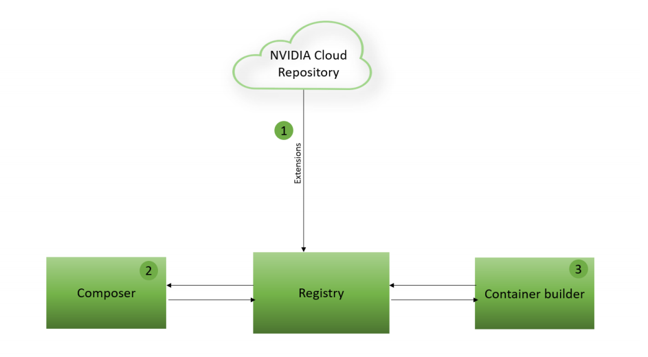
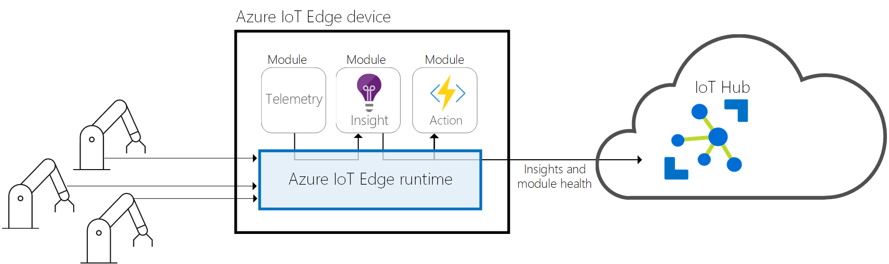

Previously, we introduced the NVIDIA DeepStream SDK. Developers can use it to create optimized Intelligent Video Analytics (IVA) applications that can ingest multiple video-input sources, apply cascading inference on processed frames, and produce telemetry that can be published to cloud services like Microsoft Azure.

We looked at developing applications with the NVIDIA DeepStream SDK by using a configuration-file-driven approach. This method is a highly enabling strategy for IVA development, but the NVIDIA Graph Composer takes this approach further. You can use it to generate DeepStream-compatible IVA pipelines by using a visual editor with drag-and-drop components. By using this mechanism, you can further simplify development while you also view how components relate to each other in an interactive graph.

:::image type="content" source="../media/composer-test1.png" alt-text="Screenshot that shows the NVIDIA DeepStream Graph Composer application." lightbox="../media/composer-test1.png":::

The available components might seem familiar to you because of the Configuration Groups we used earlier. These components and the Configuration Groups both derive from functions provided in the DeepStream SDK C libraries. These components are made available to the Composer application by using a local registry that pulls and stores extensions provided by NVIDIA. The Composer application also allows for importing custom extensions to support components.

After a graph is ready for production, an included *container-builder* tool allows developers to package Composer Graphs into container workloads capable of running on x86 or ARM64 devices. You can use this feature with the Graph Composer to build containerized IVA pipelines that can be deployed to server-class or edge-capable devices.

The full process for this workflow is shown here.

### Integrate containerized Graph Composer workloads with Azure IoT services

By packaging DeepStream Graph Composer workloads into containers, IVA applications can run in edge-to-cloud scenarios with various capabilities, such as:

- Device-to-cloud messaging.
- Cloud-to-device messaging.
- Device monitoring.
- Remote updates.
- Scalable deployment through integration with Azure IoT Edge.

With this service offering, you can instrument a capable device with a runtime that provides orchestration of containerized workloads and secure connectivity into an ingestion point known as an IoT hub.

The IoT Edge runtime runs on the physical device where containerized workloads are called *modules*. These modules can communicate with each other by using message routing. For example, one module can produce telemetry and another module can aggregate messages from the first messages by using Azure Stream Analytics at the edge. Messages from this module can then be published directly to the cloud through a connection to an IoT hub.

With devices registered and managed securely from an IoT hub, it's possible to seamlessly deploy updated workloads to devices and also monitor the connectivity status of an entire fleet. As a result, you can put your DeepStream Graph Composer applications into production with support for all stages of the software development lifecycle. These areas include plug-in support for Azure DevOps, the ability to modify running workloads by using *module twins*, and targeted deployments based on device metadata.

In this module, we'll explore how to develop applications by using the DeepStream Graph Composer. Next, we'll package that output into a containerized workload. Finally, we'll prepare that container for production by publishing it to an instance of Azure Container Registry. In the follow-up module, we'll look at how to pull that workload from a secure container registry and deploy it to an NVIDIA-powered embedded device that runs IoT Edge.

### Try this

Imagine that you've been tasked to develop an IVA application to count the number of people who enter a restaurant. Now suppose that the CEO loves your proof of concept and wants to deploy this application to 1,000 locations around the world! How might you design a strategy to carry out this deployment? What tools could you use to speed up the development and test cycle?
